# TypeScript

타입스크립트 공식 사이트
https://www.typescriptlang.org/

## 타입스크립트란?

자바스크립트를 베이스로 하는 superest of JavaScript로써 자바스크립트를 한 단계 감싸는 언어이다. `Statically Typed Lagnage`여서 컴파일 시간 때 타입에 관련된 에러를 잡을 수 있다. 타입스크립트는 `타입이 정적으로 결정`되어 우리가 코딩할 때 타입이 결정이 된다. 코드가 실행되기 전에 에러를 잡고 픽스할 수 있는 시간을 제공해준다. 그래서 즉각적으로 타입에러를 받을 수 있다.

그리고 `강력한 객체지향 프로그래밍(OOP)`이 가능하다. OOP는 객체 위주로 모듈성있는 코드를 작성할 수 있다. 모듈별로 원하는 것을 재사용할 수 있는 `재사용성`과 객체 단위로 확장해나갈 수 있는 `확장성`도 높다. 이것들을 근본으로 하여 기존 코드에 문제해결이나 새로운 기능을 추가할 때 `유지보수`를 쉽게 할 수 있다.

자바스크립트에서는 보장받을 수 없었던 타입을 보장 받음으로써 조금 더 안정적인 소프트웨어를 만들 수 있다.

---

## 자바스크립트와 타입스크립트의 차이

타입스크립트는 프로그래밍 언어로 Compiled Language다. 하지만 전통적인 Compiled Language와는 차이가 있다. 그래서 `Transpile`이라는 용어를 사용하기도 한다. 자바스크립트는 Interpreted Language로 바로 해석해서 실행시키는 언어이다.

| Compiled                        | Interpreted                  |
| ------------------------------- | ---------------------------- |
| 컴파일 O                        | 컴파일 X                     |
| 컴파일러 필요 O                 | 컴파일러 필요 X              |
| 컴파일하는 시점 O               | 컴파일하는 시점 X            |
| 컴파일된 결과물을 실행하는 시점 | 코드를 실행하는 시점(런타임) |
| 컴파일된 결과물을 실행          |                              |

---

## 타입스크립트의 공부 방법

1. 자바스크립트의 기본적인 지식 습득
1. Web APIs에 대한 이해
1. 타입에 대한 정확한 이해
1. OOP의 중요한 원칙에 대한 이해

---

## 타입스크립트 터미널

1. 실행 <br/>
   npm i -g ts-node <br/>
   npm i typescript -g <br/>
   ts-node fileName.ts

1. Watch 모드 <br/>
   tsc -w

1. Terminal 컴파일 <br/>
   ts-node fileName.ts

1. tsconfig.json 파일 생성
   tsc --init

---

## 기본 - 들어가기 전

특정한 프로그램을 만들고 프로그래밍 한다는 것은 크게 3가지로 구성된다. `input` 입력된 값을 받아와서 `operation` 입력된 값을 연산하고 처리한 뒤, `output` 다시 결과 값을 보여주는 세가지로 구성되어 있다.

`input`은 키보드로 값을 받아올 수도 있지만 파일이나 DB에서 데이터를 읽어오는 것이나 센서로 간지된 값을 받아오는 것 혹은 서버나 다른 기기에서 어떠한 값을 읽어 오거나 받아오는 것 등이 해당된다.

`operation`은 기본적인 사칙연산 뿐만 아니라 우리가 작성한 코드 함수를 실행하는 것이다.

`output`은 화면에 보여지는 것 뿐만 아니라 프린터나 파일, DB에 다시 작성하거나 서버나 다른 기기에 데이터를 전송하는 것이 해당된다.

타입이 명시되어져 있지 않은 박스에는 어떤 데이터든 담을 수 있다. 하지만 `명시되어 있는 박스`에는 명시된 것만 담을 수 있다.변수를 만들 때 타입을 지정함으로써 이 변수에는 이 데이터만 담을 수 있다는 약속을 하는 것이다.

operation(연산)을 할 때 함수가 쓰이는데, 코드가 수행된 후에 결과값을 리턴한다. 이때 타입이 없다면 어떤 데이터를 넣어야 하고 함수가 수행된 다음에는 어떤 데이터가 결과값으로 나오는지 알 수 없다.

만약 타입이 있다면 좀 더 명확하게 어떤 데이터를 담아야하는지 확인할 수 있다. 프로그램을 실행하는 도중에는 다른 타입의 데이터를 저장하거나 인자를 전달할 수 없기 때문에 조금 더 안정적으로 프로그램이 동작할 수 있도록 도와준다.

따라서 타입스크립트에서는 `최대한 명확하게 타입을 명시함`으로써 타입이 조금 더 보장이 되는 방식으로 프로그래밍하는 것이 굉장히 중요하다.변수, 클래스, 함수에 어떤 타입의 데이터를 전달할 수 있고 받아올 수 있는지를 명확하게 조금 더 세부적으로 작성해야 한다.

## 기본 - 자바스크립트의 타입과 타입스크립트 타입의 차이

| 자바스크립트                           | 타입스크립트                           |
| -------------------------------------- | -------------------------------------- |
| Static Types                           | Dynamic Types                          |
| 개발하는 중간에 타입을 확인할 수 있다. | 런타임에 돌입해야만 타입을 알 수 있다. |

```js
function add(n1, n2){
  if(typeof n1 !== "number" || typeof n2 !== "number){
    throw new Error("Incorrect Input!");
  }
  return n1 + n2;
}
const result = add(39, 28);
```

```ts
function add(n1: number, n2: number) {
  return n1 + n2;
}
const result = add(39, 28);
```

1. 프로그램이 유용하려면, 가장 간단한 데이터 단위로 작업할 수 있어야 한다. Ex) numbers, strings, structures, boolean ...
1. 타입스크립트에서 자바스크립트에서 기대하는 것과 동일한 타입을 지원하며, 돕기 위해 추가적인 열거 타입을 제공한다.

## 기본 - Type Annotation

타입스크립트에서는 프로그램 작성을 위해 기본으로 제공하는 타입이 있다. 사용자가 만든 타입은 결국 이 기본 자료형들로 쪼개진다. 자바스크립트의 기본 자료형 6가지와 프로그래밍을 도울 몇가지 타입들이 더 제공된다.

특정한 개체에 어떤 타입인지 명시하는 것을 `Type annotation`이라고 한다. 변수의 이름 뒤에 `:`을 붙여 타입을 명시할 수 있다.

### 기본 - Primitive Type

오브젝트와 레퍼런스 형태가 아닌 실제 값을 저장하는 자료형이다. Primitive 형의 내장 함수를 사용 가능한 것은 자바스크립트 처리 방식 덕분이다. ES2015기준으로 총 6가지의 타입이 있다.

1. literal 값으로 Primitive 타입의 서브 타입을 나타낼 수 있다.

```js
true;
("hello");
3.14;
null;
undefined;
```

2. Wrapper object로 만들 수 있다. 하지만 타입스크립트에서는 이 방식을 권장하지 않는다.

```js
new Boolean(false);
new String("world");
new Number(42);
```

[NUMBER]

```ts
const num: number = -6;
```

`number`타입에는 양수, 음수, 실수를 입력할 수 있다. <br/>

[STRING]

```ts
const str: string = "hello";
```

`string`타입에는 문자, 문자열을 입력할 수 있다. <br/>

[BOOLEAN]

```ts
const boal: boolean = false;
```

`boolean`타입에는 ture, false 값을 입력할 수 있다.<br/>

[UNDEFINED]

```ts
let name: undefined; // X
let age: number | undefined;
age = undefined;
age = 1;
```

`undefined`는 기본적인 데이터를 입력할 수 없어 단독으로 쓰이는 일이 없다. 보통은 `Union`타입과 함께 사용된다. <br/>

[NULL]

```ts
let person: null; // X
let person2: string | null;
```

`null`은 기본적인 데이터를 입력할 수 없어 단독으로 쓰이는 일이 없다. 보통은 `Union`타입과 함께 사용된다. 보편적으로는 Null보다는 undefined를 많이 사용한다.<br/>

### 기본 - Non-Primitive Type

[UNKNOWN]

응용 프로그램을 작성할 때 모르는 변수의 타입을 묘사해야 할 수도 있다. 이러한 값은 API 등 동적 콘텐츠를 받아올 때 필요하다. 이 경우 컴파일러와 코드를 읽는 사람에게 이 변수가 무엇이든 될 수 있음을 알려주는 타입을 제공하기 위해 `unknown`을 이용한다. any와 같이 아무거나 할당할 수 있지만, 타입을 확정해주지 않으면 다른 곳에 할당할 수 없고, 사용할 수도 없다.

```ts
let notSure: unknown = 0;
notSure = "he";
notSure = true;
```

`unknown`은 어떤 종류의 데이터가 담길지 알 수 없다. 어떤 데이터 타입이든 넣을 수 있어 사용을 자제하는 편이 좋다.

타입스크립트는 `타입이 없는 자바스크립트`와 연동해서 사용할 수 있다. 자바스크립틀 라이브러리를 이용하는 경우 자바스크립트에서 리턴하는 타입을 모를 수 있다. 그럴 때 unknown을 사용할 수 있다. 하지만 `구체적으로 타입을 지정하는 것이 좋다`.

[ANY]

```ts
let anything: any = 0;
anything = "hello";
```

`any`는 무엇이든 할당할 수 있다. 컴파일 타임에 타입체크가 정상적으로 이뤄지지 않아 타입스크립트의 안정성을 해친다. 만약 any 타입이 맞다면 `noImplicitAny`를 설정하여 any가 맞다고 확정시켜 주는 것이 좋다.

```ts
function returnAny(message: any): any {
  console.log(message);
}
```

[VOID]

```ts
function print() {
  console.log("HELLO");
  return;
}
let unusable: void = undefined;
```

`void`는 아무것도 없는 타입이다. void의 경우 생략할 수 있으나 스타일 가이드에 따라서 void를 적어야 하는 경우가 있다. 변수의 선언에서 쓰는 경우는 극히 드물며 void로 선언하게 되면 undefined 밖에 할당할 수 없어 활용성이 떨어진다.

[NEVER]

`never`는 리턴하지 못하는 타입으로 주로 에러를 던질 때 사용된다. 리턴할 값을 입력하게 되면 never를 사용할 수 없다. `무한히 반복되는 함수`나 `에러`를 발생하고자 할 때 사용할 수 있다.

```ts
function throwError(message: string): never {
  throw new Error(message);
}

function loopNever(): never {
  while (true) {}
}
```

never는 모든 타입의 subtype으로, 모든 타입에 할당할 수 있다. 하지만 never에는 그 어떤 것도 할당할 수 없다. any조차도 never에는 할당할 수 없으며, 잘못된 타입을 넣은 실수를 막고자 할 때 자주 사용된다.

```ts
let a:string = "hello";

if(typeof a /== "string"){
  a; // never
}
```

```ts
let a: string | number;

if(typeof a /== "string"){
  a; // number
}
```

[OBJECT]
Primitive type이 아닌 것을 나타내고 싶을 때 사용된다.

```ts
let obj: object = [1, 5];
function acceptSomeObject(obj: object) {}
acceptSomeObject({ name: "cotton" });
acceptSomeObject({ animal: "dog" });
```

`obeject`로 선언된 변수는 어떤 타입의 데이터도 담을 수 있다. 따라서 구체적으로 object의 타입을 명시하는 것이 중요하다.

```ts
// Create by object literal
const person1 = { name: "Mark", age: 39 };
// person1의 타입은 Object가 아니라 {name : "Mark", age : 39}이다.

// Create by Object.create
const person2 = Object.create({ name: "Mark", age: 39 });
```

[ARRAY]

같은 타입의 요소들을 함께 모아둔 자료형이다. 배열 안에 있는 요소들은 모두 `같은 타입`이다.

```ts
let list: number[] = [1, 2, 3];
let list: Array<number> = [1, 2, 3];
// jsx, psx 파일과 충돌이 일어날 수 있으므로 위 방법이 선호된다.

// Union type
let list: (number | string)[] = [1, 2, 3, "4"];
```

[TUPLE]
길이가 정해져있고 앞 뒤의 타입이 정확해야 한다.

```ts
let x: [string, number];
x = ["hello", 39];
x = [10, "Mark"]; // Error!!
```

```ts
const person: [string, number] = ["Mark", 39];
const [first, second] = person;
```

---

## 기본 - 함수에서 타입 이용하기

예제 1)

```js
function jsAdd(num1, num2) {
  return num1 + num2;
}
console.log(jsAdd(2, 3));
console.log(jsAdd("cotton", "git0"));
```

함수가 긴 경우에는 어떤 값이 전달해야 될지 모르는 경우가 있다. 위 함수의 경우, 인자로 문자를 전달하게 되면 합친 문자를 리턴하게 된다. 타입이 명시되지 않은 함수는 만든 이의 의도와 반대로 활용될 가능성이 있다. 그래서 함수에 타입을 명시하는 것은 중요하다.

```ts
function tsAdd(num1: number, num2: number): number {
  return num1 + num2;
}
console.log(tsAdd(2, 3));
console.log(tsAdd("cotton", "git0")); // ERROR!
```

예제 2)

```js
function jsFetchNum(id) {
  // code...
  return new Promise((resolve, reject) => {
    resolve(100);
  });
}
```

함수가 긴 경우에는 어떤 타입을 리턴하는 지 알기위해 함수의 끝부분을 확인해야 한다. 이러한 문제점은 타입을 명시하면 쉽게 해결할 수 있다.

```ts
function tsFetchNum(id: string): Promise<number> {
  // code...
  return new Promise((resolve, reject) => {
    resolve(100);
  });
}
```

`Promise`를 반환하는 함수의 경우 Promise<반환타입>을 입력해야 한다.

## 기본 - 함수에서 타입 이용하기 2

[Optional parameter]

```ts
function printName(firstName: string, lastName: string) {
  console.log(firstName);
  console.log(lastName);
}
printName("Steve", "Jobs");
printName("Cotton"); // ERROR!
```

두가지 인자를 사용하는 함수를 만들 시, 한가지 인자만 전달하게 되면 에러를 발생시킨다. 여러 개의 인자를 받을 수 있지만 그 중 일부만 사용하고 싶을 때가 있다. 그런 경우 `Optional parameter`를 이용하여 제어할 수 있다.

```ts
function printName(firstName: string, lastName?: string) {
  console.log(firstName);
  console.log(lastName);
}
printName("Steve", "Jobs");
printName("Cotton");
printName("Anna", undefined);
```

매개변수의 `?`를 붙임으로써 인자를 반드시 전달받지 않아도 함수를 출력할 수 있다. 전달되지 않은 인자는 `undefined`로 설정되어 진다.

```ts
function printName(firstName: string, lastName: string | undefined) {
  console.log(firstName);
  console.log(lastName);
}
printName("Steve", "Jobs");
printName("Cotton"); // ERROR!
printName("Anna", undefined);
```

Union 타입을 이용하여 인자를 제어할 수도 있지만, 이 경우 함수를 사용 시 undefined를 붙여주어야 한다. 그러지 않을 경우 에러를 발생시킨다. 함수 인자를 `optional`로 사용하고 싶다면 `?`마크를 사용하는 것이 바람직하다.

[Default parameter]

```ts
(function printMessage(message: string = "default message") {
  console.log(message);
})();
```

기본적으로 함수는 인자가 전달되지 않으면 에러가 발생한다. 하지만 아무것도 전달하고 싶지 않고 기본 메세지를 전달하고 싶다면 타입스크립트 내에서 `default`값을 설정할 수 있다. 아무런 인자를 전달하지 않아도 함수를 호출할 시, 설정한 `default`값이 실행된다.

[Rest parameter]

```ts
function addNumbers(...numbers: number[]) {
  return numbers.reduce((a, b) => a + b);
}
addNumbers(1, 2, 3);
```

함수를 사용 시, 여러 개의 인자를 받아야 하는 경우가 있다. 만약 타입이 동일한 여러 개의 인자를 받아야 하는 경우 `rest parameter`를 이용할 수 있다. 매개변수 앞에 `...`을 붙이면 쉽게 여러 개의 인자를 받을 수 있는 함수가 완성된다.

---

## 기본 - 배열과 튜플

[Array]

```ts
const fruits: string[] = ["바나나", "사과"];
const scores: Array<number> = [1, 3, 4];
```

배열을 선언하는 방법에는 두 가지 방법이 있다. `[]`를 이용한 기본적인 방법과 `Array`라는 오브젝트 타입의 변수를 가질 수 있는 배열로 정의할 수도 있다.

```ts
function printArray(fruits: readonly string[]) {}
function printArray(scores: readonly Array<number>) {} //ERROR!
```

두 방식의 차이점은 `readonly`의 사용여부이다. 오브젝트 타입으로 선언된 배열은 readonly를 사용할 수 없다. 만약 읽기 전용으로 배열을 만들고 싶다면 `[]`를 이용해서 변수를 생성해야 한다.

`오브젝트의 불변성`을 보장하는 것은 굉장히 중요하다. 그래서 `readonly`를 많이 사용하게 된다. 일관성 있는 코드를 짜고 싶다면 `[]`를 이용하여 타입을 선언하는 것이 좋다.

[Tuple] <br/>
원래 배열에는 `한가지 타입`만 허용할 수 있다. 하지만 `tuple`을 이용하면 서로 다른 타입을 가진 데이터를 담을 수 있다.

```ts
let student: [string, number];
student = ["name", 123];
student[0]; // name
student[1]; // 123
```

배열 안에 여러 타입의 데이터를 넣을 수 있다는 장점이 있으나 권장되는 방법은 아니다. 데이터를 접근할 때 인덱스로 접근하는 것은 가독성이 떨어진다. 인덱스만으로는 어떤 데이터가 들어있는지 유추하기가 어렵다. `class`형태를 이용하면 조금 더 명시적으로 접근할 수 있다. tuple을 사용하는 것보단 후술할 `interface, type alias, class`를 이용하는 것이 명시적이고 가독성이 좋다. 그래서 tuple을 사용하는 경우는 드물다. 하지만 이러한 tuple의 문제점은 `Object destructuring`로 어느정도 해결이 가능하다.

```ts
const [name, age] = student;
```

하지만 여전히 데이터가 정해진 곳이 아니라 데이터를 사용하는 곳에서 임의로 name과 age라고 이름을 결정하고 써야하는 단점이 존재한다.

---

## 기본 - Type Alias

`Aliasing Primitive`를 통해 Primitive type을 다른 이름으로 사용할 수 있다.

```ts
type Text = string;
const name: Text = "cotton";
const address: Text = "korea";

type Num = number;
type Student = {
  name: string;
  age: number;
};
const student: Student = {
  name: "cotton",
  age: 11,
};
```

`type alias`는 `새로운 타입을 정의하여 사용하는 것`으로, 기본적인 타입 정의부터 시작해서 복잡한 타입까지 정의할 수 있다. `type alias`는 `primitive type` 뿐만 아니라 `object` 형태도 정의할 수 있다.

```ts
type Student = {
  name: string;
  age: number;
};

const student: Student = {
  name: "cotton",
  age: 11,
};
```

`String Listeral Types`
타입을 `문자열`로 지정할 수 있다.

```ts
type Name = "name";
let cottonName: Name;
cottonName = "name";

type JSON = "json";
const json: JSON = "json";
```

cottonName 변수에는 NAME 타입을 따라간다. 즉, cottonName에는 오직 "name"이라는 문자열만 할당할 수 있다.

union타입을 작성할 때 하나하나 작성하는 번거로움이 있다. `Aliasing Union Type`를 이용하면 반복작성하는 번거로움을 줄일 수 있다.

```ts
let person: string | number = 0;
person = "Mark";

type StringOrNumber = string | number;

let another: StringOrNumber = 0;
another = "Anna";
```

`Aliasing Tuple`도 가능하다.

```ts
let person: [string, number] = ["Mark", 35];
type PersonTuple = [string, number];
let another: PersonTuple = ["Anna", 24];
```

매개변수로 함수를 넣을 때가 있다. `Aliasing Function`을 통해 반복사용할 수 있다.

```ts
type EatType = (food: string) => void;
```

> 목적이나 존재가치가 명확하면 interface를, 어떤 타입을 가리킬 뿐이라면 type alias가 사용되는 편이다.

---

## Union types <OR>

```ts
type Direction = "left" | "right" | "up" | "down";
function move(direction: Direction) {
  console.log(direction);
}
move("left");
```

`union`타입은 쉽게 OR로 설명이 된다. 원하는 하는 타입을 `|(OR)`를 통해 묶을 수 있다.

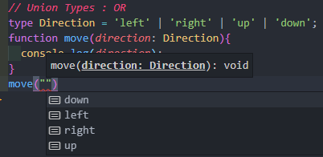<br/>
문자열을 작성하려는 순간 이 함수가 받을 수 있는 direction의 4가지 타입을 `자동으로` 보여준다.가능한 케이스 중에 발생할 수 있는 딱 하나를 담을 수 있는 타입을 만들고 싶을 때 `union`타입을 이용한다.
<br/><br/>
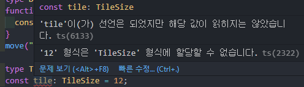<br/>
`union`타입에 입력되지 않은 값을 넣으려 하자 에러가 발생한다. `union` 타입은 발생할 수 있는 모든 케이스 중에 하나만 할당할 수 있다.

union 타입을 활용해보자. 로그인하는 함수가 있다. 성공했다면 response를 반환하고 실패했다면 실패 reason을 반환한다.

```ts
type SuccessState = {
  response: {
    body: string;
  };
};
type FailState = {
  reason: string;
};

function login(id: string, password: string): SuccessState | FailState {
  return {
    response: {
      body: "로그인 성공",
    },
  };
}
```

`union`타입을 이용하여 성공 시와 실패 시 타입을 정한다. Object를 이용하여 복잡한 타입도 구현할 수 있다. 이보다 훨씬 가독성 좋게 `union`을 활용할 수 있다.

```ts
type SuccessState = {
  response: {
    body: string;
  };
};
type FailState = {
  reason: string;
};
type LoginState = SuccessState | FailState;

function login(id: string, password: string): LoginState {
  return {
    response: {
      body: "로그인 성공",
    },
  };
}
```

LoginState라는 union 타입을 추가하여 묶을 수 있다. 이러면 함수가 정의된 것만을 보아도 login을 할 떄, id와 password를 받아오면 LoginState를 리턴하는 것을 쉽게 확인할 수 있다.

> 원래는 네트워크 통신은 비동기로 하기에 LoginState를 promise하는 'promise'를 리턴해야 한다.

이처럼 union은 발생할 수 있는 다양한 케이스 중에 하나만 정하고 싶을 떄 많이 사용한다.

어떤 타입(LoginState)이냐에 따라서 다르게 출력되는 것을 구현해보자. 성공(SuccesState), 실패(FailState)에 따라 다르게 출력시킨다.

printLoginState 함수는 state를 인자로 받아온다. 타입은 LoginState로 union타입으로 직접 만든 타입이다. 아무것도 리턴하지 않으므로 함수의 리턴 타입은 void다. state의 값이 무엇이냐에 따라서 성공시 body를 출력하고 실패시 reason을 출력해야 한다.

Class를 이용했던 것처럼 state.response를 쓰더라도 타입스크립트는 알 수 없다. 따라서 다른 방법으로 이용해야 한다.

```ts
function printLoginState(state: LoginState) {
  if ("response" in state) {
    console.log(`${state.response.body}`);
  } else {
    console.log(`${state.reason}`);
  }
}
```

`in` 키워드를 이용하면 state 안에 있는 reaponse에 접근할 수 있다. 자동완성이 되어 바로바로 찾아진다. else 사용 시에도 자동완성이 쉽게 된다. LoginState에는 두 가지 타입밖에 없기 떄문에 이미 사용된 SucessState가 아닌 FailState의 reason을 추천해준다. `in`이라는 키워드를 통해 이용할 수 있으나 이 방법은 좋지 않다. LoginState의 값은 두 가지로 타입스크립트는 `in`키워드를 사용하기 전까지 어떤 값이 올지 모른다. 만약 코드를 전혀 모르는 작성자가 `in` 키워드를 사용하기 위해서는 state안에 어떤 key 값이 어떻게 구분되어 있는지 확인해야 한다. 이 문제를 해결하기 위해 `Discriminated Union`을 사용할 수 있다.

---

## 기본 - Discriminated Union

union 타입과는 `차별화`되는 이름의 `동일한 타입`을 둠으로써 간편하게 구분지을 수 있다. 어떤 케이스든 공통적인 프로퍼티를 가지고 있음으로서 조금 더 구분하기 쉽게 만들어준다.

`union` 타입에서 사용했던 예제를 `discriminated` 타입으로 코드를 리펙토링해보자.

```ts
type SuccessState = {
  result: "success";
  response: {
    body: string;
  };
};
type FailState = {
  result: "fail";
  reason: string;
};
type LoginState = SuccessState | FailState;

function login(id: string, password: string): LoginState {
  return {
    result: "success",
    response: {
      body: "로그인 성공",
    },
  };
}

function printLoginState(state: LoginState) {
  if (state.result === "success") {
    console.log(`성공. ${state.response.body}`);
  } else {
    console.log(`실패. ${state.reason}`);
  }
}
```

각각 union 타입 안에는 동일한 result라는 key를 갖고 있지만 어떤 state냐에 따라서 다른 값이 지정되어 있다. result라는 타입으로 `차별화`를 둔 덕분에 타입스크립트는 state 내부 값에 에러없이 바로바로 접근할 수 있다.

`discriminated` 타입을 이용하면 조금 더 직관적으로 코드를 작성할 수 있고 가독성도 좋아진다.

---

## Intersection Type <AND>

`union` 타입은 발생할 수 있는 케이스 중에 한 가지만 선택하는 것이었다면, `intersection`은 그 모든 것을 합한 성격이다. `union`이 `OR`같은 개념이었다면 `intersection`은 `AND`와 같은 개념이다.

```ts
type Students = {
  name: string;
  score: number;
};
type Worker = {
  employeeId: number;
  work: () => void;
};

function internWork(person: Students & Worker) {
  console.log(person.name, person.employeeId, person.work());
}

internWork({
  name: "cotton",
  score: 1,
  employeeId: 123,
  work: () => {},
});
```

`intersection` 타입으로 정의되면 모든 데이터가 들어가 있는 object를 전달해야 한다. 하나라도 빠지면 에러가 발생한다. `intersection` 타입을 사용하면 다양한 타입을 하나로 묶어서 선언할 수 있다.

---

## 기본 - Enum

`enum`은 다른 프로그래밍 언에서 흔하게 사용되는 타입이다. 과련도니 상수 값들을 한 곳으로 모아 정의할 수 있게 도와주는 타입이다. 하지만 자바스크립트에서는 enum 타입이 존재하지 않아 다른 방법으로 `enum`을 구현했다.

```js
const MAX_NUM = 6;
const MAX_STUDENTS_PER_CLASS = 10;
```

자바스크립트에서 상수를 정의할 떄, 한 번 정해지면 바뀌지 않은 특정한 고정 값을 나타낼 때 `대문자` 형태로 사용한다. 하지만 서로 연관되어 있지만 묶을 수 있는 `enum` 타입이 존재하지 않는다. 그래서 `enum`과 가깝게 표현할 수 있는 `Object.freeze`를 이용해왔다.

```js
const DAYS_ENUM = Object.freeze({ MONDAY: 0, TUSEDAY: 1, WEDNESDAY: 2 });
const dayOfToday = DAYS_ENUM.MONDAY;
```

하지만 타입스크립트에서는 자체적으로 `enum` 타입을 제공하고 있다.

```ts
enum Days {
  Monday,
  Tuesday,
  Wednesday,
  Tursday,
  Friday,
  Satarday,
  Sunday,
}
console.log(Days.Friday);
const day = Days.Monday;
console.log(day);
```

`enum`을 통해 공통된 데이터를 묶을 수 있다. 별다른 선언이 없으면 맨 위(Monday)는 0으로 시작된다. 그래서 console.log(Days.Friday);를 통해 값을 확인해보면 4가 출력됨을 확인할 수 있다.

```ts
enum Days {
  Monday = 1,
  Tuesday,
  Wednesday,
  Tursday,
  Friday,
  Satarday,
  Sunday,
}
```

이와 같이 직접 숫자를 할당하면, 그 숫자부터 다시 순서대로 할당된다. console.log(Days.Friday); 를 통해 값을 확인해보면 4였던 값이 5가 됨을 확인할 수 있다.

```ts
enum Days {
  Monday = "md",
  Tuesday = "td",
  Wednesday = "wd",
  Tursday = "td",
  Friday = "fd",
  Satarday = "std",
  Sunday = "sud",
}
```

문자도 할당할 수 있는데, 이 경우 모든 데이터에 문자를 할당해주어야 한다. 다시 console.log(Days.Friday); 통해 값을 확인해보면 fd가 출력된다.

하지만 타입스크립트에서 `enum`의 사용은 권장되지 않는다. 예제를 통해 알아보자.

```ts
enum Days {
  Monday,
  Tuesday,
  Wednesday,
  Tursday,
  Friday,
  Satarday,
  Sunday,
}

let day: Days = Days.Monday;
day = Days.Tuesday;
day = 10;
```

day라는 변수는 `enum`인 Days 타입을 받고 있다. day에는 Days에 있는 데이터를 마음대로 넣을 수 있다. 그 중에는 숫자값도 받을 수 있다. 우리가 선언한 Days에는 0에서 6까지만 사용이 가능하다. 하지만 days는 7이상의 값까지 받아도 에러를 발생하지 않는다. 타입스크립트를 컴파일하면 경고메시지없이 작동하는 것을 확인할 수 있다. `enum` 타입을 사용하게 되면 타입이 정확하게 보장되지 않는다. 타입스크립트에서는 `enum`을 사용하지 않고 앞에서 사용했던 `union` 타입을 통해 enum을 재현할 수 있다.

```ts
type DaysOfWeek = "Monday" | "Tuesday" | "Wednesday";
let dayOfWeek: DaysOfWeek = "Monday";
dayOfWeek = "Tuesday";
```

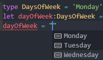<br/>
문자열을 입력하면 들어갈 수 있는 값들이 자동으로 나와 코드를 쉽게 완성할 수 있다. DayOfWeek에 해당하지 않은 다른 변수 값은 할당할 수 없으며 오직 `union`타입에 지정된 값만 사용할 수 있다.

> 그럼에도 불구하고 타입스크립트에서 `enum`을 사용해야 하는 경우가 있다. 다른 모바일 클라이언트 안드로이드나 IOS는 코틀린이나 스위프트와 같은 언어를 이용한다. 사용자의 데이터를 JSON으로 묶어서 다시 클라이언트에게 보내야할 때, 모바일 클라이언트에서 사용하는 네이티브 프로그래밍 언어에서는 `union `타입을 표현할 수 있는 방법이 없다. 그래서 서로 이해할 수 있는 `enum` 타입을 사용한다.

---

## 기본 - 작성자와 사용자의 관점으로 코드 바라보기

하나의 함수를 두고 사용자와 구현자가 나누어진다. 자신의 코드에서 해당 함수를 사용하는 `사용자`와 해당 함수를 구현하는 `구현자`가 있다.

타입이란 해당 변수가 할 수 있는 일을 결정한다. 자바스크립트에서는 타입을 명시하지 않아, 함수 사용법에 대해 오해를 야기하곤 한다.

f2라는 함수가 있다. 구현자는 매개변수 a에는 number 타입의 변수가 들어가야 한다는 가정 하에 함수를 작성했다. 하지만 사용자가 사용법을 숙지하지 않고 문자열을 사용하여 함수를 사용한다면 곤란해진다. 그렇다고 구현자의 모든 함수를 사용자가 샅샅이 살펴보며 숙지하기란 어렵고 번거로운 일이다.

```js
function f2(a) {
  return a * 38;
}

console.log(f2(10)); // 380
console.log(f2("Mark")); //NaN
```

### 기본 - Type Inferencs(타입추론)

타입스크립트에서 자체적으로 타입을 결정하는 경우가 있다.

```ts
let text = "hello";
text = 1;
```

text에 별다른 타입을 명시하지 않았음에도 text에 1을 삽입하려 하자 에러를 발생시킨다. 이는 타입스크립트가 text에 삽입된 값을 보고 string 타입이라고 `추론`한 것이다.

```ts
function print(message = "hello") {
  console.log(message);
}
print("Hello");
print(1);
```

message에는 타입은 명시되어 있지 않지만 default 값이 입력되어 있다. 타입스크립트는 이 default 값을 통해 타입을 추론한다. 그래서 문자열을 통해 print를 호출한 경우 에러를 발생시키지 않지만, 숫자를 인자로 전한 경우 에러를 발생시킴을 확인할 수 있다.

```ts
function add(x: number, y: number) {
  return x + y;
}
```

add 함수의 리턴값에는 타입이 명시되어 있지 않지만 x와 y 값은 number로 명시되었다. return 값은 number 타입인 x와 y를 더한 값을 리턴하고 있다.

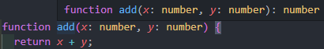<br/>

그래서 타입스크립트는 자체적으로 add함수는 number타입을 리턴할 것으로 추론한다.

하지만 타입스크립트의 추론에 의지하는 경우, 자바스크립트와 동일한 문제를 야기할 수 있다.

```ts
function f3(a) {
  return a * 38;
}

console.log(f2(10)); // 380
console.log(f2("Mark")); //NaN
```

타입스크립트 코드지만, a의 타입은 명시적으로 지정되어 있지 않다. 타입스크립트의 추론은 완벽하지 않아서 a의 타입을 any로 추론하게 된다. 함수의 리턴 값은 number로 추론된다. a는 any이기 때문에 타입스크립트 컴파일러 입장에서 문자열을 사용해도 올바른 방법이라고 인식하게 된다.

타입을 명시할 필요없이 타입스크립트는 자체적으로 타입을 추론한다. 하지만 코드가 복잡해질 수록 추론은 어려워진다. 모든 경우에서는 타입을 정확하게 명시하는 것이 중요하다. 이때 `noImplicityAny` 옵션을 설정하면 타입스크립트가 추론 중 any라고 판단할 시, 컴파일 에러를 발생시켜 명시적으로 지정할 수 있도록 유도해준다.

```ts
function f4(a: number) {
  if (a > 0) {
    return a * 38;
  }
}
console.log(f4(-5)); //NaN
```

사용자는 사용법에 맞게 숫자형을 사용하여 함수를 실행하였다. 하지만 if 조건에 만족하지 못하여 undefined + 5가 실행되어 NaN이 출력되었다. 기본적으로 모든 타입에는 자동으로 `null`과 `undefined`가 포함되어 있다. 기본값을 제거하기 위해서는 `strictNullChecks`를 설정함으로써 해결할 수 있다. 옵션을 키면 함수 실행 부분에 에러가 발생함을 확인할 수 있다.

```ts
function f4(a: number): number {
  if (a > 0) {
    return a * 38;
  }
}
```

함수에 반환 타입을 정해줄 수 있다. 위 함수는 if 조건이 맞을 때만 값을 반환한다. 모든 상황에서 반환을 하고 있지 않아 컴파일 에러를 발생시킨다. 이때 `noImplicitReturns` 옵션을 활성화하면 함수 내에서 모든 코드가 값을 리턴하지 않으면, 컴파일 에러를 발생시킨다.

```js
function f6(a) {
  return `이름은 ${a.name}이고, 연령대는 ${
    Math.floor(a.age / 10) * 10
  }대 입니다.`;
}

console.log(f6({ name: "Mark", age: 38 }));
//이름은 Mark 이고, 연령대는 30대 입니다.
console.log(f6("Mark"));
//이름은 undefined 이고, 연령대는 NaN대 입니다.
```

매개변수에 Object가 들어오면 예상치 못한 상황이 발생하곤 한다. 그래서 Object Literal Type으로 타입을 지정해줄 수 있다.

```ts
function f6(a: { name: string; age: number }): string {
  return `이름은 ${a.name}이고, 연령대는 ${
    Math.floor(a.age / 10) * 10
  }대 입니다.`;
}

console.log(f6({ name: "Mark", age: 38 }));
//이름은 Mark 이고, 연령대는 30대 입니다.
console.log(f6("Mark"));
// Error!
```

하지만 Object Literal Type은 받아야 할 데이터가 많아질 수록 작성이 번거로워진다. 이는 interface, type allias를 이용하면 해결할 수 있다.

---

## 기본 - Structural type system

타입스크립트는 `Structural type system`를 따르고 있으며, 구조가 같다면 다른 이름이어도 같은 타입이라고 본다.

```ts
interface IPerson {
  name: string;
  age: number;
  speak(): string;
}

type PersonType = {
  name: string;
  age: number;
  speak(): string;
};

let personInterface: IPerson = {} as any;
let personType: PersonType = {} as any;

persontInterface = personType;
personeType = personInterfase;
```

---

## 기본 - Type Assertion

타입스크립트는 타입이 없는 자바스크립트와 함께 연동되는 경우가 있다. 그래서 `type assertion`을 불가피하게 사용해야 되는 경우가 있다. 예를 들어 자바스크립트 함수에 string과 관련된 함수가 있다 해보자.

```ts
function jsStringFunc(): any {
  return "Hello";
}

const result = jsStringFunc();
console.log(result.length); // 사용불가!
```

자바스크립트는 타입이 없기 때문에 어떤 값을 리턴하는지 컴파일은 알 수 없다. 그래서 타입스크립트는 any 타입으로 추론한다. 하지만 이 함수는 분명히 문자열을 리턴한다. 내가 만약 이 문자열의 길이를 알고 싶다면 문자열 타입에 사용할 수 있는 API인 `length`를 사용하고자 할 것이다. 하지만 타입스크립트에서는 result 값은 any이다. 그래서 문자열 타입에서 이용할 수 있는 API를 사용할 수 없다. 하지만 result 값이 100% 문자열이라고 확신할 때 `type assertion`을 통해 해결할 수 있다.

```ts
console.log((result as string).length);
console.log((<string>result).length);
```

`as type` 혹은 `<type>`을 통해 result의 값을 문자열로 명시해주면 any값을 반환받았음에도 불구하고 문자열 API를 사용할 수 있다. 하지만 `type assertion`을 사용하면 문제가 발생할 수 있다.

```ts
function jsStringFunc(): any {
  return 1;
}

const result = jsStringFunc();
console.log((result as string).length);
console.log((<string>result).length);
```

이제 jsStringFunc은 숫자를 반환한다. 우리는 이제 result는 숫자값임을 알 수 있다. 하지만 타입스크립트는 `type assertion`으로 인해 문자열이라고 확신하고 있다. 그래서 이를 컴파일 하면 아무런 에러를 발생하지 않고 컴파일이 완료된다. 이번에는 다른 예제를 살펴보자.

```ts
const wrong: any = 5;
console.log((wrong as Array<number>).push(1)); // ERROR!
```

wrong 변수는 any 타입이다. 이를 숫자를 가진 배열이라고 확신하고 배열 API인 push를 사용한다. 하지만 이를 컴파일 하면 에러가 발생하고 애플리케이션이 종료됨을 확인할 수 있다.

> TypeError wrong.push is not a function

```ts
function findNumbers(): number[] | undefined {
  return undefined;
}

const numbers = findNumbers();
numbers!.push(2);
```

findNumbers() 함수를 보면 number 배열 혹은 undefined를 리턴한다. numbers가 숫자 배열이라 생각하여 배열 API를 사용하게 되면 타입스크립트는 경고를 발생시킨다. 하지만 이것이 number 배열임을 확신한다면 변수 뒤에 `!`를 붙임으로써 타입을 확신시킬 수 있다. null 혹은 undefined가 아님을 확신시키는 것이다.

HTML로 동적으로 받아올 떄 예제를 확인해보자.

```ts
const button = document.querySelector("class");
```

queryselector를 이용하면 선택자를 통해 DOM요소를 동적으로 받아올 수 있다. querySelecter의 함수정의를 확인해보자.

```ts
querySelector<E extends Element = Element>(selectors: string): E | null;
```

querySelector는 Element(요소)를 찾으면 element를 리턴할 수 있고, element가 존재하지 않는다면 null을 리턴시킨다. querySelector를 통해 받아온 button은 element가 있을 수 있고 null일 수도 있다.

```ts
button?.nodeValue;
```

그래서 button의 nodeValue를 이용하려 하면 경고를 발생시킨다. 만약 정말로 button 값이 있음을 확신한다면 `!`를 통해 해결할 수 있다.

```ts
const button = document.querySelector("class")!;
```

하지만 `type assertion`은 가능하면 피해서 쓰는 것이 좋다. 잘못하면 에러를 발생시켜 애플리케이션이 종료될 수 있기 때문이다.

---

## 기본 - 타입 호환성

하위타입(Subtype)에는 상위타입(Super type)을 넣을 수 없다.

```ts
let sub1: 1 = 1;
let sup1: number = sub1;
sub1 = sup1; // ERROR!

let sub2: number[] = [1];
let sup2: object = sub2;
sub2 = sup2; // ERROR!

let sub3: [number, number] = [1, 2];
let sup3: number[] = sub3;
sub3 = sup3; // ERROR!

class Animal {}
class Dog extends Animal {
  eat() {}
}
let sub6: Dog = new Dog();
let sup6: Animal = sub6;
sub6 = sup6; //ERROR!
```

any는 상위, 하위 상관없이 모든 값을 삽입할 수 있다.

```ts
let sub4: number = 1;
let sup4: any = sub4;
sub4 = sup4;
```

그래서 같거나 서브 타입인 경우, 할당이 가능하며 이를 `공변`이라고 한다.

```ts
let sup7: string = "";
let sup7: string | number = sub7;

let sub8: { a: string; b: number } = { a: "", b: 1 };
let sup8: { a: string | number; b: number } = sub8;

let sub9: Array<{ a: string; b: number }> = [{ a: "", b: 1 }];
let sup9: Array<{ a: stirng | number; b: number }> = sub9;
```

그리고 함수의 매개변수 타입만 같거나 슈퍼타입인 경우, 할당이 가능한 것을 `반병`이라고 한다.

```ts
class Person{}
class Developer extends Person{
  coding(){}
}
class StartupDeveloper extends Developer{
  burning(){}
}

function tellme(f: (d:Devleoper) => Developer){}

// Developer => Developer에다가 Developer => Developer를 할당하는 경우
tellme(function pToD(d: Devleoper):Developer){
  return new Developer();
}

// Developer => Developer 에다가 Person => Developer를 할당하는 경우
tellme(function pToD(d: Person): Developer){
  return new Developer();
}

//Developer => Developer 에다가 StartupDeveloper를 할당하는 경우
tellme(function sToD(d: StartupDeveloper): Developer){
  return new Developer():
}

```

StartupDeveloper에는 burning 함수가 있지만 Developer에는 없다. 논리적으로는 문제가 있으나 타입스크립트는 융통성있게 이를 처리한다. 만약 함수를 할당할 시에 함수의 매개변수 타입이 같거나 슈퍼타입이 아닌 경우 에러를 통해 경고받고 싶다면 `strictFunctionTypes`옵션을 활성화할 수 있다.

---

# Compilation Context - tsconfig.json 설정하기

어떤 파일을 컴파일할 것인지, 어떤 방식으로 컴파일할 것인지는 `tsconfig.json`에 적혀있다. tsconfig를 어떻게 설정하느냐에 따라서 결과물도 달라진다.

타입스크립트 기본설정으로 tsconing.json을 생성해보자.

```
npm init -y
npm i typescript -D
npx tsc --init
```

생성한 tsconfig.json에는 최상위 프로퍼티가 compilerOptions 밖에 없을 것이다. 하지만 우리는 최상위 프로퍼티로 extends, compileOnSave, files, include, exclude, references를 사용할 수 있다.

## tsconfig.json - compileOnSave

```json
{
  "compileOnSave": true
}
```

compileOnSave는 저장 후 컴파일을 사용할 것인지 유무를 설정할 수 있다.

## tsconfig.json - extends

```json
{
  "extends": "path"
}
```

extends의 경로를 입력하면 해당 json파일을 상속한다.

## tsconfig.json - files, include, exclude

[files]
상대 혹은 절대 경로의 리스트 배열로, exclue보다 강력하다.

[exclude]
설정 안하면 4가지(node_modules, bower_components, jspm_packages, <outDir>)를 default로 제외한다. <outDir>은 include에 있어도 항상 제외한다.

[include]
exclude보다 약하며, \*같은 걸 사용하면 .ts, .tsx, d.ts만 include된다. 만약 js 파일도 컴파일하고 싶다면 allowJS를 설정하면 된다.

### tsconfig - compileOptions - typeRoots, types

자바스크립트 라이브러리는 js파일이기 떄문에 type이 설정되어 있지 않다. 그래서 타입을 지정해주는 도구들이 필요하다. 예를 들어, React를 사용해보자.

```
npm install react
```

그리고 React 파일을 타입스크립트에 import하면 에러가 발생한다.

```ts
import React from "react";
// "React" is declared but its value is never read.
```

타입이 존재하지 않아 타입스크립트가 React를 읽을 수 없다. 에러 문구를 읽어보면 `npm i --save-dev @types/react`를 실행해보라는 메시지를 확인해볼 수 있다. 터미널을 통해 실행해보자. 이제 node_modules라는 파일에 @types라는 폴더가 생긴 것을 확인할 수 있다. 그리고 그 파일 내부에는 react 폴더가 존재한다. 더이상 import는 에러가 발생하지 않는다.

하지만 종종 module을 사용하다보면 @types가 없는 module이 존재한다. 그럴 때, `typeRoots`에 경로를 설정하면 배열 안에 들어있는 경로들을 찾아준다. `types`는 패키지의 이름을 입력할 수 있다. ./node_modules/@types/ 안의 모듈 이름에서 찾아오며, 빈 배열을 입력하면 시스템을 이용하지 않겠다는 의미이다. typeRoots와 types는 같이 사용되지 않는다.

### tsconfig - compileOptions - target, lib

`target`은 빌드의 결과물을 어떤 버전으로 할지 설정할 수 있다.

`lib`은 기본 type definition 라이브러리로 어떤 것을 사용할지 정할 수 있다. lib을 지정하지 않으면 target에서 설정한 버전에 따라 다른 라이브러리를 사용한다. lib을 지정하면 그 lib 배열로만 라이브러리를 사용한다.

### tsconfig - compileOptions - outDir, outFile, rootDir

`outDir`은 컴파일된 파일을 담을 폴더를 설정할 수 있다.

`rootDir`은 자바스크립트 파일로 컴파일할 상위 폴더를 설정할 수 있다.

`outFile`은 여러 모듈을 하나의 파일로 만들 때 사용된다.

### tsconfig - compileOptions - strict

타입스크립트를 사용할 때는 `strict`를 true로 설정하는 것이 기본이다. strict에는 다양한 설정을 할 수 있다. strict를 이용하면 타입의 안정성을 더욱더 보장할 수 있다.

`noImplicitAny`는 명시적이지 않게 any 타입을 사용하여 표현식과 선언에 사용하면 에러를 발생시킨다. 만약 타입스크립트가 타입을 any라고 추론하였고 이것이 개발자가 의도한 것이라면 반드시 any라고 지정해야 에러가 발생하지 않는다. noImplicityAny를 사용할 때, 인덱스 객체에 인덱스 시그니처가 없는 경우 오류를 발생시킨다. 사용이 많이 불편해지는데 이를 해결하고 싶다면 `suppressImplicitAnyIndexErrors`를 설정할 수 있다.

`noImplicitThis`는 명시적이지 않게 any타입을 사용하여 this 표현식에 사용하면 에러를 발생시킨다. 첫번째 매개변수 자리에 this를 놓고, this에 대한 타입을 어떤 것이라도 표현하지 않으면, noImplicityAny가 오류를 발생시킨다. 그래서 this를 any로 명시적으로 지정하는 것이 합리적이다.

`strictNullChecks`는 null과 undefined 값이 모든 유형의 도메인에 속하지 않으며, 그 자신을 타입으로 가지거나 any일 경우에만 할당이 가능하도록 만든다. 단 undefined에 void는 할당할 수 있다. 만약 이를 설정하지 않으면, 모든 타입이 null과 undefined 값을 갖게 된다. 즉, string으로 타입을 지정해도 null 혹은 undefined를 할당할 수 있다는 것이다.

`strictFunctionTypes`는 함수 타입에 대한 bivariant 매개변수 검사를 비활성화한다. 반환타입은 공변적이어야 하고 인자타입은 반공벽적이어야 한다. 그런데 타입스크립트에서 인자타입은 공변적이면서 반공변적이다. 이 문제를 해결하기 위해 strictFunctionTypes를 설정할 수 있다.

```ts
const button = document.querySelector("#id") as HTMLButtonElement;
button.addEventListener("keydown", (e: MouseEvent) => {});
// 위와 같은 코드도 에러를 발생시키지 않았지만, 이제는 에러가 발생한다.
```

`strictPropertyInitialization`은 정의되지 않은 클래스의 속성이 생성자에서 초기화되었는지 확인한다. 이 옵션을 사용하려면 strictNullChecks를 사용하도록 설정해야 한다.

`strictBindCallApply` Function의 내장 함수인 bind, call, apply를 사용할 때 더 엄격한 검사를 수행한다. bind는 해당 함수 안에서 사용할 this와 인자를 설정해주는 역할을 하고, call과 apply는 this와 인자를 설정한 후 실행한다. call은 함수의 인자를 여러 인자의 나열로 넣어서 사용하고, apply는 모든 인자를 배열 하나로 넣어서 사용한다.

`alwaysStrict`는 각 소스 파일에 대해 자바스크립트의 strict mode 코드를 분석하고 'use strict'를 해제한다.

---

## Interface - 기본

`interface`는 자바스크립트에서는 없는 문법으로 타입스크립트에서 굉장히 중요한 기능을 한다. 내부는 숨겨져 있고 외부로는 노출되어 있는 호출방식이다. 그래서 내부적인 것과 관계없이 외부적으로 드러나는 객체의 사용방식이 적혀있는 타입이다.

```ts
function hello1(person: {name:string; age:number} : void){
  console.log(`안녕하세요. ${person.name}입니다.`);
}

const p1: {name:string; age:number} = {
  name: "Mark",
  age: 39,
}

hello(p1);
```

함수 hello1과 p1은 같은 구조이다. 변수의 구조가 똑같다면 매번 반복하는 것은 번거로운 일이다. 이럴 때 우리는 `interface`를 사용할 수 있다.

```ts
interface Person1 {
  name:string;
  age:number;
}

function hello1(person: Person1 : void){
  console.log(`안녕하세요. ${person.name}입니다.`);
}

const p1: Person1 = {
  name: "Mark",
  age: 39,
}

hello(p1);
```

interface를 이용하여 Person1이라는 구조를 만들어주면 더이상 긴 문장을 반복할 필요없이 Person1을 사용해주기만 하면 된다. 컴파일된 JS파일에 가면 interface라는 문장을 찾아볼 수 없다. 자바스크립트에서는 없는 문법이기 때문에 interface를 사용할 수 없다. 즉, interface는 실제로 컴파일되었을 때는 사라지게 된다. 컴파일 타임에만 필요하며 문제가 없는지 관계를 규명하여 체크해주는 역할을 한다.

### Interface - optional property 1

상황에 따라 항상 필요한 변수가 있고 아닌 변수가 있다. interface에서도 이를 `optional`로 지정하여 사용할 수 있다. 변수 뒤에 `?`를 붙여 optional로 설정할 수 있다. 그러면 해당 변수는 호출될 때 반드시 작성될 필요가 없어진다.

```ts
interface Person2 {
  name:string;
  age?:number;
}

function hello2(person: Person2 : void){
  console.log(`안녕하세요. ${person.name}입니다.`);
}

hello2({name: "Mark"});

```

### Interface - optional property 2

`indexable type`은 어떤 의미의 프로퍼티든지 추가로 설정할 수 있다.

```ts
interface Person3 {
  name:string;
  age?:number;
  [index:string]: any;
}

function hello3(person: Person3 : void){
  console.log(`안녕하세요. ${person.name}입니다.`);
}

const p31: Person3 = {
  name: "Mark",
  age: 39,
}

const p32: Person3 = {
  name: "Anna",
  systers: ["Sung", "Chan"].
}

const p33: Person3 = {
  name: "Bokdengi",
  father: p31,
  mother: p32,
}

hello3(p33);

```

### Interface - function in interface

interface 안에 함수를 정의할 수 있다.

```ts
interface Person4 {
  name: string;
  age: number;
  hello(): void;
}

const p41: Person4 = {
  name: "Mark",
  age: 39,
  hello: function (): void {
    console.log(`안녕하세요. ${this.name}입니다.`);
  },
};

const p42: Person4 = {
  name: "Mark",
  age: 39,
  hello(): void {
    console.log(`안녕하세요. ${this.name}입니다.`);
  },
};

const p43: Person4 = {
  name: "Mark",
  age: 39,
  hello: (this: Person4): void => {
    // console.log(`안녕하세요. ${this.name}입니다.`);
    // arrow function은 호출한 곳의 값을 받기 때문에 this를 사용하면 에러가 발생한다.
  },
};

p41.hello();
p42.hello();
```

### Interface - class implements interface

class의 interface를 `implements`하면 타입을 사용할 수 있다. interface의 구현사항에 맞게 설정해야 한다. interface로 부터 구현된 class는 interface에 있는 내용들을 모두 사용할 수 있다.

```ts
interface IPerson1 {
  name: string;
  age?: number;
  hello(): void;
}

class Person implements IPerson1 {
  name: string;
  age?: number | undefined;

  constructor(name: string) {
    this.name = name;
  }
  hello(): void {
    console.log(`안녕하세요. ${this.name}입니다.`);
  }
}

const person = new Person("Mark");
// const person: IPerson1 = new Person("Mark");
person.hello();
```

### Interface - interface extends interface

`extends`는 상속으로 interface끼리 상속이 가능하다.

```ts
interface IPerson2 {
  name: string;
  age?: number;
}

interface IKorean extends IPerson2 {
  city: string;
}

const k: IKorean = {
  name: "이웅재",
  age: 39,
  city: "서울",
};
```

### Interface - function interface

interface로 구현된 함수는 interface의 구현사항을 똑같이 구현해야 한다.

```ts
interface HelloPerson {
  (name: string, age?: number): void;
}
const helloPerson: HelloPerson = function (name: string) {
  console.log(`안녕하세요. ${name}입니다.`);
};

helloPerson("Mark", 39);
```

interface를 구현한 함수를 호출할 때도 호출된 함수는 interface의 규격을 따라간다. 그래서 helloPerson에 age 매개변수를 받지 않음에도 오류가 발생하지 않는다.

```ts
// ERROR!
const helloPerson: HelloPerson = function (name: string, age: number) {
  console.log(`안녕하세요. ${name}입니다.`);
};
```

HelloPerson 인터페이스에서는 age를 옵셔널로 받고 있다. 만약 helloPerson 함수에서 age를 확정적으로 받는다면 오류가 발생한다. 모든 타입들은 undefined도 기본으로 갖고 있기 때문이다. 더 큰 것을 작은 것에 할당할 수 없기 때문에 오류가 발생하는 것이다.

### Interface - readonly

interface의 프로퍼티에 `readonly`를 사용하면 읽기전용으로 바꿀 수 있다. 외부에서는 해당 프로퍼티를 변경할 수 없으며 오로지 읽는 것만 가능하다.

```ts
interface Person8 {
  name: string;
  age?: number;
  readonly gender: string;
}

const p81: Person8 = {
  name: "Mark",
  gender: "male",
};

p81.gender = "female"; // ERROR!
```

---

## type alias VS interface

1. function

```ts
type EatType = (food: string) => void;

interface IEat {
  (food: string): void;
}
```

2. array

```ts
type PersonList = string[];

interface IPersonList {
  [index: number]: string;
}

// indexabel type은 [index: string]: string으로 사용된다.
// 배열로만 사용하고 싶을 때는 [index: number]를 사용하면 된다.
```

3. intersection

```ts
interface ErrorHandling {
  success: boolean;
  error?: { message: string };
}
interface ArtistsData {
  artists: { name: string };
}

// type alias
type ArtistsRespnseType = ArtistsData & ErrorHadling;
// interface
interface IArtistsResponse extends ArtistsData, ErrorHandling {}

let art1: ArtistsRespnseType;
let art2: IArtistsResponse;
```

4. union types

union 타입은 interface와 class에서 사용할 수 없다.

```ts
interface Bird {
  fly(): void;
  layEggs(): void;
}
interface Fish {
  swim(): void;
  layEggs(): void;
}

type PetType = Bird | Fish;

interface IPet extends PetType {} // ERROR!
class Pet implements PetType {} // ERROR!
```

5. Declaration Merging - interface

interface를 똑같은 이름으로 여러번 생성해도 모두 합쳐져서 사용할 수 있다. type alias에서는 불가능하다.

```ts
interface MergingInterface {
  a: string;
}
interface MergingInterface {
  b: string;
}
let mi: MergingInterface;
```

---

# OOP(Obeject Oriented Programming)

`객체지향 프로그래밍(OOP)`는 프로그래밍 패러다임이다. 이 패러다임은 프로그래밍을 하는 여러가지 스타일 중에 한 가지 방식이다. OOP는 오브젝트 객체들을 컨셉으로 하여 프로그래밍을 해나가는 방식을 의미한다. 이 오브젝트는 관련된 데이터나 코드를 함께 묶을 수 있다. 다양한 프로그래밍 언어로 객체지향 프로그래밍 스타일을 구현할 수 있다. 언어마다 어떤 방식으로 어떤 문법을 통해서 객체지향을 구현할 수 있는지는 조금씩 달라지지만 전반적인 개념과 사용방법, 코딩방식에는 큰 차이가 나지 않는다. 한 언어로 객체지향을 충분히 마스터하면 다른 프로그래밍 언어를 공부하는 것은 크게 어렵지 않다.

---

## OOP - 객체지향 개념 정리

객체지향과 상반되는 Imperative 명령어와 그리고 Procedural 절차적인 프로그래밍이 있다. 하나의 어플리케이션을 만든다면 어플리케이션이 동작하기 위한 데이터와 함수를 위주로 구성하는 것을 말한다. 보통 제일 처음에 실행되는 main 함수가 있다.
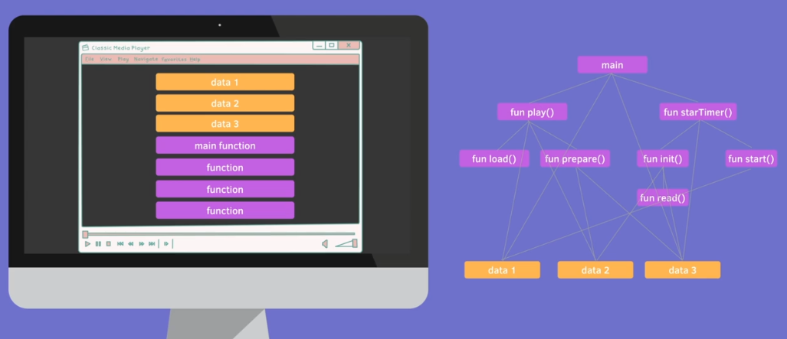 <br/>
main 함수에서 play와 startTimer라는 함수를 호출할 수 있다. 각각 함수 안에서 여러가지 함수를 호출할 수 있다. 함수 내부에서는 전역적으로 설정된 변수의 데이터에 접근할 수 있다. 이처럼 정의된 순서대로 절차적으로 함수가 하나씩 호출되는 방식을 `절차지향적 프로그래밍`이라고 한다.

절차지향적 프로그래밍에는 단점이 많다. 지금부터 단점을 알아보자.

프로젝트에 신규로 투입되었다면 함수가 여러가지로 얽혀있고 데이터도 다른 곳에서 업데이트 될 수 있기 때문에 하나를 수정하기 위해서는 전체적인 어플리케이션이 어떻게 동작하는지를 잘 이해해야 한다. 그리고 하나를 수정했을 때 다른 사이드 이펙트가 발생할 확률이 높다. 한눈에 어플리케이션을 이해하기가 어려운 단점도 있다. 그래서 절차지향적 프로그래밍은 유지보수가 힘들고 확장하기도 어렵다.

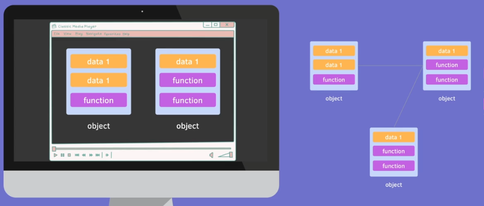 <br/>

반대로 `OOP(객체지향 프로그래밍)`은 프로그램을 객체로 정의해서 객체들끼리 서로 의사소통하도록 디자인하고 코딩해 나가는 것을 의미한다. 서로 관련있는 데이터와 함수를 여러가지 오브젝트로 정의해서 프로그래밍할 수 있다. 객체지향은 `오브젝트 단위`로 만들어 나가기 때문에 한 곳에서 문제가 생긴다면 관련있는 오브젝트만 이해하고 수정하면 된다. 또 여러 번 반복되는 부분이 있다면 관련된 오브젝트를 `재사용`할 수 있다. 무언가 새로운 기능이 필요할 때면 새로운 오브젝트를 다시 만들면 되어 `확장성`도 높아진다. 이처럼 잘 설계된 OOP는 생산성을 높여주고 조금 더 좋은 퀄리티의 프로그램을 만들 수 있게 도와준다. 더 빠르게 구현하고 새로운 기능을 추가해주며 문제를 해결하고 유지보수성이 높다.

오브젝트에는 `오브젝트의 속성을 가지고 있는 데이터`와 `행동을 할 수 있는 코드를 수행할 수 있는 함수`로 구성되어 있다. 음악 플레이어 프로그램이 있다고 해보자. 미디어 플레이어라는 오브젝트를 구현해서 음악파일을 가지고 있고 음악을 재생하고 컨트롤러를 조작할 수 있는 함수로 구성할 수 있다. 오브젝트는 우리 주변에서 볼 수 있는 다양한 객체들을 선정해서 디자인 할 수 있다. 실제로 존재하는 물체 뿐만 아니라 우리가 프로그래밍할 때 맞닥뜨릴 수 있는 추상적인 컨셉의 Error, Exception, Event 등 모두 오브젝트로 만들어 관리할 수 있다.

오브젝트 안에 들어있는 데이터들을 `fields` 혹은 `properties`라고 부른다. 함수는 `methods`라고 부른다. 오브젝트 안에 이런 종류의 데이터와 메소드가 있다는 것은 class를 이용해서 정의할 수 있다. `class`는 정의하는 `빈 템플릿`으로 실제로 class의 데이터를 넣어서 만드는 것이 `object`이다. object는 `class의 인스턴스`라고 불린다. class는 어떻게 생겼는지 묘사하며, obejct는 class 내부에 들어간 데이터라고 볼 수 있다.

---

## OOP - 객체지향의 원칙

class만 정의하고 object만 만든다고 해서 객체지향 프로그래밍인 것은 아니다. 객체지향 프로그래밍을 결정하는 중요한 4 가지의 원칙을 잘 이해하고 작성해야 한다. 객체지향의 원칙에 대한 개념을 알아보도록 하자.

1. Encapsulation ( 캡슐화 )

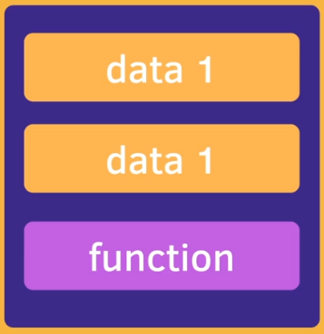

절차지향 프로그래밍 언어에서는 데이터와 함수들 여러가지가 섞여있다. 흩어져 있는 데이터와 함수들 중 `서로 연관된 것들을 묶는 것이 캡슐화`다. 예를 들어 감기약이 있다. 캡슐약 안에는 다양한 성분의 가루약이 있다. 우리는 어떤 성분의 가루가 들어있는지 신경쓰지 않고 약만 먹으면 된다. 그것과 마찬가지로 `서로 관련있는 데이터와 함수를 한 오브젝트 안에 담아두고 외부에서 보일 필요가 없는 데이터는 잘 숨겨 놓음`으로써 캡슐화할 수 있다. 어떤 관련있는 데이터를 오브젝트로 묶어낼 것인지, 어떤 데이터는 외부에서 볼 수 있고 볼 수 없는지 이런 것들을 생각하고 만들어 내는 것이 OOP의 출발점이다.

또 다른 예시를 확인해보자. 고양이 한 마리가 있다. 고양이의 내부(감정) 상태를 외부에서 설정할 수는 없다. 고양이가 배고프고 화나고 행복한 감정은 내부에 있는 상태이다. 하지만 이를 우리가 아예 못 바꾸는 건 아니다. 먹이를 주고 놀아줌으로써 고양이의 내부 상태를 바꿀 수 있다. 내부의 상태를 외부에서는 변경할 수 없지만 외부 function을 통해서 내부 상태를 바꿀 수 있다. 이것이 바로 캡슐화이다.

2. Abstraction ( 추상성 )

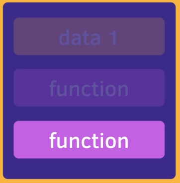

추상화 혹은 추상성은 `내부의 복잡한 기능을 이해하지 않아도 외부에서 간단한 인터페이스를 통해 사용할 수 있는 것`을 의미한다. 커피머신을 통해 추상성을 알아보자. 커피머신 한 대가 있다. 커피머신이 어떻게 동작하는 지 우리는 알 수 없다. 내부구조가 어떻게 되어 있는지 알지 못하지만 간단하게 버튼 하나만 누르면 커피를 만들 수 있다. 이처럼 추상화를 통해 외부에서는 내부가 어떻게 구현되어 있고 얼마나 복잡한 지 알 필요 없이 `외부에서만 보이는 이 인터페이스 함수를 이용해서 오브젝트를 사용`할 수 있다.

3. Inheritance ( 상속 )

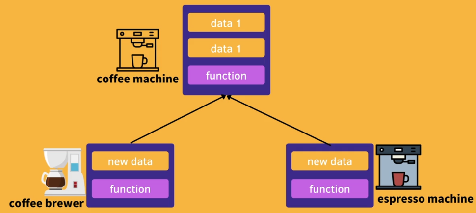

다시 커피머신으로 돌아가보자. 커피머신이라는 class가 정의되어 있다. 커피 머신에는 필요한 데이터와 함수가 함께 들어가 있다. 상속을 이용하면 이미 만들어진 커피머신의 데이터와 함수를 그대로 가져오면서 내가 좀 더 필요한 기능을 더해서 다른 종류의 커피 머신을 만들 수 있다. 즉, 상속을 이용하면 `정의해둔 클래스를 재사용`할 수 있다.

상속의 관계는 perent / super / base 클래스와 childe /sub / derived 클래스로 나눠부를 수 있다. 이런 상속의 관계를 IS-A관계라고도 부른다. 이처럼 상속을 받은 자식 클래스는 부모 클래스라고도 말할 수 있다.

또 다른 예시를 확인해보자. animal이라는 makeSound라는 함수를 가진 클래스가 있다. 상속한 강아지, 고양이, 돼지가 있다. 모두 다 animal을 상속했기 때문에 모두 animal이라고 말할 수 있다. 상속을 한 덕분에 모두 makeSound라는 함수를 갖고 있다.

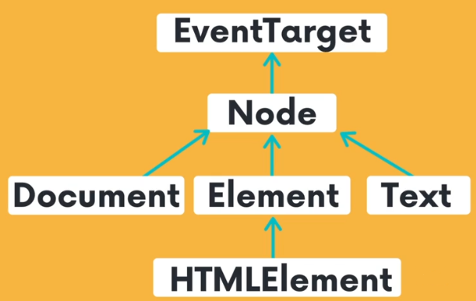

다른 상속의 예제를 하나 더 확인해보자. 브라우저 위에서 DOM 요소도 다 상속을 통해 구현되어 있다. HTMLElement 클래스는 Element라는 클래스를 상속 받았다. 즉, HTMLElement는 바로 Element라고 말할 수 있다. 이 Element는 Node도 상속받았다. Node 안에 있는 속성과 Node 안에 있는 모든 함수가 Element를 사용할 수 있다. 그리고 Node는 EventTarget을 상속받았다. EventTarget에 있는 이벤트와 관련된 모든 속성과 함수들을 Node에서도 사용할 수 있다. Element는 Node를 상속 받았기 때문에 EventTarget 뿐만 아니라 Node에 있는 모든 것을 이용할 수 있다. HTMLElement는 EventTarget, Node, Element 모든 것들을 다 사용할 수 있다.

상속의 구조를 보면 Document나 Element나 Text 이런 모든 요소들은 EventTarget을 상속하기 때문에 모든 요소들이 다 이벤트가 발생할 수 있구나 이해할 수 있게 도와준다.

4. Polymorphism ( 다형성 )

poly는 many, morphy라는 다양한 형태를 말한다. 앞의 예시로 돌아가보자. 다형성은 상속을 통해서 만들어진 강아지, 고양이, 돼지를 어떤 종류의 동물인지 상관하지 않고 animal에 정의된 makeSounde 함수를 이용해서 공통적으로 함수를 호출할 수 있다.

커피 기계도 마찬가지다. makeCoffee라는 함수를 이용해서 어떤 종류의 커피 기계인지 전혀 신경쓸 필요없이 공통된 함수를 이용해서 접근할 수 있다.이를 다형성이라고 부른다.

---

# OOP - 커피머신 만들기

### 절차지향적으로 커피머신 만들기

객체지향 프로그래밍을 하기 전, `절차지향적`으로 프로그래밍을 해보자. 이제부터 커피머신을 만들 것이다. 커피머신에는 샷과 우유가 들어가며 커피콩이 필요하다. 절차지향적으로 커피머신을 만들기 위해서는 어떻게 해야할까?

먼저 커피를 만들 수 있는 makeCoffee 함수를 구현해야 한다. makeCoffee는 shot의 개수를 받는 함수이다. shots는 number 타입이다.

```ts
function makeCoffee(shots: number) {}
```

커피를 만들게 되면 커피를 리턴해야 한다. 리턴할 수 있는 object인 CoffeeCup을 만든다. CoffeeCup에는 shots의 개수와 milk의 여부가 들어간다. 그리고 makeCoffee는 이제부터 CoffeeCup을 반환한다.

```ts
type CoffeeCup = {
  shots: number;
  hasMilk: boolean;
};
function makeCoffee(shots: number): CoffeeCup {}
```

커피를 만들 때에는 CoffeeBeans도 필요하다. CoffeeBeans의 총량과 샷 한번에 얼만큼의 CoffeeBeans가 필요한지 적혀있어야 한다.

```ts
const BEANS_GRAM_PER_SHOT: number = 7;
let coffeeBeans: number = 0;
```

이제 샷, 우유, 커피콩이 모두 준비되었다. makeCoffee 머신의 내부동작을 만들어보자. makeCoffee는 coffeeBeans가 충분히 모였다면 작동할 수 있다. coffeeBeans가 부족하다면 Error를 리턴하고 충분하다면 CoffeeCup을 리턴한다.

```ts
function makeCoffee(shots:number):CoffeeCup{
  if(coffeeBeans < shots * BEANS_GRAM_PER_SHOT){
    throw new Error("커피콩이 부족합니다!");
  }
  return {
    shots,
    hasMilk:false;
  }
}
```

이제 makeCoffee를 호출해보자. 함수를 호출하려고 하면 오류가 발생할 것이다. 위에서 우리는 coffeeBeans의 개수를 0으로 설정했기 때문이다. coffeeBeans의 수량을 늘려야 한다. 샷 3개를 뽑을 수 있을만큼 coffeeBeans의 개수를 설정하고 커피 2개를 뽑아보자.

```ts
coffeeBeans += 3 * BEANS_GRAM_PER_SHOT;
const coffee = makeCoffee(2);
console.log(coffee);
```

이제 에러없이 출력되는 것을 확인할 수 있다.

절차지향적 프로그래밍을 하면서 불편한 사항들이 있을 것이다. 필요한 상수와 데이터 함수들 이 모든 것들이 밖에서 나뒹굴고 있다. 이를 개선하기 위해 이제부터 객체지향적 프로그래밍을 통해 이 코드를 개선해볼 것이다.

```ts
type CoffeeCup = {
  shots: number;
  hasMilk: boolean;
};

const BEANS_GRAM_PER_SHOT: number = 7;
let coffeeBeans: number = 0;

function makeCoffee(shots: number): CoffeeCup {
  if (coffeeBeans < shots * BEANS_GRAM_PER_SHOT) {
    throw new Error("커피콩이 부족합니다.");
  }
  coffeeBeans -= shots * BEANS_GRAM_PER_SHOT;
  return {
    shots,
    hasMilk: false,
  };
}
coffeeBeans += 3 * BEANS_GRAM_PER_SHOT;
const coffee = makeCoffee(2);
console.log(coffee);
```

---

## 객체지향적으로 커피머신 만들기

OOP를 이용해서 다시 한번 커피머신을 구현해보자. 객체지향이기 때문에 `object`를 이용하여 커피 머신을 만들어야 한다. 그리고 커피머신이라는 `class`를 구현해야 한다. 커피 머신에는 무엇이 필요할까? coffeeBeans라는 프로퍼티가 필요하고 커피를 만들 수 있는 makeCoffee가 필요하다. 커피 머신이라는 클래스를 만들고 이 클래스를 이용한 인스턴트 커피머신이라는 객체를 만들어 커피를 만들어보자.

### Class와 Static

class는 서로 관련있는 데이터와 함수들을 묶는 기능을 한다. class 안에는 커피에 관련된 모든 속성과 함수가 들어가면 된다. 이제부터 타입 아래에 CoffeeMaker라는 class를 생성해보자. class 안에 멤버변수를 작성할 때는 const, let, function 같은 키워드가 필요없다.

```ts
class CoffeeMaker {
  BEANS_GRAM_PER_SHOT: number = 7;
  coffeeBeans: number;

  constructor(coffeeBeans: number) {
    this.coffeeBeans = coffeeBeans;
  }
  makeCoffee(shots: number): CoffeeCup {
    if (coffeeBeans < shots * CoffeeMaker.BEANS_GRAM_PER_SHOT) {
      throw new Error("커피콩이 부족합니다.");
    }
    coffeeBeans -= shots * CoffeeMaker.BEANS_GRAM_PER_SHOT;
    return {
      shots,
      hasMilk: false,
    };
  }
}
```

속성으로는 상수가 들어 있고 coffeeBeans라는 속성이 들어있다. 함수 안에는 커피를 만들 수 있는 코드가 있다. class 안에 있는 멤버변수에 접근할 때는 이름을 쓰는 것이 아니라 앞에 `this.`를 붙여 접근한다.

```ts
class CoffeeMaker {
  BEANS_GRAM_PER_SHOT: number = 7;
  coffeeBeans: number;

  makeCoffee(shots: number): CoffeeCup {
    if (this.coffeeBeans < shots * this.BEANS_GRAM_PER_SHOT) {
      throw new Error("커피콩이 부족합니다.");
    }
    this.coffeeBeans -= shots * this.BEANS_GRAM_PER_SHOT;
    return {
      shots,
      hasMilk: false,
    };
  }
}
```

CoffeeMaker 안에는 두 가지의 멤버변수가 있고 한 가지의 함수기 있다. class에서 중요한 것은 `constructor`의 사용이다. `constructor`는 클래스를 가지고 object 인스턴스를 만들 때 항상 호출되는 함수이다. 이제 contructor를 만들어보자.

```ts
class CoffeeMaker {
  BEANS_GRAM_PER_SHOT: number = 7;
  coffeeBeans: number;

  constructor() {
    this.coffeeBeans = coffeeBeans;
  }
  //...
}
```

이제 class를 이용하여 object를 생성할 수 있다. `new` 라는 것은 클래스의 인스턴스를 만드는 것이다. `()`는 바로 생성자를 호출한다. 즉 `new`와 class 이름을 이용하면 class를 이용해서 데이터를 담을 수 있는 object를 생성할 수 있다.

```ts
const coffee = new CoffeeMaker();
```

현재 contructor 생성자는 아무런 인자가 주어지지 않은 상태이다. constructor에서도 인자를 전해줄 수 있다. coffeeBeans를 인자로 전달해보자. 이제는 이 class 안에 있는 coffeeBeans를 전달된 인자만큼 설정해줄 수 있다. coffee를 통해 인자를 전해주면 그만큼 커피콩의 개수가 늘어난다.

```ts
class CoffeeMaker {
  BEANS_GRAM_PER_SHOT: number = 7;
  coffeeBeans: number;

  constructor(coffeeBeans: number) {
    this.coffeeBeans = coffeeBeans;
  }
  //...
}
const coffee = new CoffeeMaker(20);
```

선언된 BEANS_GRAM_PER_SHOT은 class에서 정해진 데이터이다. class 내부에서 연결된 정보이고 변하지 않는 상수이다. 하지만 멤버변수로 작성하게 되면 class를 이용해서 만드는 object마다 BEANS_GRAM_PER_SHOT이 들어가게 된다. class에서 한 번 정의되어지고 이 class를 이용한 object 사이에서 공유될 수 있는 데이터는 멤버변수로 두게되면 중복적으로 데이터를 생성시킨다. 이는 메모리를 낭비시킨다. 이 경우 `static`을 이용해 문제를 해결할 수 있다.

만약 `static`을 붙이지 않는다면 인스턴스 혹은 object라고 불리는 인스턴스 레벨이 된다. class 레벨이라고 하는 것은 class와 연결되어 있기 때문에 object마다 만들어지거나 생성되지 않는다. 이제 `static` 데이터를 사용할 때는 this 키워드가 아닌 `class 이름`을 지정해주어야 한다. 즉, class에 있는 BEANS_GRAM_PER_SHOT 이라는 데이터에 접근하게 되는 것이다. object마다 새로 만들어야 하는 데이터라면 `멤버변수`로, class 레벨에서 함께 공유될 수 있는 것이라면 `static`으로 선언해야 한다.

```ts
class CoffeeMaker {
  static BEANS_GRAM_PER_SHOT: number = 7;
  coffeeBeans: number;

  constructor(coffeeBeans: number) {
    this.coffeeBeans = coffeeBeans;
  }
  makeCoffee(shots: number): CoffeeCup {
    if (this.coffeeBeans < shots * CoffeeMaker.BEANS_GRAM_PER_SHOT) {
      throw new Error("커피콩이 부족합니다.");
    }
    this.coffeeBeans -= shots * CoffeeMaker.BEANS_GRAM_PER_SHOT;
    return {
      shots,
      hasMilk: false,
    };
  }
}
const coffee = new CoffeeMaker(20);
console.log(coffee.makeCoffee(2));
```

`static`은 멤버변수 뿐만 아니라 `함수`에서도 적용할 수 있다. 만약 contructor를 호출하지 않고 새로운 커피머신을 만들고 싶다면 makeMachine이라는 새로운 함수를 이용하여 만들어보자. coffeeBeans의 초기값을 받아오하고 coffeeMaker를 만들어서 반환하는 함수이다. 이 함수 안에서 coffeeMaker를 만들어 전달할 수 있을 것이다.

```ts
class CoffeeMaker {
  static makeMachine(coffeeBeans: number): CoffeeMaker {
    return new CoffeeMaker(coffeeBeans);
  }
}
```

그러면 외부에서 class를 만들지 않아도 간단하게 makeMachine이라는 함수를 이용하여 커피머신을 만들 수 있다.

```ts
CoffeeMaker.makeMachine(3);
```

static을 붙이는 것과 붙이지 않은 것에는 차이가 있다. static을 없애면 더이상 class 레벨에 있는 함수를 이용할 수 없으며 만들어진 object 안에서 함수를 호출할 수 있다.

> static을 사용하는 예제는 다양하다. javascipt에서 'Math' 함수를 이용해 보았을 것이다. 이 Math도 class 레벨에 들어가 있다. 그래서 object를 생성하지 않아도 호출할 수 있다. class 레벨에 있는 함수들은 object를 생성하지 않아도 함수를 호출할 수 있다는 차이점이 있다.

---

## OOP - Encapsulation(캡슐화)

만약 외부에서 coffeeBeans의 값을 음수로 설정하면 어떻게 될까? coffeeBeans가 음수가 되어서는 안된다. class 접근을 통해 coffeeBeans의 값을 외부에서 쉽게 수정할 수 있다. 사용자가 잘 이해하고 양수를 집어넣었다면 괜찮겠지만, 모르고 음수를 집어넣었다면 makeCoffee함수는 Error를 발생시킬 것이다. 사용자가 잘못된 값을 넣지 않도록 `캡슐화`가 필요하다.

```ts
maker.coffeeBeans = -35;
```

캡슐화는 외부에서 보이면 안되는 혹은 설정해서는 안되는 것을 은닉하는 것이다. `public`, `private`, `protected`라는 것을 이용하여 다양한 레벨의 정보를 은닉할 수 있다. 따로 작성하지 않으면 디폴트 값으로 public이 설정되어 있다.

class에 있는 BEANS_GRAM_PER_SHOT은 고정된 값으로 수정이 필요없다. 외부에서 조작할 필요없는 데이터이다. 그렇다면 `private`를 이용하여 가릴 수 있다. 그리고 coffeeBeans의 조작도 위험하다. 외부에서 잘못 조작하면 Error를 발생시킬 수 있다. coffeeBeans도 `private`를 이용하여 외부에서 조작하지 못하도록 막아야 한다.

```ts
class CoffeeMaker {
  private static BEANS_GRAM_PER_SHOT: number = 7;
  private coffeeBeans: number;
}
```

beans를 인자로 받아 coffeeBeans를 추가시키는 함수를 만들어보자. 외부에서 직접적으로 설정하는 것이 아닌 함수를 통해 coffeeBeans를 채운다. 함수를 통해 제어하는 덕분에 채우고자 하는 양이 유효한지 확인할 수 있다. 만약 사용자가 실수로 0 이하의 값을 입력하였다면 Error를 반환하도록 만든다. 유효한 값이 들어왔다면 coffeeBeans에 추가한다.

```ts
    fillCoffeeBeans(beans: number) {
      if (beans < 0) {
        return new Error("음수는 유효하지 않은 값입니다.");
      }
      this.coffeeBeans += beans;
    }
```

내부의 상태는 `private`라는 비공개 키워드를 이용하여 숨기고, 외부에서는 `public`이라는 fillCoffeeBeans 함수를 이용해서 내부의 상태를 변경할 수 있도록 만들었다. 이러한 함수를 이용하는 덕분에 전달받은 인자가 유효한지 검사할 수 있다. 즉, 조금더 `안정성`을 높여 코딩할 수 있다.

```ts
maker.coffeeBeans = 32; //ERROR!
maker.fillCoffeeBeans(32);
```

`static`이라는 키워드를 붙여서 object를 만들 수 있는 함수를 제공한다면, 보통 `constructor(생성자)`를 이용해서 생성하는 것을 금지하기 위해 사용한다. 이런 경우 `constructor`를 `private`로 만들어서 `static 메소드`를 이용할 수 있도록 권장하는 것이 좋다.

```ts
class CoffeeMaker {
  private constructor(coffeeBeans: number) {
    this.coffeeBeans = coffeeBeans;
  }
  static makeMachine(coffeeBeans: number): CoffeeMaker {
    return new CoffeeMaker(coffeeBeans);
  }
}
const coffee = CoffeeMaker.makeMachine(32);
```

> `protect`는 상속할 때 외부에서는 접근할 수 없지만 이 class를 상속한 자식 class에서만 접근 가능할 수 있도록 설정할 수 있다. 예를 들어 어떤 누구라도 class 외부에서는 coffeeBeans에 접근할 수 없지만 `protected`라고 설정하게 되면 CoffeeMaker를 상속한 다른 class 내에서는 접근이 가능해진다.

---

### getter와 setter

다른 객체지향 개념으로 넘어가기 전, class의 `getter`와 `setter`에 대해 정리해보자. User라는 class는 firstName과 lastName을 갖고 있다. 이 데이터는 constructor를 통해서 firstName과 lastName을 받아올 수 있다. constructor 안에서 멤버변수 데이터를 초기화 시켜아 한다. 그리고 firstName과 lastName을 동시에 갖는 fullName이라는 변수도 선언한다.

```ts
class User {
  firstName: string;
  lastName: string;
  fullName: string;
  constructor(firstName: string, lastName: string) {
    this.firstName = firstName;
    this.lastName = lastName;
    this.fullName = `${firstName} ${lastName}`;
  }
}
```

이제 constructor를 호출해보자. 정상적으로 출력되는 것을 확인할 수 있다.

```ts
const user = new User("cotton", "git0");
console.log(user.fullName);
```

이번에는 firstName의 값을 바꿔보자. 하지만 출력 시, contton git0이 출력된다.

```ts
user.firstName = "James";
console.log(user.fullName);
```

fullName이 설정된 뒤에는 firstName과 lastName을 변경하여도 다시 fullName이 계산되지 않는다. 한 번 할당되면 계속 지정된 값을 갖는다. 이런 경우 `getter`를 이용하여 해결할 수 있다. 멤버변수를 바로 선언하고 설정하는 것이 아니라 `get`을 이용하여 fullName을 정의할 수 있다. `get`을 사용하면 함수 형태가 되지만, 접근할 때는 멤버변수에 접근하는 것처럼 작성해야 한다. 이제 fullName을 호출하면 변경된 값이 제대로 출력된다.

```ts
class User {
  get fullName(): string {
    return `${this.firstName} ${this.lastName}`;
  }
}
const user = new User("cotton", "git0");
console.log(user.fullName);
user.firstName = "James";
console.log(user.fullName);
```

이번엔 age 값을 받아보자. number타입의 internalAge라는 데이터를 만든다. get age()는 internalAge를 리턴한다. 그리고 set age()를 이용하여 숫자 num을 받아온다. set을 이용하면 this.internalAge를 전달받은 숫자로 설정할 수 있다. User의 internalAge로는 접근할 수 없지만, get과 set을 이용하면 internalAge가 private여도 멤버변수를 전달할 수 있다.

```ts
class User {
  private internalAge: number = 0;
  get age(): number {
    return this.internalAge;
  }
  set age(num: number) {
    this.internalAge = num;
  }
}
user.age = 6;
```

setter와 getter는 일반 멤버변수처럼 사용가능하지만 어떠한 계산을 할 때 유용하게 사용할 수 있다. 조금 더 다양한 연산을 할 수 있고, 이 숫자가 정확한지에 대해 유효성 검사를 할 수 있다.

```ts
    set age(num: number) {
      if(num < 0){
        throw new Error("음수는 설정할 수 없습니다.")
      }
      this.internalAge = num;
    }
```

---

## OOP - Abstraction(추상화)

외부에서 class를 바라봤을 때 인터페이스가 복잡하다. 사용할 수 있는 함수가 많아질수록 사용자는 어떤 함수를 이용해야할지 혼란스러워진다. 이럴 때는 `추상화`를 이용하여 필요한 `interface`만 노출하여 class를 더 쉽게 만들 수 있다.

이제부터 보다 전문적인 커피머신을 만들어보자. 단순히 커피콩을 넣고 샷을 추출하던 커피머신에서 벗어나 다양한 기능을 추가할 것이다. 커피콩을 갈고(grindBeans) 커피머신을 예열하고(preHeat) 그리고 요청된 샷을 추출할 것이다(extract).

먼저 grindBeans()부터 구현해보자. 우리는 이미 makeCoffee에서 grindBeans()를 구현했다. 받아온 shots만큼 뽑을 수 있는 커피콩이 있는지 확인하고 커피콩이 충분히 있다면 샷을 추출한다. 그리고 커피콩에서 사용힌 만큼의 커피콩을 빼준다.

```ts
    grindBeans(shots: number) {
      if (this.coffeeBeans < shots * CoffeeMaker.BEANS_GRAM_PER_SHOT) {
        throw new Error('커피콩이 부족합니다.');
      }
      console.log(`${shots}개의 커피를 갈고 있습니다.`);
      this.coffeeBeans -= shots * CoffeeMaker.BEANS_GRAM_PER_SHOT;
    }
```

이번엔 preHeat() 커피머신을 예열시키는 함수를 구현해보자. 이 함수는 console log에 예열되고 있다는 문장만 출력할 것이다.

```ts
    preHeat():void {
      console.log("커피머신을 예열 중입니다. 기다려주세요.");
    }
```

마지막으로 커피를 추출하는 extract() 함수를 만들어보자. 얼마만큼의 커피를 추출할 것인지 출력하고 CoffeeCup을 반환한다.

```ts
    extract(shots: number): CoffeeCup {
      console.log(`${shots}개의 샷을 추출하고 있습니다.`);
      return {
        shots,
        hasMilk: false,
      };
    }
```

이제 우리가 기존에 만들었던 makeCoffee에는 이 3가지 함수가 들어오게 된다.

```ts
    makeCoffee(shots: number): CoffeeCup {
      this.grindBeans(shots);
      this.preHeat();
      return this.extract(shots);
    }
```

이제 함수를 호출해보자. 굉장히 많은 함수들이 눈에 띌 것이다. 우리는 직접 구현해서 어떤 함수를 이용해야 할지 알 수 있다. 하지만 다른 사용자의 입장에서는 어떤 함수를 이용해야 맞는지 어려울 것이다. class에 있는 함수를 읽는다면 이해할 수 있겠지만 복잡한 코드의 경우 너무 오랜 시간이 걸린다. 이 문제를 해결하기 위해 `추상화`를 사용한다.

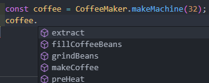

`추상화`는 interface를 굉장히 간단하게 만듦으로써 사용하는 사람이 쉽게 이용할 수 있도록 도와준다. 추상화의 방법에는 여러가지 방법이 있다. `캡슐화`를 통해서도 추상화를 할 수 있으며, `interface`를 이용해서도 가능하다. 혹은 interfacr가 없는 경우에는 정보 은닉을 통해서 추상화를 할 수 있다.

먼저 정보 은닉 방법부터 알아보자. 앞서 사용했던 `private`를 이용하면 쉽게 구현할 수 있다. 내부에서 사용하는 동작이므로 외부에서 호출할 필요가 없는 함수에 private를 설정해주는 것이다. 이제 다시 외부에서 호출하려고 하면 fillCoffeeBeans와 makeCoffee 함수만 호출할 수 있다. 이렇게 정말 필요한 함수만 노출해서 양식을 좀 더 간단하게 만드는 것을 추상화라고 한다.

```ts
class CoffeeMaker {
  private grindBeans(shots: number) {}
  private preHeat(): void {}
  private extract(shots: number): CoffeeCup {}
}
```

이번에는 `interface`를 이용하여 추상화해보자. interface는 하나의 계약서이다. 어떤 규약을 갖고 있는지 어떤 행동을 할 수 있는지 명시해둔 것이다.

> interface와 class의 이름을 만들 때, interface라면 'I'를 붙이거나, 구현한 class에 imple를 붙이기도 한다. 혹은 class의 이름을 좀 더 명시적으로 바꾸기도 한다. interface는 외부적으로 사용하는 이름이기 때문에 최대한 간단하게 사용하는 것이 좋다.

```ts
interface CoffeeMaker {
  makeCoffee(shots: number): CoffeeCup;
}
class CoffeeMachine implements CoffeeMaker {}
```

이제 class는 interface의 규격을 따라간다. CoffeeMachine은 interface를 구현한다. 그래서 interface를 구현하는 class에서는 interface에서 규격된 모든 함수를 구현해야 한다. 우리는 이미 makeCoffee()를 구현해두었다. makeCoffee()를 지운다면 에러가 발생할 것이다. `interface에 있는 모든 함수가 class 안에 구현되어 있어야 한다.`

이제 interface를 사용해보자. coffee의 타입은 우리가 이미 구현한 CoffeeMachine이 될 수 있다. 새롭게 coffee2를 만들어보자. coffee2의 타입은 CoffeeMaker 즉, interface를 받아온다. 하지만 아까와 차이점이 있다. 우리가 구현한 CoffeeMaker에는 오직 makeCoffee()라는 함수만 들어가 있다. 그래서 interface에 없는 fillCofeeBeans를 호출하게 되면 에러를 발생시킨다.

```ts
const coffee: CoffeeMachine = CoffeeMachine.makeMachine(32);
coffee.fillCoffeeBeans(32);
coffee.makeCoffee(2);

const coffee2: CoffeeMaker = CoffeeMachine.makeMachine(32);
coffee2.fillCoffeeBeans(32); // ERROR!
coffee2.makeCoffee(2);
```

interface에는 없는 함수를 이용할 수 없다. 따라서 interface를 사용하면 내가 얼마만큼의 행동을 약속하고 보장할 것인지 결정할 수 있다.

우리가 만든 CoffeeMaker는 오직 커피만 만들 수 있다. 커피를 제작하는 것 외에는 다른 기능이 없다. 좀 더 다양한 기능을 추가해보자. 커피머신에 보다 많은 기능을 추가할 것이다. CommercialCoffeeMaker라는 interface를 만든다. 여기에는 커피 전문샵에서 사용하는 커피머신이다. 조금 더 다양한 기능의 API를 추가할 것이다. CommercialCoffeeMaker에는 커피콩을 채울 수 있고(fillCoffeeBeans) 청소도 할 수 있다(clean). 이제 class와 연결해보자.

```ts
interface CommercialCoffeeMaker {
  makeCoffee(shots: number): CoffeeCup;
  fillCoffeeBeans(beans: number): void;
  clean(): void;
}
```

이제 class인 CoffeeMaker는 두 가지 interface의 규약을 따라간다. CoffeeMaker에 우리가 새로 구현할 clean이라는 함수를 추가해주자. 기계를 꺠끗이 청소하는 함수로 console log에 청소 중임을 알리도록 한다.

```ts
class CoffeeMachine implements CoffeeMaker, CommercialCoffeeMaker {
  //...
  clean() {
    console.log("커피 머신을 청소 중입니다...");
  }
  //...
}
```

이제 우리가 만든 interface인 CommercialCoffeeMaker를 사용해보자. 우리는 CommercialCoffeeMaker를 통해 커피콩을 채우고 커피를 만들고 청소까지 할 수 있다.

```ts
const coffee3: CommercialCoffeeMaker = CoffeeMachine.makeMachine(32);
coffee3.fillCoffeeBeans(32);
coffee3.makeCoffee(2);
coffee3.clean();
```

이제 새로운 class로 만들어보자. 아마추어 사용자와 프로 바리스타로 나눌 것이다. AmateurUser는 간단한 커피 기계 밖에 이용하지 못하지만, ProBarista는 상업용 커피머신을 이용할 수 있다.

```ts
class AmateurUser {
  constructor(private machine: CoffeeMaker) {}
  makeCoffee() {
    const coffee = this.machine.makeCoffee(2);
    console.log(coffee);
  }
}
class ProBarista {
  constructor(private machine: CommercialCoffeeMaker) {}
  makeCoffee() {
    const coffee = this.machine.makeCoffee(3);
    console.log(coffee);
    this.machine.fillCoffeeBeans(32);
    this.machine.clean();
  }
}
```

이제 AmateurUser class를 사용해보자. 아마추어는 커피만들기 밖에 하지 못한다. 우리가 makeCoffee에 구현했던 사항만 수행한다. 요청된 수만큼의 커피를 갈고 커피머신을 예열하고 샷을 추출한다.

```ts
amateur.makeCoffee();
```

이제 ProBarista를 사용해보자. 상업용 커피머신에는 다양한 기능이 구현되어 있다. 커피를 갈고 예열하고 샷을 추출하고 커피머신을 청소한다. CommercialCoffeeMaker interface에 있는 모든 사항을 수행한 뒤 종료한다.

```ts
pro.makeCoffee();
```

동일한 object의 인스턴스여도 이 object는 두 가지 interface를 구현하기 때문에 AmateurUser와 ProBarista는 CoffeeMachine(class)를 받아오는 것이 아니라 CoffeeMaker와 CommercialCoffeeMaker라는 interface에서 생성자를 받아온다. 그래서 interface에서 규약된 class보다는 조금 더 좁은 범위에 interface에서 규약된 함수들만 접근이 가능하다. 아마추어와 바리스타는 interface가 어떻게 구현되어 있는지 신경쓸 필요없이 interface에 규약된 함수들만 이용해서 생성된 object와 의사소통할 수 있다. 그렇기 떄문에 사용자들은 class의 복잡한 기능을 알 필요가 없다.

---

## OOP - Inheritance(상속)

상속을 이용하면 class를 상속하는 다른 종류의 class를 만들 수 있다. 커퍼머신 class를 상속하는 다른 종류의 커피머신을 만들 수 있게 되는 것이다. 상속을 이용해 다양한 커피기계를 만들어보자.

우유거품을 만들어 카페라떼를 만들 수 있는 머신을 추가해보자. class에 CaffeeLatte를 만든다. BEANS_GRAM_PER_SHOT, constructor, makeCoffee 모든 것 과정이 똑같다. 하지만 우유를 스팀하는 과정만 추가하면 CaffeeLatteMachine을 만들 수 있다. 다른 class를 상속할 때는 `extend`를 이용해야 한다.

```ts
class CaffeeLatteMachine extends CoffeeMachine {}
```

상속을 위해 `extends`를 이용했더니 Error가 발생했을 것이다. 살펴보면 constructor가 private이기 때문에 상속이 안된다고 적혀있다. `public`을 이용하면 상속받은 class는 물론 외부에서도 활용할 수 있다. 외부에서 보이면 안되지만 다른 class가 상속받아야 하는 경우, `protected`를 사용할 수 있다. `protected`는 상속하는 자식 class에서는 접근할 수 있으며 외부에서는 접근이 불가능하다. 외부에서 접근할 것과 접근을 막을 것을 분류하여 public과 protected를 설정해주자. 이제 Error없이 정상적으로 상속을 이용할 수 있다.

```ts
class CoffeeMachine implements CoffeeMaker {
  protected static BEANS_GRAM_PER_SHOT: number = 7;
  private coffeeBeans: number;

  constructor(coffeeBeans: number) {
    this.coffeeBeans = coffeeBeans;
  }
}
```

상속이 되었는지 확인하기 위해 아무것도 구현하지 않은 상태로 카페라떼 머신을 만들어보자.

```ts
const latteMaker = new CaffeeLatteMachine(32);
const coffee = latteMaker.makeCoffee(1);
console.log(coffee);
```

똑같이 커피콩을 갈고 커피머신을 예열하며 샷을 추출한다. 커피머신과 동일하게 출력되는 것을 확인할 수 있다. 이것이 바로 상속이다. 우리는 카페라떼 머신에 우유를 스팀해서 첨가되길 바란다. 상속한 class에서 다른 동작을 하고 싶다면 자식 class에서 부모 class에 있는 함수를 덮어 씌울 수 있다. 이를 `overwriting` 이라고 한다.

부모 class에 있는 makeCofee함수를 overwriting 해보자. 부모 class인 CoffeeMachine에서는 hasMilk의 return값이 false였다. CoffeeLatteMachine은 우유를 사용할 것이니 true값을 리턴하면 된다. 다시 출력해보면 hasMilk가 true로 출력되는 것을 확인할 수 있다.

```ts
class CaffeeLatteMachine extends CoffeeMachine {
  makeCoffee(shots: number): CoffeeCup {
    return {
      shots,
      hasMilk: true,
    };
  }
}
```

자식 class에서 부모에 있는 함수를 이용하고 싶을 때가 있다. const 부모에서 만든 coffee를 이용해보자. 그럴 때는 `super`를 이용하면 상속하는 부모에 있는 함수를 호출할 수 있다. 부모 class에 있는 makeCoffee 함수를 호출하여 기본적인 작업들이 이루어진 후, 만들어진 커피에 우유를 추가할 것이다.

CaffeeLateeMachine에서 쓸 steamMilk를 만들어보자. 내부에서만 작동하며 외부에서 사용할 수 없도록 `private`를 설정해준다. steamMilk는 console에 우유가 스팀 중임을 알리는 로그를 출력시킨다. 그리고 부모에서 만든 coffee를 그대로 이용하면서 hasMilk만 true값으로 바꿔주면 된다.

```ts
class CaffeeLatteMachine extends CoffeeMachine {
  private steamMilk(): void {
    console.log("우유를 스팀 중입니다...");
  }
  makeCoffee(shots: number): CoffeeCup {
    const coffee = super.makeCoffee(shots);
    this.steamMilk();

    return {
      ...coffee,
      hasMilk: true,
    };
  }
}
```

이제 출력해보면 기본적인 모든 과정을 거친 후, 우유를 스팀하고 hasMilk가 true가 된 것을 확인할 수 있다.

상속을 잘 이용하면 `공통적인 기능은 그대로 재사용`하면서 자식 class에서 `특화된 기능을 추가`할 수 있다. 그리고 `super`라는 키워드를 이용하여 부모 class에 있는 함수를 호출하거나 접근할 수 있다.

만약 자식 class에서 또다른 데이터 contructor를 받아올 수 있다면 어떻게 될까. 이번에는 기계의 serialNumber를 받아와보자. 자식 class에서 constructor를 구현하는 경우에는 Error가 발생하며 경고문을 띄운다.

> 파생 클래스의 생성자는 'super' 호출을 포함해야 합니다.

constructor 내부에 super 함수를 작성하면 된다. 하지만 또 빨간 줄이 그이며 경고문이 나온다.

> 1개의 인수가 필요한데 0개를 가져왔습니다.

우리가 만든 CoffeeMachine의 contructor는 coffeeBeans라는 인수를 갖고 있다. 추가적으로 어떤 데이터를 받아올 때는 공통적으로 부모 class에서 필요한 데이터를 받아와야 한다. 부모 class와 같이 constructor에 커피콩을 받아오자. 그리고 우리는 serialNumber도 받아올 것이다. 총 두 가지의 인수를 받는 constructor를 만들었다. 받아온 데이터는 super를 이용하여 전달해주면 앞선 문제가 해결된다.

외부에서 보여줘도 되는 데이터지만, 외부에서 수정하면 안되는 데이터의 경우 public `readonly`를 사용할 수 있다.

```ts
class CaffeeLatteMachine {
  constructor(beans: number, public readonly serialNumber: string) {
    super(beans);
  }
}
```

이제 CaffeeLatteMachine을 호출해보자.

```ts
const latteMaker = new CaffeeLatteMachine(32, "SN-1010");
const coffee = latteMaker.makeCoffee(1);
console.log(coffee);
console.log(latteMaker.serialNumber);
```

CaffeeLatteMachine에 커피콩과 시리얼 넘버 두개의 인자를 전달하고 출력해보면 정상적으로 작동하는 것을 확인할 수 있다.

---

## OOP - Polymorphism(다형성)

class를 상속하고 자신을 class에 맞게 부모의 함수를 다시 구현함으로써 `다형성`을 만들어볼 수 있다. 이번에는 설탕을 넣는 커피머신(SweetCoffeeMaker)를 만들어보면서 `다형성`에 대해 이해해보자.

우선 동일하고 부모 class에 있는 함수를 overwriting을 할 것이다. 동일한 interface를 유지하며 똑같이 CoffeeCup을 리턴한다. 부모 class에 있는 super.makerCoffee를 이용하여 커피를 만들어보자. 반환할 때는 만들어진 커피를 하나씩 풀어서 sugar를 추가하면 된다. 이때 hasSugar를 true로 설정해주면 된다.

```ts
class SweetCoffeeMaker extends CoffeeMachine {
  private addSugar() {
    console.log("설탕을 추가합니다.");
  }
  makeCoffee(shots: number): CoffeeCup {
    const coffee = super.makeCoffee(shots);
    this.addSugar();
    return {
      ...coffee,
      hasSugar: true,
    };
  }
}
```

하지만 아직 CoffeeCup에는 hasSugar가 설정되어 있지 않다. hasSugar를 true로 설정해주면 된다. hasSugar는 `Optional parameter`를 이용해보자. 설탕은 설정할 수도 있고 안할 수도 있다.

```ts
type CoffeeCup = {
  shots: number;
  hasMilk: boolean;
  hasSugar?: boolean;
};
```

각각 다른 3가지의 커피머신을 구현해보았다. CoffeeMachine은 부모 class이고 CaffeLatteMachine과 SweetCoffeeMaker는 CoffeeMachine을 상속한 자식 class이다. 이처럼 `다형성`을 이용하면 한 가지의 class나 한 가지의 interface를 통해서 다른 방식으로 구현한 class를 만들 수 있다.

이제 다형성의 장점을 확인해보자. machines라는 배열을 만들어보자. 이 배열에는 다양한 커피머신이 들어가 있다. 심플한 커피머신, 카페라떼를 만들 수 있는 커피머신, 그리고 설탕을 넣을 수 있는 커피머신이 있다.

```ts
const machines = [
  new CoffeeMachine(16),
  new CaffeeLatteMachine(16, "SN-1010"),
  new SweetCoffeeMaker(16),
  new CoffeeMachine(16),
  new CaffeeLatteMachine(16, "SN-1010"),
  new SweetCoffeeMaker(16),
];
```

machines를 돌면서 각각의 머신을 받아와 console에 출력해볼 것이다. forEach문을 사용하여 makeCoffee를 출력해보자. 배열에 있는 모든 커피머신들이 쭉 돌면서 수행되고 있다는 것을 확인할 수 있다.

```ts
machines.forEach((machine) => {
  console.log("---------------------------------------");
  machine.makeCoffee(1);
});
```

`다형성`의 장점은 내부적으로 구현된 다양한 class들이 한 가지의 interface를 구현하거나 동일한 부모 class를 상속했은 때 동일한 함수를 class별로 구분하지 않고 공통된 API(makeCoffee)를 통해 호출할 수 있다는 점이다.

하지만 API를 사용했을 때 makeCoffee뿐만 아니라 CoffeeMachine에서 public으로 설정한 모든 함수를 사용할 수 있다. 이 범위를 좀 더 좁혀보자. 외부에서는 오직 makeCoffee만 접근할 수 있도록 만들 것이다.

CaffeLatteMachine과 SweetCoffeeMaker는 CoffeMachine의 자식이다. CoffeeMachin은 곧 CoffeeMaker다. 즉 machines는 CoffeeMaker의 배열로 만들 수 있다. CoffeeMaker에는 오직 makeCoffee라는 함수만 존재한다. 이제 machines를 호출하면 makeCoffee밖에 사용하지 못함을 확인할 수 있다.

```ts
const machines: CoffeeMaker[] = [
  //...
];
```

이처럼 다형성은 하나의 인터페이스나 부모의 class를 상속한 자식 class들이 interface와 부모 class에 있는 함수를 `다른 방식으로 다양하게 구성`함으로써 다양하게 만들 수 있음을 의미한다. 이처럼 interface와 부모 class에 있는 동일한 함수 API를 통해서 각각의 구현된 자식 class의 내부 구현사항을 신경쓰지 않고 약속된 한 가지의 API를 호출함으로써 사용하는 사람도 간편하게 다양한 기능을 활용할 수 있도록 도울 수 있다.

---

## OOP - abstract

우리가 어떤 상속 class를 이용할 때, 무언가 반복되는 class에서 절차적으로 진행되는 것이 있고 어떤 특정한 기능만 자식 class에서 행동이 달라진다면 `abstract` class를 만들 수 있다.

CoffeeMaker라는 interface가 있고 CoffeeMachine에 최종 부모class가 있다. 그리고 그것을 상속하는 두 가지의 class가 있다. CoffeeMachine에는 많은 함수들 중에서 makeCoffee라는 함수에서 커피콩을 갈고 가열하고 추출하는 절차가 정해져 있다. extract에서는 설탕이나 우유를 추가할 수 있다.

만약 자식 class에서 `super`를 호출하지 않는 실수를 할 수 있다. shots을 받아와 그냥 커피를 만들 수 있다. 절차적으로 수행되어야 할(커피를 갈고, 머신을 가열하고, 추출하는) 과정들을 놓칠 수 있다. 조금 더 안전하고 절차적으로 코드를 운용하고 싶다면 `abstract` class를 만들어 볼 수 있다.

```ts
class CaffeeLatteMachine extends CoffeeMachine {
  //...
  makeCoffee(shots: number): CoffeeCup {
    this.steamMilk();

    return {
      shots,
      hasMilk: true,
    };
  }
}
```

부모 class은 CoffeeMachine 앞에 `abstract`를 붙여보자. 이제 CoffeeMachine 자체로는 오브젝트를 만들 수 없다. new CoffeeMachine이 에러를 발생시키고 있음을 확인할 수 있다.

> 추상 클래스의 인스턴스를 만들 수 없습니다.

그래서 이 abstract는 만들어지는 것을 목적으로 하지 않고 `부모/추상 클래스로서 필요한 것을 정의`해놓은 것이다.

```ts
abstract class CoffeeMachine implements CoffeeMaker {}
```

이제 abstract class 안에서 추상을 선언할 수 있다. CoffeeMachine안에 있는 함수 중 extract를 이용해보자. 자식 class마다 달라질 수 있는 행동이 있다면 함수 앞에 abstract를 붙일 수 있다. abstract를 붙인 함수는 자식 class마다 다르게 구현해야 할 것이다. 외부에서는 extract만 접근할 수 없기 때문에 접근 제어자인 `protected`를 사용한다.

추상적인 메소드이기 때문에 구현사항은 작성해서는 안된다. 오직 abstract라고만 선언해야 한다.

```ts
abstract class CoffeeMachine implements CoffeeMaker {
  protected abstract extract(shots: number): CoffeeCup;
}
```

이제 다른 자식 class에서 extract를 구현해보자. 더이상 makeCoffee를 overwriting할 필요는 없다. 동일하게 protected를 사용하여 extract 메소드를 구현해보자. super를 호출하여 함수를 만들지 않아도 추상메소드만으로도 구현할 수 있다.

```ts
class CaffeeLatteMachine extends CoffeeMachine {
  //...
  protected extract(shots: number): CoffeeCup {
    this.steamMilk();
    return {
      shots,
      hasMilk: true,
    };
  }
}

class SweetCoffeeMaker extends CoffeeMachine {
  //...
  protected extract(shots: number): CoffeeCup {
    this.getSugar();
    return {
      shots,
      hasMilk: false,
      hasSugar: true,
    };
  }
}
```

이제 CoffeeMachine은 추상 클래스이기 때문에 항상 이것을 구현한 class만 만들 수 있다. 이제 코드를 실행하여 결과값을 확인해보자. 동일하게 작동하는 것을 확인할 수 있다.

```ts
const machines: CoffeeMaker[] = [
  new CaffeeLatteMachine(16, "SN-1010"),
  new SweetCoffeeMaker(16),
  new CaffeeLatteMachine(16, "SN-1010"),
  new SweetCoffeeMaker(16),
];
```

abstract 클래스로 만들어진 클래스는 오브젝트를 사용할 수 없다. 오직 추상적인 클래스이다. 그래서 공통적인 기능들이 있다면 그런 기능들을 다 구현할 수 있다. 이걸 구현하는 클래스마다 달라져야 하는 내용이 있다면 그 부분만 abstract 메소드로 정의할 수 있다. 우리가 interface에서 함수의 규격을 정의한 것처럼 abstract 메소드에서는 함수 이름은 뭔지 어떤 인자를 받아서 어떤걸 리턴하는지만 정의할 수 있다. 구현하는 class마다 달라져야하는 이 abstract 함수만 abstract 클래스를 구현하는 곳에서 구현해주면 된다.

이렇게 abstract 클래스를 이용하면 조금 더 안전하게 우리가 의도한대로 공통적인 기능들을 수행하고 달라져야 되는 것만 상속하는 class에게 꼭 구현해야할 사항을 강조할 수 있다. 상속을 이용할 때는 abstract의 사용을 한 번 고려해보는 것도 좋다.

---

## OOP - composition

`Composition`에 대해 알기 전, `상속에 대한 문제점`을 알 필요가 있다. 흔히들 족보가 꼬인다는 말을 들어봤을 것이다. 상속의 깊이가 점점 깊어질 수록 서로 간의 관계가 복잡해진다. 우리의 만든 커피머신만 봐도 알 수 있다. CoffeMachine이 있고 CaffeLatteMachine과 SweetCoffeeMaker를 상속한다. 만약 우리가 우유거품도 들어갔고 설탕도 들어간 달달한 카페라떼를 만들고 싶다면 어떻게 해야할까? CaffeLatteMachine와 SweetCoffeeMaker를 상속한 새로운 class를 만들 것이다. 이것들이 여러 개 생기게 되면 엄청나게 복잡해질 것이다. 상속의 관계는 `수직적`이기 때문에 부모 class의 행동을 수정하게 되면 수정사항 때문에 모든 자식 class에 영향을 미친다. 새로운 기능을 도입하려 해도 어떻게 상속의 구조를 가져와야 할지 복잡해진다. 제일 큰 문제점은 `타입스크립트에서는 한 가지 이상의 부모 class를 상속할 수 없다!` 즉, 우리가 SweetCaffeLatteMachine을 만들고 싶어도 CaffeLatteMachine와 SweetCoffeeMaker를 상속하는 class를 만들 수 없다. 이러한 상속의 문제점 때문에 `composition`을 사용해야 한다.

> Favor Composition over inheritance!

우리는 상속대신 `composition`을 선호해야 한다. Composition은 `구성`이라는 뜻으로 우리가 레고를 만들 때, 필요한 부품들을 모아 조립해 나가는 것처럼 composition도 `필요한 것들을 가져다 조립`하는 것을 의미한다. 이제 이 composition이 무엇인지 예제를 통해 확인해보자.

> 하지만 상속을 사용하는 것이 나쁜건 아니다. 상속을 이용해서 공통적으로 쓰이는 CoffeeMachine이라는 로직을 다른 여러 자식요소들이 상속함으로써 공통적인 행동들을 재사용이 가능했다. 즉, 상속은 재사용성을 높여준다. 중요한 것은 관계를 상속으로만 만들면 관계가 복잡해질 수 있다. 따라서 불필요한 상속 대신에 composition을 이용하는 것이다.

두 개의 class를 만들어보자. 하나는 저렴한 우유를 거품내는 class(CheapMilkSteamer)와 다른 하나는 설탕을 자동으로 섞어주는 class(AutomaticSugarMixer)를 만들 것이다. CheapMilkSteamer는 steamMilk 함수를 통해 console에 거품을 낸다는 것을 알리고 hasMilk를 true로 반환한다. AutomaticSugarMixer는 getSugar를 통해 설탕을 가져옴을 console에 알려준다. 그리고 true값을 반환한다. addSugar는 CoffeeCup을 인자로 받아오며 CoffeeCup을 반환한다. 그리고 hasSugar를 sugar값(true)로 덮어준다.

```ts
class CheapMilkSteamer extends CoffeeMachine {
  private steamMilk(): void {
    console.log("우유 거품을 내는 중입니다..");
  }
  makeMilk(cup: CoffeeCup): CoffeeCup {
    this.steamMilk;
    return {
      ...cup,
      hasMilk: true,
    };
  }
}
class AutomaticSugarMixer extends CoffeeMachine {
  private getSugar(): boolean {
    console.log("설탕을 가져옵니다.");
    return true;
  }
  addSugar(cup: CoffeeCup): CoffeeCup {
    const sugar = this.getSugar();
    return {
      ...cup,
      hasSugar: sugar,
    };
  }
}
```

우유 거품기와 설탕 제조기를 만들었다. 이제 우유와 설탕이 필요한 곳에서 각각 로직을 반복해서 작성할 필요 없이 `외부에서 주입`받아서 가져올 것이다. 이를 `Dependecy Injection`이라고 부른다. 이제 CaffeLatteMachine과 SweetCoffeeMaker에서 필요한 것을 외부에서 불러와보자.

CaffeLatteMachine에 우유거품을 받아올 변수가 필요하다. milkFother은 CheapMilkSteamer밖에 없다. private로 지정한 후, class의 멤버변수로 만든다. 이제 우리는 CheapMilkSteamer에서 우유거품을 내는 과정을 받아올 수 있다. 이젠 steamMilk를 사용하여 hasMilk값을 바꿔줄 필요가 없다. return.this의 milkFrother가 있는 makeMilk 함수를 통해 우리가 만든 커피를 전달하면 우유거품을 추가해서 새로운 커피를 리턴한다.

```ts
class CaffeeLatteMachine extends CoffeeMachine {
  constructor(
    beans: number,
    public readonly serialNumber: string,
    private milkFother: CheapMilkSteamer
  ) {
    super(beans);
  }
  makeCoffee(shots: number): CoffeeCup {
    const coffee = super.makeCoffee(shots);
    return this.milkFother.makeMilk(coffee);
  }
}
```

SweetCoffeeMaker도 동일하다. AutomaticSugarMixer에서 설탕을 받아올 sugar를 설정해준다. 그리고 makeCoffee에서 this.sugar를 통해 addSugar를 불러온다.

```ts
class SweetCoffeeMaker extends CoffeeMachine {
  constructor(beans: number, private sugar: AutomaticSugarMixer) {
    super(beans);
  }
  makeCoffee(shots: number): CoffeeCup {
    const coffee = super.makeCoffee(shots);
    return this.sugar.addSugar(coffee);
  }
}
```

이렇게 각각의 class에서는 우리가 필요한 것을 매번 구현하는 것이 아니라, `Composition`을 통해각각의 기능별로 class를 따로 만들어 둠으로써 필요한 곳에서 가져다가 쓸 수 있다. 이제 손쉽게 SweetCaffeLatte를 만들 수 있다.

constructor를 이용하여 super에서 필요한 beans 정보를 받아오자. 그리고 CheapMilkSteamer, AutomaticSugarMixer를 통해 우유거품과 설탕을 받아올 것이다. 상속된 이 class에서는 항상 super에 contructor를 호출해주어야 한다. 똑같이 super에 beans를 전달해주면 된다. 이제 makeCoffee라는 함수를 Overwriting 해보자.

먼저 const coffee는 부모에 있는 makeCoffee를 이용해서 기본적인 커피를 만든다. 그리고 반환값으로 우유와 설탕을 전달해주면 된다. milk에 있는 makeMilk함수와 sugar에 있는 addSugar를 이용하여 반환해주면 된다.

```ts
class SweetCaffeLatteMachine extends CoffeeMachine {
  constructor(
    private beans: number,
    private milk: CheapMilkSteamer,
    private sugar: AutomaticSugarMixer
  ) {
    super(beans);
  }
  makeCoffee(shots: number): CoffeeCup {
    const coffee = super.makeCoffee(shots);
    return this.milk.makeMilk(this.sugar.addSugar(coffee));
  }
}
```

만약 위 과정이 복잡하다면 필요한 함수를 정의할 수 있다.

```ts
class SweetCaffeLatteMachine extends CoffeeMachine {
  constructor(
    private beans: number,
    private milk: CheapMilkSteamer,
    private sugar: AutomaticSugarMixer
  ) {
    super(beans);
  }
  makeCoffee(shots: number): CoffeeCup {
    const coffee = super.makeCoffee(shots);
    const sugarAdded = this.sugar.addSugar(coffee);
    return this.milk.makeMilk(sugarAdded);
  }
}
```

Composition을 이용하면 필요한 기능을 가져와서 외부에서 주입받아 필요한 기능을 `재사용`할 수 있다. 하지만 Composition에도 치명적인 단점이 있다.

CaffeLatteMachine과 SweetCoffeeMaker, SweetCaffeLatteMachine 이 3가지는 CheapMilkSteamer와 AutomaticSugarMixer랑 굉장히 타이트하기 이어져 있다. 즉, 앞의 3가지 class는 항상 CheapMilkSteamer와 AutomaticSugarMixer를 이용해야 한다. 나중에 다른 우유거품기와 설탕제조기를 만들었을 때, 이 모든 class가 새로 업데이트되어야 한다. 즉, 항상 CheapMilkSteamer와 AutomaticSugarMixer만 사용할 수 있는 class로 스스로를 제약시킨다. 그래서 `class는 너무 깊게 연관되서는 안된다.`

---

## OOP - 강력한 interface

상속보다 Composition을 더 선호해야 한다. Composition을 통해 복잡한 상속의 수직구조를 피하면서 상속의 레벨을 한 단계로만 유지하면서 코드를 어떻게 재사용할 수 있는지 알아보았다. 하지만 우리가 가져다 쓰는 class가 서로 너무 밀접해지는 문제가 발생했다. 밀접한 관계는 변경이 일어나거나 다른 것으로 대체하고 싶다면 연관된 모든 Class를 업데이트해야 한다. 이번에는 조금 더 확장이 가능하고 유연하게 사용할 수 있는 방법을 알아보자.

Composition을 통해 그럴싸하게 만들었지만 아직 문제가 많다. 각 Class를 한 번 사용해보자.

```ts
const cheeepMilkMaker = new CheapMilkSteamer();
const candySugar = new AutomaticSugarMixer();
const sweetMachine = new SweetCoffeeMaker(12, candySugar);
const latteMachine = new CaffeeLatteMachine(12, "SN-1010", cheeepMilkMaker);
const sweetLatteMachine = new SweetCaffeLatteMachine(
  12,
  cheeepMilkMaker,
  candySugar
);
```

한 눈에 봐도 재사용성이 떨어져 보인다. A브랜드의 우유와 B브랜드의 설탕만 넣을 수 있는 커피머신이 있다. 커피머신에 좀 더 좋은 설탕을 넣거나 고급스러운 우유 거품기를 구입해도 커피머신에 사용할 수 없게 된다. 정말 사용하고 싶다면 커피 기계를 분리해서 다시 만들어야 한다. 만약 이런 커피머신이 있다면 아무도 구입하지 않을 것이다. 그래서 Class들 사이에 서로 상호작용을 하는 경우에는 Class 자신을 노출하는 것이 아니라 계약서를 통해 의사소통해야 한다. 앞서 우리는 `interface`라는 강력한 계약서를 배웠다. interface를 통해 class 간의 의사소통을 조절할 수 있다. 이것이 `디커플링 원칙`이다

이제 우유에 거품을 내고 설탕을 만들 수 있는 각각의 interface를 만들어보자. makeMilk와 addSugar를 재사용한 각각의 interface를 선언한다. 각각 정해진 interface는 계약서 규격 상황에 맞는 함수를 구현한 규격을 따라가는 class다.

```ts
interface MilkFrother {
  makeMilk(cup: CoffeeCup): CoffeeCup;
}

interface SugarProvider {
  addSugar(cup: CoffeeCup): CoffeeCup;
}
```

이제 사용하는 곳에서 class를 받아오는 것이 아니라, interface에서 받아오자. class 간에 커플링되어 있던 것들이 interface를 통해 디커플링되었다. 이제 서로 연결되어 있지않고 interface를 통해 의사소통을 하게 되었다. 이제부터 코드의 재사용성을 극대화할 수 있다.

```ts
class CaffeeLatteMachine extends CoffeeMachine {
  constructor(
    beans: number,
    public readonly serialNumber: string,
    private milkFother: MilkFrother
  ) {
    super(beans);
  } //...
}

class SweetCoffeeMaker extends CoffeeMachine {
  constructor(beans: number, private sugar: SugarProvider) {
    super(beans);
  } //...
}

class SweetCaffeLatteMachine extends CoffeeMachine {
  constructor(
    private beans: number,
    private milk: MilkFrother,
    private sugar: SugarProvider
  ); //...
}
```

이제 interface를 사용하여 다양한 커피머신을 만들어보자.

```ts
class FancyMilkSteamer implements MilkFrother {
  private steamMilk(): void {
    console.log("고급 우유 거품을 내는 중입니다..");
  }
  makeMilk(cup: CoffeeCup): CoffeeCup {
    this.steamMilk;
    return {
      ...cup,
      hasMilk: true,
    };
  }
}

class ColdMilkSteamer implements MilkFrother {
  private steamMilk(): void {
    console.log("차가운 고급 우유 거품을 내는 중입니다..");
  }
  makeMilk(cup: CoffeeCup): CoffeeCup {
    this.steamMilk;
    return {
      ...cup,
      hasMilk: true,
    };
  }
}

class FancySugarMixer implements SugarProvider {
  private getSugar(): boolean {
    console.log("고급 설탕을 가져옵니다.");
    return true;
  }
  addSugar(cup: CoffeeCup): CoffeeCup {
    const sugar = this.getSugar();
    return {
      ...cup,
      hasSugar: sugar,
    };
  }
}
```

동일한 class를 이용함에도 불구하고 sugar를 전달만 해줘도 다른 객체를 만들 수 있다. SweetCoffeeMaker class의 코드를 재사용하면서 원하는 부품을 가져다가 서로 다른 객체를 만들 수 있다. 그래서 내가 원하는 용도에 따라서 SweetCoffeeMaekr를 다르게 사용할 수 있다. 라떼머신들도 마찬가지다. 원하는 기능들을 조립하여 내가 어떤 커피 기계를 만들건지 결정할 수 있다.

```ts
const cheeepMilkMaker = new CheapMilkSteamer();
const fancyMilkMaker = new FancyMilkSteamer();
const coldMilkMaker = new ColdMilkSteamer();

const candySugar = new AutomaticSugarMixer();
const sugar = new FancySugarMixer();

const sweetCandyMachine = new SweetCoffeeMaker(12, candySugar);
const sweetMachine = new SweetCoffeeMaker(12, sugar);

const latteMachine = new CaffeeLatteMachine(12, "SN-1010", cheeepMilkMaker);
const coldLatteMachine = new CaffeeLatteMachine(12, "SN-1010", coldMilkMaker);
const fancyLatteMachine = new CaffeeLatteMachine(12, "SN-1010", fancyMilkMaker);
const sweetLatteMachine = new SweetCaffeLatteMachine(
  12,
  cheeepMilkMaker,
  candySugar
);
```

이제 우리가 원하는 milkMaker와 sugarMaker를 전달할 수 있기 때문에 많은 종류의 커피머신이 필요하지 않다. 즉, 우리가 만들어낸 수많은 자식 class들이 필요가 없어졌다. 이제는 CoffeeMachine 하나만 있으면 모든 커피를 만들 수 있다. CaffeeLatteMachine, SweetCoffeeMaker, SweetCaffeLatteMachine와 같은 커피머신들을 모두 지우고 기본기능(우유거품기, 설탕제조기)들만 남긴다. 이제 CoffeeMachine에 여러 기능들을 추가해보자. 우유거품과 설탕 모두 CoffeeMachine에서 추가할 수 있다.

커피를 만들 때는 앞으로 커피콩, 우유, 설탕을 전달받을 것이다. makeCoffee에서 커피 뿐만 아니라 설탕과 우유도 반환해준다.

```ts
class CoffeeMachine implements CoffeeMaker {
  protected static BEANS_GRAM_PER_SHOT: number = 7;
  private coffeeBeans: number = 0;

  constructor(
    coffeeBeans: number,
    private milk: MilkFrother,
    private sugar: SugarProvider
  ) {
    this.coffeeBeans = coffeeBeans;
  }
  //...
  makeCoffee(shots: number): CoffeeCup {
    this.grindBeans(shots);
    this.preHeat();
    const coffee = this.extract(shots);
    const sugarAdded = this.sugar.addSugar(coffee);
    return this.milk.makeMilk(sugarAdded);
  }
}
```

우리가 커피머신을 만들 때, 어떤 곳에는 우유나 설탕이 들어가지 않는 경우가 있었다. 이런 경우도 충분히 구현할 수 있다. 우유와 설탕을 넣지 않는 새로운 class를 만들어보자. 우유와 설탕은 전달받지 않고 CoffeeCup을 리턴해주면 된다.

```ts
class NoMilk implements MilkFrother {
  makeMilk(cup: CoffeeCup): CoffeeCup {
    return cup;
  }
}

class NoSugar implements SugarProvider {
  addSugar(cup: CoffeeCup): CoffeeCup {
    return cup;
  }
}
```

이제 CoffeeMachine을 사용하여 다양한 객체들을 만들 수 있다.

```ts
//우유 거품기
const cheeepMilkMaker = new CheapMilkSteamer();
const fancyMilkMaker = new FancyMilkSteamer();
const coldMilkMaker = new ColdMilkSteamer();
const noMilk = new NoMilk();
//설탕 제조기
const candySugar = new AutomaticSugarMixer();
const sugar = new FancySugarMixer();
const noSugar = new NoSugar();

const sweetCandyMachine = new CoffeeMachine(12, noMilk, candySugar);
const sweetMachine = new CoffeeMachine(12, noMilk, sugar);

const latteMachine = new CoffeeMachine(12, cheeepMilkMaker, noSugar);
const coldLatteMachine = new CoffeeMachine(12, coldMilkMaker, noSugar);
const sweetLatteMachine = new CoffeeMachine(12, cheeepMilkMaker, candySugar);
```

이렇게 상속을 이용하지 않고 composition을 통해 CoffeeMachine으로 우리가 원하는 오브젝트를 만들 수 있다. 내가 원하는 기능을 추가하여 원하는 것들을 가져와 조립하며 사용할 수 있다. 그렇다고 해서 상속이 나쁜 것은 아니다. 상속도 유용하며 꼭 필요한 경우가 있다. 하지만 코드를 짜면서 내가 너무 수직적인 관게를 만들고 있는 건 아닌지 꼭 확인해보아야 한다. 상속의 관계가 지나치게 깊다면 composition을 통해 대체할 수 없는지 확인해보자. composition을 이용해서 조금 더 필요한 기능들을 조립해서 확장이 가능하며 재사용성이 높고 유지보수가 쉬운 코드를 만들 수 있다.

한 가지 유의해야할 점이 있다.

> 오버엔지니어링은 하지 말 것!

타이트한 일정 내에 어떤 기능을 구현해야 할 떄가 있다. 기능 구현보다 코드의 개선에 집중한다면 기간 내에 만들지 못하게 된다. 아직 일어나지도 않은 일을 대비해가며 코드개선에 시간을 투자하지 않아도 된다. 기능을 구현하고 차근차근 개선해 나가는 것이 중요하다.

---

## OOP 연습하기 - 단일연결리스트

Stack을 구현해보자. push라는 함수를 통해 문자열을 집어넣고 pop이라는 함수를 통해 맨 마지막 문자열을 빼낼 것이다. 단, 배열 API의 사용없이 구현해야 한다.

먼저 Stack을 구현해보기 전에 class에 어떤 API를 가지고 있는지 규격을 정의해야 한다. 앞서 배운 `interface`를 활용해보자.

> interface로 작성하면 나중에 스택 코드를 바꾸거나 다른 종류의 스택을 도입하더라도 사용하는 곳에서는 코드를 변경하지 않아도 되기 때문에 편리하게 이용할 수 있다.

Stack에는 크게 두 가지 기능이 있다. value라는 string타입을 넣을 수 있는 `push`와 value를 순서대로 꺼내오는 `pop`이다. 그리고 몇 개의 문자열이 들어왔는지 확인할 수 있는 `size`도 필요하다. 이 size는 외부에서 변경할 수 없고 오직 내부에서만 결정된다. `readonly`로 설정하여 외부에서 값을 변경하지 못하도록 막는다.

```ts
interface Stack {
  push(value: string): void;
  pop(): string;
  readonly size: number;
}
```

class의 기본 구조부터 만들어보자. Stack에서 구현된 모든 아이들이 구현되어 있어야 한다. size라는 멤버변수가 있다. size는 내부에서면 변경이 가능하다. 외부에서는 접근할 수 없도록 `private`를 설정한다. 문자열의 개수를 확인하는 size는 내부에서만 사용할 수 있다. size의 값은 `getter`를 이용해 받아온다. setter가 없기 때문에 외부에서는 size만 읽을 수 있고 변경할 수는 없다. getter를 사용하면 멤버변수와 이름이 동일해진다. 외부에서 사용하는 것과 내부에서 사용하는 것이 이름이 동일한 경우, 변수명에 `_`를 붙여 구분해준다. size를 딱 보았을 때 내부에서만 쓰이는 변수고 동일한 public 변수가 있다고 이해할 수 있다. getter에서는 this.\_size를 반환해주면 된다.

```ts
class StackImpl implements Stack {
  private _size: number = 0;

  get size() {
    return this._size;
  }
}
```

이제 함수인 push와 pop을 구현해보자. push를 할때마자 size가 증가하고 pop 할때마다 size가 감소한다. 우리는 `단일 연결리스트`를 구현해보기로 했다. 단일 연결리스트에는 `head`가 있으며 head에 할당된 아이들을 이용하 아이템을 하나하나씩 찾아간다. 그래서 사용자가 새로운 문자열(value)를 전달하면 이를 저장하는 것이 아니라 한 단계 감쌀 수 있는 `node`를 만들어낸다 head가 새로 들어온 문자열을 가리킨다. 그리고 node는 새로 들어온 문자열을 찾아간다.

이제 데이터를 한 단계 감싸줄 수 있는 node가 필요하다. 데이터를 담고 있는 데이터 타입이기 때문에 이를 `type`으로 정의해줄 수 있다. `StackNode`라는 타입은 value(string)가 있고 다른 스택노드를 가리킬 수 있는 next가 있다. next는 스택노드를 가리키고 있거나 가리키지 않을 수 있다. 아이템이 아무것도 없을 때는 아무것도 가리키지 않는다. 그래서 next는 `optional`이다.

한 단계 감싸줄 수 있는 무언가를 만들 때에는 `불변성`을 유지하는 것이 있다. 전달된 값이 있다면 이 값이 들어왔을 때 내용물이 변경되지 않도록 유지해야 한다. 그래서 `readonly`를 이용해서 value와 next값이 변경되지 않도록 만들어줘야 한다.

```ts
type StackNode = {
  readonly value: string;
  readonly next?: StackNode;
};
```

push는 새로운 값이 들어오면 노드를 만든 후, head가 새로 들어온 값을 가리키도록 만든다. 그리고 value는 이전 값을 가리킨다. node는 StackNode 데이터 타입을 따라간다. next는 head를 가리킨다.

head를 아직 정의하지 않았다. head는 StackNode를 가리킬 수도 있고 가리키지 않을 수도 있다. 즉 `optional`이다. class 내부에서만 사용되므로 head는 `private`다. head는 새로운 데이터를 가리키며, 새로운 데이터는 이전 node를 가리키도록 만든다.

마지막으로 \_size값을 더해 문자열 추가를 알린다.

```ts
class StackImpl implements Stack {
  //...
  private head?: StackNode;

  push(value: string) {
    const node: StackNode = {
      value,
      next: this.head,
    };
    this.head = node;
    this._size++;
  }
}
```

이제 pop을 구현해보자. head가 가리키고 있는 것을 삭제하는 함수이다. head가 가리키고 있는 node의 value를 반환하면 된다. head가 가리키고 있는 node를 pop이 제거해야 한다. 상수의 node는 pop이 제거하고자 하는 노드이다. 제거하려는 노드는 head가 가리키고 있는 노드이다. 그리고 이 노드는 있을 수도 있고 없을 수도 있다. Stack이 비워져있는 경우에는 this.head가 없기 때문이다. 그래서 조건이 필요하다. Stack이 비워져 있는 경우(null과 undefined), 에러를 발생시키도록 한다.

head가 가리켰던 기존 노드가 삭제되면 다음 것을 가리켜야 한다. 그래서 this.head는 다음 것을 가리키도록 설장한다. 그리고 size를 하나 감소시킨다.

```ts
class StackImpl implements Stack {
  //...

  pop(): string {
    if (this.head == null) {
      throw new Error("스택이 비어있습니다.");
    }
    const node = this.head;
    this.head = node.next;
    this._size--;
  }
}
```

이제 제대로 돌아가는지 확인해보자. 스택이 정상적으로 출력되는 것을 확인할 수 있다.

```ts
const stack = new StackImpl();
stack.push("cotton1");
stack.push("cotton2");
stack.push("cotton3");
while (stack.size != 0) {
  console.log(stack.pop());
}
```

보통 자료구조를 사용할 때 `contructor`를 이용하여 얼마만큼의 size를 만들건지 인자로 받는 것이 좋다. capacity라는 총 스택의 size를 전달받고 정해진 size내에서 사용할 수 있도록 만든다. 그래서 push를 사용할 때, 용량이 꽉차면 에러메시지를 던져줄 수 있다.

> 자료구조를 만들 때, 어느 정도의 size를 허용할지 `initial value`를 설정해주면 좋다.

```ts
class StackImpl implements Stack {
  //...
  constructor(private capacity: number) {}

  push(value: string): void {
    if (this.size === this.capacity) {
      throw new Error("스택이 꽉 찼습니다.");
    }
    const node: StackNode = {
      value,
      next: this.head,
    };
    this.head = node;
    this._size++;
  }
  //...
}
const stack = new StackImpl(10);
```

---

## Generics - 함수

이전에 스택을 배열 API를 사용하지 않고 구현해보았다. 구현한 스택은 오직 문자만 들어가서 재사용성이 떨어진다. 객체나 숫자 등 다양한 것을 넣고 싶어도 문자만 들어간다. 하지만 `Generic`을 이용하면 우리가 만든 스택의 활용성을 높일 수 있다. 재사용성을 높이고 유연하고 확실하게 타입을 보장할 수 있다. Generic을 제대로 공부하면 API문서를 읽거나 오픈소스 프로젝트를 볼 때 많은 도움을 준다.

null인지 아닌지 체크하는 함수를 만들어보자. checkNotNull은 arg에는 숫자가 들어올 수 있고 null이 들어올 수도 있다.null이라면 에러를 출력하고 number가 들어오면 값을 전달해준다.

```ts
function checkNotNull(arg: number | null): number {
  if (arg == null) {
    throw new Error("잘못된 값을 입력했습니다.");
  }
  return arg;
}
```

이제 실행해보자. 숫자를 넣은 경우, 제대로 값을 출력하지만 null이 입력된 경우 에러를 발생시킨다.

값을 확인하는 함수는 유용하다. 자바스크립트 라이브러리에서 querySelector를 이용하는 경우 요소가 반환될 수 있고 null이 반환될 수 있다. 그래서 아이템이 유효한지 유효하지 않은지 확인하는 함수를 만들면 좋다.

```ts
console.log(checkNotNull(23));
console.log(checkNotNull(null));
```

하지만 우리가 만든 함수는 숫자만 확인할 수 있다. 그렇다고 타입별로 하나하나 구현하기에는 재사용성이 떨어진다. 그럼 어떤 방법을 이용해야 모든 타입을 확인할 수 있는 함수를 만들 수 있을까?

`any`를 사용해보려고 생각하는 사람도 있을 것이다. any라면 모든 타입을 전부 넣을 수 있어서 숫자가 아니어도 함수에 넣을 수 있다. 어떤 인자인지 상관없이 인자가 null이 아닌 경우에만 any를 반환하면 된다. 하지만 타입이 보장되지 않는 문제가 생긴다. 만약 숫자를 전달했는데 숫자가 null이 아니라면 any가 리턴되기 때문에 result는 any가 된다. 타입에 대한 정보가 없기 때문에 타입이 안전하지 않다.

```ts
function checkNotNullAny(arg: any | null): any {
  if (arg == null) {
    throw new Error("유효한 값이 아닙니다.");
  }
  return arg;
}
const anyResult = checkNotNullAny(23);
console.log(anyResult); //any!
```

이럴 떄 `generic`을 이용하면 어떤 타입이든 받을 수 있다. generic은 코딩할 때 타입이 결정하는 덕분에 타입을 안전하게 보장받는다. 함수에서 generic을 이용하는 방식은 비슷하다. 어떤 인자를 받고 어떤 걸 반환할 것인데 이 인자는 `T`이다. 인자는 무엇인지 모르겠지만 T이라는 타입을 받아서 T라는 타입을 리턴한다. T일 수도있고 null일 수도 있다.

이제 이 함수는 어떤 인자를 전달하는지 상관없이 null이 아닐 때만 같은 타입으로 반환하는 함수이다. generic을 이용하면 사용하는 사람이 어떤 타입인지 결정할 수 있고 유연하지만 확실하게 타입을 보장받을 수 있다.

> generic은 타입을 길게 쓰지 않고 대문자 하나만 사용한다.

```ts
function checkNotNullGeneric<T>(arg: T | null): T {
  if (arg == null) {
    throw new Error("유효한 값이 아닙니다.");
  }
  return arg;
}
const number = checkNotNullGeneric(231);
const boal: boolean = checkNotNullGeneric(true);
```

---

## Generics - 클래스

Either라는 interface를 만들어보자. 왼쪽과 오른쪽에 각각 숫자를 받받으며 호출하면 숫자를 반환한다.

```ts
interface Either {
  left: () => number;
  right: () => number;
}
```

Either를 구현하는 SimpleEither는 contructor에 두 가지 값을 받아온다. leftValue와 rightValue 모두 숫자 타입을 받아온다. 내부적으로 사용할 것이기 때문에 private를 지정해준다.

그리고 interface에서 구현한 left와 right 함수를 구현해야 한다. left는 leftValue를 반환하고, right는 rightValue를 반환한다.

```ts
class SimpleEither implements Either {
  contructor(private leftValue: number, private rightValue: number) {}
  left(): number {
    return this.leftValue;
  }
  right(): number {
    return this.rightValue;
  }
}
```

새로운 Either를 만들어 숫자를 전달해주면 값이 반환된다.

```ts
const either = new SimpleEither(4, 5);
either.left();
either.right();
```

하지만 이 class는 숫자타입만 받아낼 수 있다. 숫자 두 개가 아니라 `어떤 타입이든 받을 수 있도록` 만들려면 generic을 활용하면 된다.

왼쪽과 오른쪽에 다른 타입으로 쓸 수도 있고 같은 타입을 쓸 수 있다. 이것은 사용자의 자유다. 조금 더 유연한 generic 클래스를 만들어보자. 왼쪽 타입과 오른쪽 타입을 generic을 이용해 지정해준다. 이제는 number 타입 대신에 L과 R을 사용할 것이다.

```ts
interface Either<L, R> {
  left: () => L;
  right: () => R;
}
class SimpleEither<L, R> implements Either<L, R> {
  constructor(private leftValue: L, private rightValue: R) {}
  left(): L {
    return this.leftValue;
  }
  right(): R {
    return this.rightValue;
  }
}
```

이제는 좀더 유연한 either를 만들 수 있다. SimpleEither에 숫자, 문자열, 객체 상관없이 쓰는 사람이 결정해서 만들 수 있다.

이처럼 generic을 활용하면 활용성이 높은 class나 함술르 만들 수 있다.

```ts
const best = new SimpleEither({ nmae: "cotton" }, "hello");
```

---

## Generics - 조건(constrain)

월급을 자동으로 지불할 수 있는 함수를 만들어보자. Employee라는 interface가 있다. 월금을 지불할 수 있는 pay가 내부에 있다.

그리고 직원의 종류는 2개다. 정규직(FullTimeEmployee)와 비정규직(PartTimeEmployee)가 있다. 그리고 이 둘 모두 Employee를 받는다. 내장된 함수 pay는 콘솔에 어떤 직원인지 출력한다. 그리고 내부에는 각각 workFullTime과 workPartTime가 있다.

```ts
interface Employee {
  pay(): void;
}

class FullTimeEmployee implements Employee {
  pay() {
    console.log("정규직");
  }
  workFullTime() {}
}

class PartTimeEmployee implements Employee {
  pay() {
    console.log("비정규직");
  }
  workPartTime() {}
}
```

이제 pay 함수를 구현해보자. pay는 자동으로 월급을 지불할 수 있는 함수이다. 이 함수는 employee를 받아온다. 타입은 Employee를 받아서 월급을 지불한 다음, 다시 직원을 반환한다.

```ts
function pay(employee: Employee): Employee {
  employee.pay();
  return employee;
}
```

이제 pay 함수를 사용해보자. 정규직과 비정규직 두 가지를 만든다. AfterPay는 해당 직원에게 월급을 준다. 그리고 다시 직원을 반환한다. 하지만 pay가 이루어지고 난 다음에 일할 수 있는 함수를 호출할 수 없다.

pay라는 함수는 유용해보인다. 모든 직원을 받아와서 어떤 직원인지 상관 안하고 interface의 Employee를 받아온다. 그리고 지불한 다음 다시 동일한 Employee를 전달했지만 FullTime이라는 정보를 잃어버린 채로 Employee만 반환된다. 즉, 정규직인지 비정규직인지 세부 클래스 정보를 잃어버리는 것이다.

```ts
const cotton1 = new FullTimeEmployee();
const cotton2 = new PartTimeEmployee();
cotton1.workFullTime();
cotton2.workPartTime();
const cotton1AfterPay = pay(cotton1);
const cotton2AfterPay = pay(cotton2);
```

이 pay함수를 generic을 이용하여 바꿔보자. T 타입을 통해 employee를 받아올 수 있고 동일한 T를 반환한다. 이렇게 하면 받아온 employee를 타입 그대로 반환할 수 있다. 하지만 이 employee에는 pay라는 함수가 없다. 코딩하는 시점에서는 employee에 pay가 있는지 없는지 확인할 수 없기 때문에 사용할 수 없다.

이때 좀더 세부적인 조건을 달 수 있다. 일반 타입이지만 `extends(상속)`을 이용하면 오직 Employee를 확장한 타입만 가능하도록 만들 수 있다. 이제 pay함수를 꺼내 사용할 수 있다. 이제 Employee를 구현한 어떠한 오브젝트든 전달할 수 있다. 하지만 다른 타입을 전달하면 에러를 발생시킨다.

이처럼 generic도 조건을 걸어둠으로써 조금 더 제한적인 범위네에서 generic을 사용할 수 있다.

```ts
function pay<T extends Employee>(employee: T): T {
  employee.pay();
  return employee;
}
```

새로운 generic 함수를 만들어보자. 오브젝트가 있다. 오브젝트에는 이름과 나이가 있다. 그리고 getValue라는 함수를 통해 오브젝트를 전달하고 오브젝트에 있는 키값을 전달하면 오브젝트의 value를 반환한다. 타입이 보장되면서 이러한 기능을 할 수 있는 함수는 어떻게 만들 수 있을까?

```ts
const obj = {
  name: "cotton",
  age: 10,
};
console.log(getValue(obj, "name"));
```

getValue는 오브젝트와 키를 받아온다. 오브젝트와 키는 어떠한 타입을 받아온다. 그리고 함수는 어떠한 타입을 반환한다. 이 부분을 generic을 이용하여 구현해보자. 우선 이 함수는 T라는 어떠한 오브젝트를 받아올 수 있다. 대신에 여기에 전달되는 것은 오브젝트 안에 있는 키 중 하나여야 한다. K는 오브젝트 T안에 있는 키들 중 하나를 상속한다. `keyof`는 오브젝트 안에 들어있는 키 타입을 말한다. 따라서 K는 T의 키 값을 상속한다. 그리고 반환되는 값은 타입을 보장해야 하기 때문에 오브젝트 T에 있는 value 값을 리턴하게 된다.

```ts
function getValue<T, K extends keyof T>(obj: T, key: K): T[K] {
  return obj[key];
}
```

---

## Generics - Stack

이전에 stack을 구현했었다. 하지만 우리가 구현했던 stack은 string타입만 받을 수 있는 사용성이 떨어지는 자료구조이다. 이제 Stack을 어떤 타입이든지 받을 수 있는 활용성높은 stack으로 만들어보자.

받아왔던 모든 string 타입을 T 타입으로 변경해준다. generic을 이용할 떄는 인터페이스, 함수, 클래스 정의 부분 모두 T로 정의해야 한다.

Stack이라는 인터페이스는 T라는 타입을 받을 수 있다. push를 하게 되면 T타입을 전달해주고 pop을 하면 T타입이 반환된다.

```ts
interface Stack<T> {
  push(value: T): void;
  pop(): T;
  readonly size: number;
}
```

StackNode는 T라는 것을 정의한다. value는 T를 리턴하고 next는 동일한 T타입의 StackNode를 가리킬 수 있다.

```ts
type StackNode<T> = {
  readonly value: T;
  readonly next?: StackNode<T>;
};
```

Class도 마찬가지다. T라는 것을 정의한 다음에 인터페이스를 구현하는 부분에 동일한 타입을 이용한다. head도 동일한 타입의 StackNode를 가리킬 수 있다.

```ts
class StackImpl<T> implements Stack<T> {
  private _size: number = 0;
  private head?: StackNode<T>;
  value: T;

  constructor(private capacity: number) {}

  get size() {
    return this._size;
  }

  push(value: T): void {
    if (this.size === this.capacity) {
      throw new Error("스택이 꽉 찼습니다.");
    }
    const node: StackNode<T> = {
      value,
      next: this.head,
    };
    this.head = node;
    this._size++;
  }
  pop(): T {
    if (this.head == null) {
      throw new Error("스택이 비어있습니다.");
    }
    const node = this.head;
    this.head = node.next;
    this._size--;
    return node.value;
  }
}
```

하지만 인스턴스를 생성할 때, 값이 unknown으로 명시되어 있다. 이는 타입을 명시해주면 해결된다. generic을 사용할 때는 타입을 정확하게 명시하여 unknown이 나오지 않도록 주의해야 한다.

```ts
const stack = new StackImpl<string>(10);
stack.push("cotton1");
stack.push("cotton2");
stack.push("cotton3");
while (stack.size != 0) {
  console.log(stack.pop());
}
```

다른 타입의 Stack도 이제 만들 수 있다.

```ts
const stack2 = new StackImpl<number>(10);
stack2.push(123);
stack2.push(342);
stack2.push(543);
while (stack2.size != 0) {
  console.log(stack2.pop());
}
```

---

# API

코딩을 하다보면 자바스크립트나 언어 자체에서 혹은 라이브러리에서 제공하는 API를 이용할 때, 공식문서를 볼 수도 있으나 API가 정의된 곳으로 가서 어떤 스펙으로 작성되었는지 확인하는 것이 빠르다. 해당 API에 ctrl을 누른 상태로 마우스를 누르면 정의되어 있는 곳을 볼 수 있다.

```ts
Array;
```

이런 파일들은 자바스크립트에서 만들어져 정의된 파일이 아니라 `VS code 설치시 타입스크립트가 같이 설치되면서 딸려 나온 파일`들이다. `d`라고 하는 것은 타입이 정의되어져 있는 Type definition 또는 Type declaration라고 한다. 자바스크립트 코드를 작성하거나 자바스크립트 언어 자체에서 제공 혹은 DOM 요소를 조작할 수 있는 DOM api를 사용할 때, 타입이 없는 자바스크립트만 이용하기 어려우니 명확하게 타입이 어떤 것인지 확인할 수 있도록 타입을 정의해둔 파일이다.

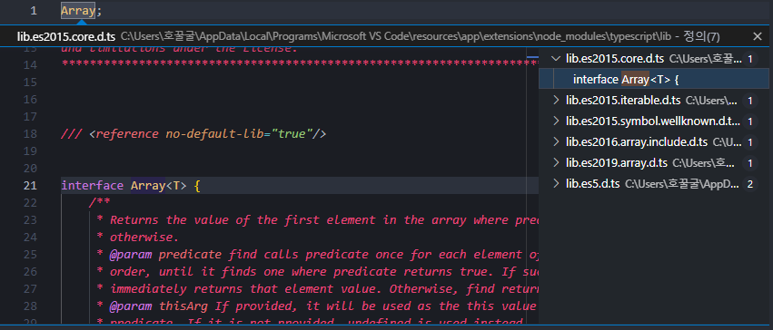

---

# Exception Handling

`Exception Handling`는 프로그래밍에서 필수적으로 처리해야 한다. 어플리케이션을 사용하다보면 예상하지 못한 오류가 발생하거나 메모리에 문제가 있는 등 심각한 상황이 발생하여 어플리케이션이 죽는 경우가 있다. Exeption은 `예상하지 못한 Error`를 의미한다. 이러한 Exception을 사용자가 사용하게 둘 것이 아니라 Exception을 잘 처리하고 Handling하는 것이 중요하다. Exception을 잘 처리하면 `안정성`도 높아질 뿐만 아니라 `유지보수성`도 높아진다. 최대한 어플리케이션 내부에서 해결해야 하며, 만약 문제가 발생한다면 사용자에게 알려주는 역할을 해야 한다.

어플리케이션 내부에서 코딩할 때, 예상할 수 있는 것을 `Error State`라고 한다. 많은 사람들이 에상할 수 있는 Error임에도 불구하고 Exception으로 간주해서 처리하지 않거나 잘못 처리하는 경우가 있다. 우리가 예상할 수 있는 혹은 예상되어지는 Error state인지, 혹은 예상하지 못한 Error Exception인지 구분해서 사용할 필요가 있다. Error는 우리가 예상할 수 있는 어플리케이션 내부에서 발생할 수 있는 Error 케이스를 의미한다. Exception은 전혀 예상하지 못하는 상태를 말한다. 이제 예상되는 Error와 예상하지 못한 Exception을 어떻게 처리할 수 있는지 알아보자.

## Exception Handling - Error

다른 프로그래밍 언어에서는 exception이라는 클래스 오브젝트가 있다. 하지만 자바스크립트나 타입스크립트에서는 `Error`라는 클래스가 있다.

에러가 발생하는 예시를 확인해보자. array를 수용할 수 없을 정도로 커다란 범위의 배열로 만들어보자. 생성할 수 있는 배열의 개수보다 많이 생성하게 되면 Error는 발생시키지 않고 경고메시지가 나온다.

```ts
const array = new Array(10000000000000000000);
```

> 절댓값이 2^53보다 크거나 같은 숫자 리터럴은 너무 커서 정수로 정확하게 표시할 수 없습니다.

이를 실행해보면 Error가 발생하는 것을 확인할 수 있다. RangeError는 Errror 클래스를 상속한 조금 더 세부적인 Error클래스이다. Error를 확인해보면 유효하지 않은 배열의 개수를 사용한다고 에러를 송출했다. 이처럼 전혀 예상하지 못한 이슈가 발생했을 때, 사용할 수 있는 것이 Error다.

> RangeError: Invalid array length

우리가 기존에 만들었던 game.ts를 확인해보자. Switch문에서도 Error를 사용한 걸 확인할 수 있다. move라는 함수를 호출할 때 전달될 수 있는 모든 union타입에 대해서 각각의 case별로 처리하고 case를 제대로 처리하지 않으면 Error를 발생시킨다. 만약 이 함수를 쓰는 개발자들이 새로운 타입을 추가하면 어떻게 될까?

```ts
function move(direction: Direction) {
  switch (direction) {
    case "up":
      position.y = position.y + 1;
      break;
    case "down":
      position.y = position.y - 1;
      break;
    case "left":
      position.x = position.x - 1;
      break;
    case "right":
      position.x = position.x + 1;
      break;
    default:
      throw new Error("Unknown command");
  }
}
```

새로운 타입 front가 추가되었다. 이 case를 제대로 handling하지 않으면 Error가 발생한다. API를 사용하는 사람들에게 이렇게 사용하는 것은 잘못된 것임을 알려주는 Error를 던질 수 있다. 하지만 이런 경우 실시간으로 Error가 나오는 것보다는 `컴파일 단게에서 Error를 발생`시켜 알리는 것이 좋다. 개발자가 front를 추가했다면 컴파일을 돌릴 때, Error가 발생해서 컴파일 시간 때 수정할 수 있도록 해야 한다. front를 추가했지만 컴파일에서는 아무런 경고를 발생시키고 있지 않다. 이럴 때 사용할 수 있는 방법이 있다.

```ts
type Direction = "up" | "down" | "left" | "right" | "front";

let position = { x: 0, y: 0 };

function move(direction: Direction) {
  switch (direction) {
    case "up":
      position.y = position.y + 1;
      break;
    case "down":
      position.y = position.y - 1;
      break;
    case "left":
      position.x = position.x - 1;
      break;
    case "right":
      position.x = position.x + 1;
      break;
    default:
      throw new Error("Unknown command");
  }
}
```

const invalid라는 변수에 반환하지 못하는 never 타입을 지정해준다. 그리고 invalid에 direction을 할당한다. invalid를 사용하지 않았기 때문에 에러를 발생시킨다. Error문에 invalid를 사용하면 기존의 에러가 사라지고 다른 에러를 발생시킨다.

> string 형식은 never 형식에 할당할 수 없습니다.

case에 들어오지 않고 default로 들어와지는 것은 front밖에 없다. string 타입인 front는 never에 할당될 수 없다. 따라서 invalid가 에러를 발생시키고 있는 것이다. 이 방식으로 사용자에게 컴파일할 때 에러를 알려줄 수 있다.

```ts
function move(direction: Direction) {
  switch (direction) {
    case "up":
      position.y = position.y + 1;
      break;
    case "down":
      position.y = position.y - 1;
      break;
    case "left":
      position.x = position.x - 1;
      break;
    case "right":
      position.x = position.x + 1;
      break;
    default:
      const invalid: never = direction;
      throw new Error(`Unknown command ${invalid}`);
  }
}
```

이제 case에 front를 추가해보자. 더이상 컴파일 에러를 발생시키지 않는다. 타입스크립트 컴파일러가 모든 case가 다 되며 default에 올 수 있는 값은 never밖에 없음을 확인한 덕분이다. direction에 있던 모든 case를 다 다뤘으므로 never가 된다. never는 never에 할당되고 Error를 발생시킨다.

```ts
function move(direction: Direction) {
  switch (direction) {
    case "up":
      position.y = position.y + 1;
      break;
    case "down":
      position.y = position.y - 1;
      break;
    case "left":
      position.x = position.x - 1;
      break;
    case "right":
      position.x = position.x + 1;
      break;
    case "front":
      console.log("front");
      break;
    default:
      const invalid: never = direction;
      throw new Error(`Unknown command ${invalid}`);
  }
}
```

---

## Error Handling - try, catch, finally

Error Handling 혹은 다른 프로그래밍 언어에서는 Exception이라고 많이 사용한다. 이 Error handling은 3가지 단계로 나눠진다. 에러가 발생할 수 있는 부분을 `시도(try)`하고 에러가 발생한다면 `잡아(catch)`내고 에러 발생유무와 관계없이 `마무리 단계로 finally`를 이용한다. 정말 심각한 오류라면 어플리케이션이 죽겠지만 메모리에 문제가 있거나 복구할 수 없는 심각한 문제의 경우, 어느 정도 처리할 수 있다면 try와 catch를 이용해 에러를 잡아내고 조금 더 의미있는 에러메시지를 사용자에게 보여준다던지 복구하기 위한 노력을 할 수 있다. 이를 데모로 확인해보자.

파일을 읽을 수 있는 함수가 있다. 파일의 이름을 전달해주면 파일을 읽어서 파일의 내용을 문자열 형태로 전달해주는 함수이다. 여기서 이 전달된 파일이 존재하지 않으면 읽을 수 없다. 파일의 이름이 존재하지 않는다면 파일이 있는지 없는지 확인하고 불러야 된다는 `Error`를 던져줘야 한다. 그래서 파일이름이 잘못되었다는 것을 이해할 수 있다. 파일이 존재하지 않을 때는 에러를 던지고, 파일이 있을 때만 컨텐츠를 전달해준다.

```ts
function readFile(fileName: string): string {
  if (fileName === "존재하지 않는 파일이름") {
    throw new Error(`해당 이름의 파일이 존재하지 않습니다. ${fileName}`);
  }
  return `파일 내용`;
}
```

파일을 읽으면 항상 닫아야 하는 함수가 있다. 프로그래밍 언어에서는 통상적으로 열면 닫아야 되는게 정해져 있다. 그래서 여기에서도 동일하게 파일이름을 전달하면 이 파일을 닫을 수 있는 아무것도 하지 않는 함수가 있다.

```ts
function closeFile(fileName: string) {}
```

이제 이 함수를 사용해보자. 정상적으로 출력된 것을 확인할 수 있다. 이제 존재하지 않는 파일이름을 입력해보자.

```ts
const file = "Cotton";
console.log(readFile(file));
closeFile(file);
```

어플리케이션이 죽으면서 우리가 작성한 에러문이 호출된다. 그리고 에러가 어디서 발생했는지 정확한 위치정보와 함께 콜스택도 보여준다.

> Error: 해당 이름의 파일이 존재하지 않습니다. 존재하지 않는 파일이름
> (D:\Coding\GitCotton0\Lecture\TypeScript\8-exception\8-1-exception.ts:15:13)

```ts
const notExist = "존재하지 않는 파일이름";
console.log(readFile(notExist));
closeFile(notExist);
```

이처럼 예상하지 못한 에러가 발생할 수 있는 함수를 사용할 때는 에러가 발생할 수 있는 정확한 부분에 `try`를 이용해서 감싸주면 된다. 그래서 한번 `시도(try)`했다가 문제가 생기면 에러를 `잡게(catch)`한다. catch의 인자의 이름은 주로 e 혹은 error라고 쓰기도 한다. 그래서 try 했다가 에러가 발생하면 catch 문으로 들어오게 된다. catch문에는 에러를 확인했다는 문구를 콘솔에 출력하도록 만든다.

다시 실행시켜보면 어플리케이션이 죽지 않는 것을 확인할 수 있다. catch문에서 작성한 '에러 확인'이라는 문구는 확실하게 출력됐지만 어플리케이션은 죽지 않는다. 왜냐하면 발생한 에러를 우리가 잡아냈기 때문에다. 파일을 읽으려고 했지만 읽지 못했다면 catch를 이용해서 에러를 잡은 다음에 dialog를 보여줄 수 있고 적절한 뒷처리를 할 수 있다.

```ts
const notExist = "존재하지 않는 파일이름";
try {
  console.log(readFile(notExist));
} catch (error) {
  console.log("에러 확인");
}
closeFile(notExist);
```

마지막으로 `finally`가 있다. 파일을 읽었다면 꼭 닫아줘야 하는 것이 있다. 바로 closeFile이다. 이는 finally에서 실행하는 것이 좋다. try가 성공하든 실패하든 혹은 catch가 호출되든 호출되지 않든 `finally`는 무조건 항상 호출하게 되어 있다. 그래서 문제가 발생할 때도 finally가 호출되고 문제가 없을 때도 finally는 호출된다.

```ts
try {
  console.log(readFile(notExist));
} catch (error) {
  console.log("에러 확인");
} finally {
  closeFile(notExist);
  console.log("finally 출력");
}
```

내가 무언가 시도하고 항상 여기에 성공하든 실패하든지에 상관없이 무언가를 반드시 수행해야 한다면 finally를 사용하는 것이 좋다. 우리가 catch밑에 closeFile을 실행시키면 되지 않을까 생각할 수 있다. 하지만 catch 내부에서 무슨 일이 발생할지 알 수 없다.

run이라는 함수가 있다. 기존에 있던 것에서 finally문을 제거하고 closeFile함수를 실행시켜보자. 그리고 콘솔에 닫힘을 알리는 로그를 출력한다. 내부에서 아무런 문제가 없어서 정상적으로 닫아지고 log가 출력된다.

```ts
function run() {
  const fileName = "존재하지 않는 파일이름";
  try {
    console.log(readFile(notExist));
  } catch (error) {
    console.log("에러 확인");
  }
  closeFile(fileName);
  console.log("닫기");
}
run();
```

만약 catch안에서 에러가 발생하여 더이상 밑의 코드를 실행할 필요없이 리턴시킨다면 어떻게 될까? catch문만 실행되고 밑에 파일닫기는 실행되지 않는다. 이처럼 catch 안에서 무언가 처리할 때 다른 에러가 발생하거나 반환되는 경우 파일을 닫을 수 없게 된다. 그래서 try하는 것과 항상 마지막에 마무리 해야되는 것이 있다면 `finally`안에서 하는 것이 좋다.

```ts
function run() {
  const fileName = "존재하지 않는 파일이름";
  try {
    console.log(readFile(notExist));
  } catch (error) {
    console.log("에러 확인");
    return;
  }
  closeFile(fileName);
  console.log("닫기");
}
run();
```

finally에 파일 닫기에 대한 내용을 추가해보자. catch가 반환되었음에도 불구하고 finally는 호출됨을 확인할 수 있다. 이처럼 이 finally 안에 있는 코드는 에러가 발생하여 catch가 되어도 `항상 실행한다`는 것을 보장한다.

```ts
function run() {
  const fileName = "존재하지 않는 파일이름";
  try {
    console.log(readFile(notExist));
  } catch (error) {
    console.log("에러 확인");
    return;
  } finally {
    closeFile(fileName);
    console.log("닫기");
  }
}
run();
```

try 안에서는 여러 코드를 작성하는 것보다는 정말 에러가 발생하는 부분만 try로 감싸서 catch하고 finally하는 것이 좋다.

---

## Error Handling

새로운 class를 만들어보자. NetworkClient라는 클래스이다. 이는 tryConnect를 이용해 네트워크에 연결해준다. 만약 네트워크가 불안정하다면 에러를 던진다.

```ts
class NetworkClient {
  tryConnect(): void {
    throw new Error("네트워크 연결이 끊어졌습니다.");
  }
}
```

그리고 또 다른 클래스인 UserService가 있다. 클라이언트를 받아와서 필요한 것을 외부에서 받아오는 compostion dependency injection이다. 내부에서만 변경될 수 있도록 private로 설정한다. 그리고 클라이언트를 받아와서 로그인할 수 있는 함수가 있다. this.client의 tryConnect로 서버에 연결한 다음 로그인하는 로직들이 있다.

```ts
class UserService {
  constructor(private client: NetworkClient) {}
  login() {
    this.client.tryConnect();
    //login...
  }
}
```

이 class들을 사용해보자. NetworkClient를 먼저 만들고 UserService를 만든다. new UserService에는 미리 만든 client를 전달해준다. 이제 service를 이용해서 login을 호출할 수 있다.

실행을 해보면 에러가 발생한 것을 확인할 수 있다.

> Error: 네트워크 연결이 끊어졌습니다.

```ts
const client = new NetworkClient();
const service = new UserService(client);
service.login();
```

다른 예시도 확인해보자. App이라는 클래스가 있다. 이 클래스 안에는 run이 있다. 이 App안에는 생성자로 UserService를 받아온다. run 함수 안에는 UserService에 로그인을 한번 한다. 즉 App이 시작하면 자동으로 로그인하는 구조이다.

```ts
class App {
  constructor(private userService: UserService) {}
  run() {
    this.userService.login();
  }
}
```

이제 App을 실행해보자. service를 app에 전달하고 app을 실행시킨다. 동일하게 에러가 발생하는 것을 확인할 수 있다. 이번엔 에러가 발생한 부분을 자세히 확인해보자.

```ts
const client = new NetworkClient();
const service = new UserService(client);
const app = new App(service);
app.run();
```

> at NetworkClient.tryConnect (D:\Coding\GitCotton0\Lecture\TypeScript\8-exception\8-2-handling.ts:3:11)<br/>at UserService.login (D:\Coding\GitCotton0\Lecture\TypeScript\8-exception\8-2-handling.ts:10:17)<br/>at App.run (D:\Coding\GitCotton0\Lecture\TypeScript\8-exception\8-2-handling.ts:22:22)

NetworkClient의 tryConnect라는 함수에서 에러가 발생했다. 그리고 이 함수를 부른 것은 UserService.login이다. 그리고 App에 있는 run이라는 함수에서 UserService.login을 불렀다. 이렇게 다용한 곳에서 아용하다가 에러가 발생한다. 이 경우, 어디에서 try, catch를 사용하는 것이 좋고 어느 부분에서 handling해야할까?

한 번 UserService에 try, catch를 사용해보자. 실행을 해보면 에러가 잡혔고 어플리케이션이 죽지 않았다. 하지만 잡은 에러로 의미있게 할 수 있는 일은 없다. App은 login을 호출했지만 아무것도 받지 못하게 된다.

```ts
class UserService {
  constructor(private client: NetworkClient) {}
  login() {
    try {
      this.client.tryConnect();
    } catch (error) {
      console.log("에러 확인");
    }
    //login...
  }
}
```

에러가 발생했을 때, 정확하게 처리할 수 있는 것이 아니라면 `catch를 하지 않는 것이 낫다.` 그래서 이것을 처리할 수 있는 곳에서 try하는 것이 훨씬 좋다. App에서 try, catch를 이용해보자.

try 즉 로그인을 하고 무언가 에러가 발생했다면 여기에서 조금 더 의미있는 일을 할 수 있다. 에러에 대한 내용을 출력해줄 수 있게 된다.

```ts
class App {
  constructor(private userService: UserService) {}
  run() {
    try {
      this.userService.login();
    } catch (error) {
      // 유저에게 에러 사항을 출력한다.
      console.log("에러 확인");
    }
  }
}
```

예상하지 못한 에러가 발생한다면 try catch Handling을 할 때, 여기서 처리하는 것이 과연 `의미있는 처리`인가를 생각해야 한다. 가장 확실하게 처리할 수 있는 곳에서 `catch`를 사용해야 한다.

---

## Error Handling - Error State

언제 Error를 사용해야 하고 언제 Error State를 사용해야 할까? 만약 tryConnect에 발생할 수 있는 에러의 종류가 많다고 생각해보자. class로 TimeoutError에러와 OfflineError가 있다. 그래서 네트워크 클라이언트가 커넥션을 시도할 때 타임아웃이 될 수도 있고 오프라인이 될 수도 있다.

```ts
class TimeoutError extends Error {}
class OfflineError extends Error {}
```

그래서 조금 더 세부적인 상속된 클래스를 만들어서 에러가 난 종류에 맞게 세부적인 클래스를 던져본다 생각하자. 하지만 아쉬운 문제점은 try catch에 전달되는 에러는 어떠한 타입정보다 전달되지 않는다.

```ts
class NetworkClient {
  tryConnect(): void {
    throw new OfflineError("네트워크 연결이 끊어졌습니다.");
  }
}
```

그래서 try, catch문에서 `instanceof`라는 키워드를 사용하고 싶어도 사용할 수 없다. catch로 에러를 받는 순간 any type이 되기 때문에 타입에 대한 정보가 완전히 사라지기 때문이다. 따라서 Error는 예상하지 못한 곳에서 에러가 발생할 때 사용하는 것이 좋다.

```ts
class App {
  constructor(private userService: UserService) {}
  run() {
    try {
      this.userService.login();
    } catch (error) {
      if (error instanceof OfflineError) {
        // 사용불가!
      }
    }
  }
}
```

이렇게 세부적인 Error를 결정하고 싶을때는 `ErrorState`를 사용하는 것이 좋다. 네트워크 에러가 발생할 수 있는 것은 코드를 작성할 때 예상할 수 있는 state다. 실패한다면 어떻게 실패할 수 있을지 예상할 수 있다. 그래서 예상하지 못하게 throw를 남발해선 안된다. tryConnect가 실행된 후에는 어떤 상태가 되는지 ResultState를 반환하게 만들어보자.

ResultState는 union 타입이다. 성공할 수도 있고 실패할 수도 있다. 실패할 경우에는 NetworkErrorState가 있으며 성공하는 경우 SuccessState가 있다. result에는 각각 성공과 실패를 구분짓는 `Discriminated union`을 이용한다. 실패했다면 왜 실패했는지 reason을 세부적으로 작성한다. 나중에 이 에러들을 Handling할 때 적절한 에러메시지를 사용자에게 보여준다면 적절한 대처를 할 수 있을 것이다.

```ts
type NetworkErrorState = {
  result: "fail";
  reason: "offline" | "down" | "timeout";
};
type SuccessState = {
  result: "success";
};
type ResultState = SuccessState | NetworkErrorState;
class NetworkClient {
  tryConnect(): ResultState {}
}
```

---

# Advanced Types

모든 프로그래밍 언어에는 타입이 있지만, 이 중에서 타입스크립트는 정말 유연하고 강력한 타입을 가지고 있다. Coditional Types라는 조건부 타입이 있으며 Mapped Types라는 다른 언어에서 찾아보기 힘든 구조적인 타입이 있다. 이 외에도 다양한 Utility Types가 있다. 타입스크립트의 다양한 타입들을 사용해보자.

---

## Type Alias ve Interface - 기술 측면

type과 interface는 성격과 특징이 다르다. 많은 곳에서 type과 interface를 교체해서 사용할 수 있지만, interface를 남용하는 것보다는 정확하게 type과 interface가 어떻게 다른지 알고 사용하는 것이 좋다. 먼저 type과 interface가 `기술 측면`에서 어떤 공통점과 차이점이 있는지 알아보자.

서로 동일한 것을 묘사하는 type과 interface가 있다. 다양한 예시를 통해 확인해보자.

```ts
type PositionType = {
  x: number;
  y: number;
};

interface PositionInterface {
  x: number;
  y: number;
}
```

타입과 인터페이스 모두 동일하게 `오브젝트 형태`로 만들 수 있다.

```ts
const obj1: PositionType = {
  x: 1,
  y: 1,
};
const obj2: PositionInterface = {
  x: 1,
  y: 1,
};
```

타입과 인터페이스 모두 동일하게 `클래스`로 구현 가능하다.

```ts
class pos1 implements PositionType {
  x: number;
  y: number;
}
class pos2 implements PositionInterface {
  x: number;
  y: number;
}
```

`extends(확장)`도 가능하다. interface는 기존의 Position을 이용해서 기존의 인터페이스를 확장시킬 수 있다. 타입도 마찬가지로 가능하다. 인터섹션을 이용해서 추가된 아이를 함께 묶을 수 있다. 타입스크립트 초창기에는 타입을 이용한 확장은 불가능했다. 타입을 이용해서 할 수 없는 것들이 많았지만 지금은 많은 기능을 할 수 있게되었다.

```ts
interface ZPositionInterface extends PositionInterface {
  z: number;
}

type ZPositionType = PositionType & { z: number };
```

`merge`는 오직 인터페이스만 가능하다. 중복된 인터페이스를 호출하여 새로운 값을 추가할 수 있다.

```ts
interface PositionInterface {
  x: number;
  y: number;
}

interface PositionInterface {
  z: number;
}

class pos2 implements PositionInterface {
  x: number;
  y: number;
  z: number;
}

const obj2: PositionInterface = {
  x: 1,
  y: 1,
  z: 1,
};
```

타입만 가능한 것도 있다. NumberType과 같은 새로운 타입을 만든다거나 Union 타입을 만들 수 있다. 그리고 유틸리티나 맵타입 혹인 인덱스 타입도 이용 가능하다. 즉, `computed properties`를 다룰 수 있다.

```ts
type Person = {
  name: string;
  age: string;
};
type Name = Person["name"];

type NumberType = number;
type Direction = "left" | "right";
```

---

## Type Alias ve Interface - 개념 측면

타입과 인터페이스의 정의부터 다시 한 번 짚어보자.

`interface`는 어떤 것의 `규격 사항`이다. 다른 사람들과 의사소통할 때 오브젝트와 오브젝트 간의 의사소통을 할 때, 이 정해진 interface를 토대로 해서 서로 간의 `상호작용`을 할 수 있도록 도와주는 것이다. 그래서 API는 서로간의 약속을 할 수 있는 계약서와 동일하다. CoffeeMaker라는 인터페이스가 있다. 그리고 그 안에는 makeCoffee라는 함수가 있다. 구현하는 사람들이 interface를 구현함으로써 동일한 규격 사항을 따라간다. 최신 타입스크립트 버전에서는 type도 동일하게 구현할 수 있지만 interface를 활용하는 것이 좋다. `어떤 특정한 규격을 정의`하는 것이라면 이 규격을 통해서 어떤 것이 구현된다면 interface를 쓰는 것이 정확하다. 누군가 구현을 해야 한다면 정의해서 사용하는 것이 좋다. 다른 프로그래밍 언어에서도 interface는 이러한 용도로 이용된다.

```ts
interface CoffeeMaker {
  coffeeBeans: number;
  makeCoffee: (shots: number) => Coffee;
}

class CoffeeMaker implements CoffeeMaker {
  coffeeBeans: number;
  maekCoffee(shots: number) {
    return {};
  }
}
```

반대로 type은 어떠한 데이터를 담을 수 있을지 데이터의 타입을 결정하는 것이다. 어떠한 것을 구현할 목적으로 만드는 것이 아니라 `데이터를 담을 목적`을 만들 때 사용한다. 만약 type 구현할 것을 interface를 사용한다면 어떤 클래스가 있을 거라고 착각할 수 있다.

```ts
type Position = {
  x: number;
  y: number;
};
const pos: Position = { x: 0, y: 0 };
printPosition(pos);
```

초창기에는 Type Alias가 할 수 있는 것이 많이 없었다. 그래서 많은 사람들이 interface를 사용했었다. 지금은 점점 Type Alias가 강력해지자 type과 interface를 구분지어 사용하는 것이 중요해졌다. interface는 규격사항이다. 그리고 많은 프로그래밍 언어에서도 이런 식으로 interface를 활용한다.

---

# Utilty Type

타입스크립트에서는 일반적인 프로그래밍 언어에서는 찾을 수 없는 타입을 변환하는 것이 가능하다. 예를 들어 별모양 타입을 일부분을 타입으로 변환하는 것도 가능하다. 다른 종류의 타입으로 `transfrom(변환)`하는 것이 가능하기 때문이다. 이를 잘 사용하면 굉장히 유용하다.


---

## index type

index type을 이해하기 위해서는 기본적인 이해가 필요하다. obj에 name이라는 key가 있다. 이때 key값에 접근하기 위해 어떤 방법을 사용할 수 있을까? 총 두 가지 방법이 있다. obj의 key값으로 접근하는 방법이 있고, index에 접근하는 방법이 있다. 이것처럼 타입도 index 기반으로 해서 타입을 결정할 수 있다.

```ts
const obj = {
  name: "cotton",
};

obj.name;
obj["name"];
```

Animal이라는 타입이 있다. 이름과 나이, 성별을 담을 수 있다. 그리고 타입 Name에 Animal에 있는 키 값을 그대로 사용할 것이다. 이러면 Name은 string 타입이 된다. 동물에 있는 name(string)이라는 `키의 타입`을 Name 타입에 선언한 것이다.그래서 Name 타입에는 오직 문자열만 할당할 수 있게 된다.

이를 활용하면 다른 방식으로도 사용할 수 있다. Gender라는 타입이 있다. 동일하게 Animal 안에 있는 gender 키 값의 타입을 할당할 것이다. Keys는 `keyof`를 이용해 Animal에 있는 모든 키의 타입을 할당받는다. 그래서 name, age, gender라는 문자열 union 타입으로 할당된다. 데이터를 할당할 때, 다른 문자열은 사용할 수 없고 오직 3가지만 사용할 수 있다.

```ts
  type Animal = {
    name:string;
    age:number;
    gender:"male" | "female";
  }

  type Name = Animal["name"] // string
  const text:Name = "only string!"

  type Keys = keyof Animal; // "name" | "age" | "gender"
  const key: Keys = "gender";
}
```

Person이라는 타입이 있다. 이름과 성별을 받는다. 근데 성별은 Animal에 있는 gender를 그대로 할당하여 사용한다. person은 Person 타입을 갖는다. 그래서 name과 gender를 꼭 적어야 한다. gender 작성 시, 힌트로 Animal에 있던 male과 female이 나오는 걸 확인할 수 있다.

```ts
type Person = {
  name: string;
  gender: Animal["gender"];
};
const person: Person = {
  name: "cotton",
  gender: "female",
};
```

Index Type을 이용하면 다른 타입에 있는 키에 접근해서 그 키의 value의 타입을 그대로 다시 선언할 수 있다.

---

## Mapped Type

기존에 있는 타입들을 이용하면서 조금 다른 형태로 변환할 수 있는 것을 의미한다. Mapped Type은 왜 이용하는지 알아보자.

Video라는 타입이 있다. Video에는 title과 author에 대한 정보가 있다. 만약 Video지만 title과 author를 옵셔널로 받는 타입을 만들고 싶다면 어떻게 해야할까? 새로운 Video 타입을 만들어 옵셔널을 줄 수 있을 것이다. 또 읽기만 가능한 타입을 새로 만들고 싶다. 그러면 readonly를 사용하는 새로운 타입을 만들 수 있을 것이다.

하지만 Video에서 변경사항이 일어나면 VideoOptional과 VideoReadOnly를 똑같이 다시 변경해주어야 한다. 일일히 수정하는 것은 너무 번거롭다. 이를 간편하게 하고 재사용성을 높이기 위해 `Mapped Type`을 사용한다.

```ts
type Video = {
  title: string;
  author: string;
};
type VideoOptional = {
  title?: string;
  author?: string;
};
type VideoReadOnly = {
  readonly title: string;
  readonly author: string;
};
```

배열에서 숫자 배열이 있다면 map이라는 API를 활용하여 각각의 아이템을 다른 것으로 변환하는 것이 가능했다. 아이템 두개를 곱하면 각각 1과 4가 출력된다. 그리고 나온 값을 배열 형태로 다시 만들어준다. 이것과 마찬가지로 Mapped Type을 활용하면 `기존의 타입을 다양한 형태로 변환`할 수 있다.

```ts
[1, 2].map((item) => itme * item);
```

`[]`를 이용하면 키를 하나씩 돌 수 있다. 이는 `for ...in`을 썼을 때와 동일하다. for ...in는 오브젝트에 있는 모든 키들을 하나하니씩 도는 연산자이다. 타입 오브젝트 정의 안에서 인덱스 기호를 사용하면 for ...in처럼 키를 돌 수 있다.

P라는 것은 T 타입의 모든 키들 중 하나이다. 그래서 T가 가지고 있는 키들 중에 들어있는 하나의 P라는 키는 T 오브젝트 안에 있는 키를 이용해서 value를 정의할 수 있다. 그래서 이 Optional은 기존에 있는 T 오브젝트 타입의 모든 키들을 돌면서 T 타입의 키 값의 타입을 다시 정의한다.

```ts
type Optional<T> = {
  [P in keyof T]: T[P]; //for ...in
};
```

T 타입과 똑같지만 Optional 기호를 주게 되면 우리가 앞서 만들었던 VideoOptional을 간단하게 만들 수 있다. VideoOptional이라는 타입을 만들어보자. 우리가 정의한 Optional을 이용하여 만든다. Video에 Optional 타입을 만드는 것이다. 그러면 이 Optional에 전달된 Video는 Video를 계속 돈다. 먼저 title을 optional로 만들고 value의 타입을 string으로 지정한다. 그리고 author도 똑같이 반복해준다. 이를 이용하면 VideoOptional이라는 오브젝트 타입을 따르는 객체들을 쉽게 만들 수 있다. 단 optional로 설정했기에 있을 수 있고 없을 수 있지만 Video 타입에 없던 다른 종류의 타입을 넣게 되면 에러가 발생한다. 이처럼 Mapped Type을 이용하면 재사용성이 높아진다.

```ts
type Optional<T> = {
  [P in keyof T]?: T[P]; //for ...in
};

type VideoOptional = Optional<Video>;
const videoOp: VideoOptional = {
  title: "hi",
};
```

한 번 정의해둔 Optional은 이곳저곳에서 사용할 수 있다. 새로운 Animal이라는 타입을 만들어보자. name과 age를 받는다. 우리가 Video를 활용했던 것처럼 똑같이 활용할 수 있다.

이렇게 타입 오브젝트 정의 안에서 배열과 같은 기호를 사용하면 key를 빙글빙글 반복하게 된다. 그래서 T 타입에 있는 모든 키들이 순차적으로 P에 할당된다. P키는 Optional이고 P값의 타입을 맵핑해서 만들 수 있다.

```ts
type Animal = {
  name: string;
  age: number;
};
const animal: Optional<Animal> = {
  name: "dog",
};
```

이걸 이용해서 VideoReadOnly도 구현해보자. videoRo에 있는 값을 바꾸려고 하면 에러가 발생할 것이다. 이처럼 Mapped Type을 이용하면 기존의 타입에서 다른 타입으로 성질변화를 할 수 있다.

```ts
type ReadOnly<T> = {
  readonly [P in keyof T]: T[P];
};

type VideoReadOnly = Readonly<Video>;
const videoRo: VideoReadOnly = {
  title: "mapping",
  author: "cotton",
};

const video: ReadOnly<Video> = {
  title: "mapping",
  author: "cotton",
};
```

Mapped type에는 union도 활용할 수 있다. Nullable 타입은 이제 null값도 받을 수 있다. 그래서 오브젝트를 생성하면 string 타입만 넣는 것이 아니라 null도 지정할 수 있다.

```ts
type Nullabe<T> = { [P in keyof T]: T[P] | null };
const obj2: Nullabe<Video> = {
  title: "Hi",
  author: null,
};
```

Proxify라는 타입은 전달된 오브젝트를 돌면서 타입을 Proxy라는 타입으로 한 단계 감싸준다.

```ts
type Proxy<T> = {
  get(): T;
  set(value: T): void;
};
type Proxify<T> = {
  [P in keyof T]: Proxy<T[P]>;
};
```

---

## Condition Type

자바스크립트를 사용하면서 삼항연산자를 이용해보았을 것이다. Condition Type은 삼항연산자와 매우 유사하다. Check라는 타입이 있다. 기존에 주어진 타입이 string을 상속한다면 boolean 타입이 되고 아니라면 number 타입이 된다. Type은 Check 타입을 이용해서 string을 전달한다. T로 받아온 타입은 string이기 때문에 Type은 boolean 타입이 된다. 이처럼 조건이 맞으면 어떤 타입을 선택하도록 만들 수도 있다.

```ts
type Check<T> = T extends string ? boolean : number;
type Type = Check<string>; // boolean
```

Codition Type은 여러개로 묶어서 사용할 수도 있다. 전달된 타입이 string을 상속하면 string을 number를 상속하면 number를 사용하는 여러개로 중첩된 ternary operator다. Condition type은 이처럼 `타입을 조건적으로 결정할 수 있는 타입`이다.

```ts
type TypeName<T> = T extends string
  ? "string"
  : T extends number
  ? "number"
  : T extends boolean
  ? "boolean"
  : T extends undefined
  ? "undefined"
  : T extends Function
  ? "function"
  : "object";

type T0 = TypeName<string>;
type T1 = TypeName<"a">;
type T2 = TypeName<() => void>;
```

---

## Utility Type - Reaonly

앞서 만든 Optional, ReadOnly와 같은 타입들은 이미 타입스크립트에서 `utility type`이라해서 만들어져있다. 일일이 만들 필요없이 개발자가 공통적으로 필요한 타입들이 미리 정의되어 있다. 이를 잘 사용하기만 하면된다.

```ts
type Partial<T> = {
  [P in keyof T]?: T[P];
};

type Readonly<T> = {
  readonly [P in keyof T]: T[P];
};
// ...
```

ToDo라는 타입이 있다. 이를 `읽기전용`으로 만들어 불변성을 보장하고 싶다. 그리고 display라는 함수를 이용해서 매개변수를 호출하고 싶다. 우리는 타입스크립트가 이미 만들어준 utility type인 `Readonly`를 꺼내 사용하기만 하면 된다. 이제 display 함수 안에서 ToDo의 값을 변경하려고 하면 Error가 발생하는 것을 확인할 수 있다.

```ts
type ToDo = {
  title: string;
  description: string;
};
function display(todo: Readonly<ToDo>) {
  todo.title = ""; // ERROR! 읽기 전용 속성이므로 'title'에 할당할 수 없습니다.
}
```

---

## Utility Type - Partial

이제 Readonly 뿐만 아니라 다양한 utility type들을 알아가보자. Partial은 이미 구현해봤다. 우리가 구현한 Optional이 바로 Partial이다. Partial은 기존의 타입 중에서 `부분적인 것만 허용하고 싶을 때` 이용할 수 있다. ToDo에 좀 더 다양한 프로퍼티를 추가해보자.

```ts
type ToDo = {
  title: string;
  description: string;
  label: string;
  priority: "high" | "low";
};
```

이제 ToDo의 내용을 업데이트할 수 있는 함수를 만들 것이다. updateTodo는 ToDo의 타입을 받아와 다른 내용으로 업데이트할 수 있다. 이때 `Partial`을 굉장히 유용하게 사용할 수 있다. fieldsToUpdate는 업데이트 하려는 내용을 받아와 변경시켜준다. 이제 엉뚱한 key와 value는 전달할 수 없고 ToDo 타입에 있는 것들 중에 부분적인 아이들만 받아올 수 있다. 새로 업데이트 되면 새로운 ToDo를 반환한다. 기존에 있는 todo 아이템을 스프레드 연산자를 이용해서 하나씩 복사한 후, 전달된 fieldsToUpdate를 덮어씌워주면 된다.

```ts
function updateTodo(todo: ToDo, fieldsToUpdate: Partial<ToDo>): ToDo {
  return { ...todo, ...fieldsToUpdate };
}
```

이제 이 함수를 사용해보자. 새로 todo라는 데이터를 생성해보자. todo는 ToDo 타입을 받는다. ToDo형식에 맞춰 작성해준다. 그리고 우리가 만든 updateTodo를 이용하여 다른 내용으로 업데이트 해줄 것이다.

```ts
const todo: ToDo = {
  title: "Programming Laguage",
  description: "Learn TypeScript",
  label: "Study",
  priority: "high",
};
```

updateTodo를 이용하여 priority의 값을 변경했다. 그리고 콘솔에 출력해보면 우리가 변경한 값 그대로 출력된 것을 확인할 수 있다. ToDo의 기존 데이터를 유지하면서 priority만 변경되었다.

```ts
const updated = updateTodo(todo, { priority: "low" });
console.log(updated);
```

---

## Utility Type - Pick

`Pick`은 기존의 타입에서 `원하는 속성과 값`들만 뽑아서 만들 수 있다. 예를 들어 Video라는 타입이 있다. Video에는 id, title, url과 같은 메타데이터 정보 뿐만 아니라 실제로 Video에 데이터가 들어있는 타입이다. getVideo라는 함수는 Video를 반환한다. Video의 정보뿐만 아니라 Video의 byte-data도 전부 리턴한다. 굉장히 무거운 API다.

```ts
type Video = {
  id: string;
  title: string;
  url: string;
  data: string;
};
function getVideo(id: string): Video {
  return {
    id,
    title: "video",
    url: "https://..",
    data: "byte-data..",
  };
}
```

반대로 getVideoMetadata는 Video에 관련된 간략한 데이터만 반환하는 타입이다.

```ts
function getVideoMetadata(id: string): Pick<Video, "id" | "title"> {
  return {
    id: id,
    title: "title",
  };
}
```

하지만 랜덤한 곳에서 바로 사용하기보다는 타입을 선언해서 계속 `재사용`할 수 있도록 만드는 것이 좋다. Pick이라는 타입은 기존에 있는 타입에서 원하는 것만 골라서 조금 더 제한적인 타입을 만들고 싶을 때 사용할 수 있다.

```ts
type VideoMetadata = Pick<Video, "id" | "title">;
function getVideoMetadata(id: string): VideoMetadata {
  return {
    id: id,
    title: "title",
  };
}
```

Pick이라는 것은 어떤 타입을 받아온다. K는 T타입에 있는 key들을 상속한 아이들이다. 그래서 항상 Pick을 이용할 때 기존의 Video에 있는 key들 중 하나를 써야한다. 만약 다른 걸 사용한다면 에러가 발생한다. 그래서 선언된 곳에 가보면 K라는 것은 T 타입에 있는 key들 중에 하나를 써야 함을 알 수 있다. 그리고 전달된 key들에 한에서만 돌면서 타입을 결정함을 확인할 수 있다.

```ts
// From T, pick a set of properties whose keys are in the union K

type Pick<T, K extends keyof T> = {
  [P in K]: T[P];
};
```

---

## Utility Type - Omit

`Omit`은 Pick과 반대로 원하는 것을 빼버릴 수 있다.

```ts
type VideoMetadata = Omit<Video, "url" | "data">;

function getVideoMetadata(id: string): VideoMetadata {
  return {
    id: id,
    title: "title",
  };
}
```

타입스크립트에서 정의한 Omit에 대해 알아보자. 전달된 T타입과 어떤 종류의 key를 상속하는 K가 있다. 즉, Omit에 전달되는 key가 Video에 없는 것도 가능하다. key의 유무와는 상관없이 다른 어떤 종류의 key도 전달이 가능하다. Omit은 Pick을 이용하는데, T 타입을 그대로 유지하면서 T에 있는 key들 중 K를 제외한 아이들을 Pick한다.

```ts
//Construct a type with the properties of T except for those in type K.

type Omit<T, K extends keyof any> = Pick<T, Exclude<keyof T, K>>;

type VideoMetadata = Omit<Video, "url" | "data" | "empty">;
```

Exclude를 보면 U가 T 안에 들어있다면, 그 타입은 사용하지 않고 T가 U 안에 없을 때만 T를 이용한다. 그래서 Exclude에 전달된 T에 U가 제외된 아이들을 반환하게 된다.

```ts
// Exclude from T those types that are assignable to U

type Exclude<T, U> = T extends U ? never : T;
```

---

## Utility Type - Record

Pageinfo와 page라는 타입이 있다. 이 둘을 서로 엮을 수 있는 것이 바로 Record type이다.

```ts
type PageInfo = {
  title: string;
};
type Page = "home" | "about" | "contact";
```

자료구조 map을 알고 있다면 Record가 매우 익숙할 것이다. Page를 key로 삼고 PageInfo를 value로 삼으면 된다. Record는 map과 비슷하게 하나와 어떤 하나를 연결하고 싶을 때 혹은 하나를 key로 쓰고 나머지를 다른 타입으로 묻고 싶을 때 유용하게 사용할 수 있다.

```ts
const nav: Record<Page, PageInfo> = {
  home: { title: "Home" },
  about: { title: "About" },
  contact: { title: "Contact" },
};
```

---

# JavaScript

타입스크립트는 자바스크립트를 기반으로 하는 언어이다. 자바스크립트가 어렵다면 타입스크립트도 어려워진다. 조금 어려울 수 있고 헷걸리는 내용들을 다시 확인해보자.

---

## JavaScript - Prototype

자바스크립트도 엄밀히 따지면 객체지향 프로그래밍 언어이다. Prototype을 기반으로 하여 객체지향 프로그래밍을 할 수 있다. ES6부터는 Class를 사용할 수 있게 되었는데, 이 Class가 프로토를 기반으로 한다. 우리가 타입스크립트에서 작성하는 수많은 class와 interface들 모두 컴파일러로 변환하면 `Prototype`으로 변환된다. 그래서 이 자바스크립트에서 Prototype은 근본이라고 볼 수 있다. Prototype은 `상속`을 위해 사용된다. Class를 이용해서 Class를 선언하고 그 Class를 extends해서 상속을 구현할 수 있는 것처럼, 자바스크립트에서는 Prototype을 이용하여 상속을 구현할 수 있다. Prototype은 Class에서 속성과 함수들을 정의한 것과 마찬가지로 `반복적`으로 사용할 수 있도록 속성과 함수를 정의하는 것이다. 즉, Prototype은 `inheritance(상속)`을 위해서 사용되는 언어이다. Prototype을 기반으로 하는 프로그래밍 언어는 객체지향 프로그래밍을 할 수 있는 한 가지의 방식으로 행동과 기존에 있는 오브젝트를 `재사용`할 수 있다.

x와 y라는 오브젝트를 만들어보자. 그리고 콘솔에 x와 y를 각각 출력한다. 아무것도 들어있지 않는 오브젝트이지만 오브젝트를 열어보면 `__proto__: Object`가 들어있는 걸 확인할 수 있다. 프로토는 오브젝트로 자바스크립트에 있는 모든 오브젝트는 프로토를 상속한다.

```js
const x = {};
const y = {};
console.log(x);
console.log(y);
```

그래서 x, y에 별다른 데이터를 작성하지 않았음에도 불구하고 proto 내부에 들어있는 함수를 사용할 수 있다.

```js
console.log(x.toString());
```

x의 proto와 y의 proto는 동일하다. 바로 x와 y는 동일한 오브젝트의 proto를 상속하고 있기 때문이다.

```js
console.log(x.__proto__ === y.__proto__);
```

이번엔 배열을 확인해보자. 빈 배열의 array가 있다. 콘솔에 출력해보면 동일하게 `__proto__: Array(0)`가 내부에 있음을 확인할 수 있다. 그래서 proto에 있는 모든 함수들을 이용할 수 있다. 쭉 내려보면 Array라는 proto는 `__proto__: Object`를 상속한다. 즉, 자바스크립트에 있는 모든 오브젝트는 proto라는 오브젝트를 가지고 있다. 어떠한 종류의 오브젝트인지 상관없이 무조건 toString을 이용할 수 있는 것도 상속하고 있기 때문이다.

```js
const array = [];
console.log(array);
```

타입스크립트의 기능을 이용하여 만들었던 커피머신을 자바스크립트의 proto를 이용하여 간단하게 만들어보자. constructor의 기능을 하는 CoffeeMachine을 만든다. beans를 받아오며 this.beans는 전달받은 beans로 설정된다. 그리고 새로운 오브젝트를 생성한다. 각각의 머신별로 beans의 개수를 다르게 넣어보았다.

CoffeeMachine이라는 생성자 함수를 이용해서 만들어보았다. 기본적으로 오브젝트를 상속하고 있음을 확인할 수 있다. 그리고 beans라는 공통된 프로퍼티가 들어있다.

> CoffeeMachine {beans: 10}<br/>>beans: 10<br/>>>\_\_proto\_\_:<br/>constructor: ƒ CoffeeMachine(beans)<br/>\_\_proto\_\_: Object

```js
function CoffeeMachine(beans) {
  this.beans = beans;
}

const machine1 = new CoffeeMachine(10);
const machine2 = new CoffeeMachine(20);

console.log(machine1);
console.log(machine2);
```

---

이제 makeCoffee라는 함수도 만들어보자. 샷을 인자로 받아 커피를 만들어주는 함수이다. 다시 확인해보면 오브젝트 안에 beans와 makeCoffee 함수가 들어있다. 이런 식으로 생성자 함수 안에 만들게 되면 만들어지는 오브젝트마다 공통된 함수를 갖게 된다. 만들어지는 오브젝트마다 포함되는 것을 instacne member level이라고 부른다.

> CoffeeMachine {beans: 10, makeCoffee: ƒ}<br/>>beans: 10<br/>>>makeCoffee: (shots) => { console.log("커피를 만드는 중입니다.."); }<br/>>>\_\_proto\_\_: Object

```js
function CoffeeMachine(beans) {
  this.beans = beans;
  this.makeCoffee = (shots) => {
    console.log("커피를 만드는 중입니다..");
  };
}
```

하지만 이 makeCoffee를 한 번만 정의하고 싶다면, CoffeeMachine의 prototype에 접근할 수 있다. 그 안에 makeCoffee를 선언한다. 그리고 동일하게 다시 로그를 출력한다. 오브젝트 안에는 더이상 makeCoffee는 없고 \_\_proto\_\_를 열어보면 makeCoffee가 공통적으로 들어있는 것을 확인할 수 있다.

CoffeeMachine은 proto를 가지고 있고 proto는 오브젝트이다. makeCoffee를 가지고 있으며 이 proto는 오브젝트를 상속한다. 즉, 만든 machine1, 2는 CoffeeMachine이라는 프로토를 가지고 상속하고 있다. 결국 CoffeeMachine이라는 것은 오브젝트 proto를 상속하고 있다.

> CoffeeMachine {beans: 10}<br/>>beans: 10<br/>>\_\_proto\_\_:<br/>>>makeCoffee: (shots) => { console.log("커피를 만드는 중입니다.."); }<br/>>>constructor: ƒ CoffeeMachine(beans)<br/>>>\_\_proto\_\_: Object

```js
function CoffeeMachine(beans) {
  this.beans = beans;
}

CoffeeMachine.prototype.makeCoffee = (shots) => {
  console.log("커피를 만드는 중입니다..");
};
```

이번에는 라떼머신을 만들어보자. LatteeMachine은 milk를 인자로 받는다. 타입스크립트와는 달리 타입이 정의되어 있지 않아서 타입에 상관없이 인자를 받아올 수 있다. 새로운 latteMachine을 만들어 출력해보면 결국 이 LatteMachine도 오브젝트 proto를 상속하고 있음을 알 수 있다.

```js
function LatteMachine(milk) {
  this.milk = milk;
}
const latteMachine = new LatteMachine(true);
console.log(latteMachine);
```

이제 이 LatteMachine을 makeCoffee에 상속해보자. 상속하려면 LatteMachine의 prototype에 object.create를 사용하여 CoffeeMachine에 있는 prototype을 연결하면 된다. 그리고 다시 출력해보자. LatteMachine은 CoffeeMachine을 상속한다. 열어보면 CoffeeMachine은 오브젝트를 상속하는 것을 확인할 수 있다. 이제 LatteMachine에서도 makeCoffee라는 함수를 이용할 수 있다.

> LatteMachine {milk: true}<br/>>milk: true<br/>>>\_\_proto\_\_: CoffeeMachine<br/>>>>\_\_proto\_\_: Object

```js
LatteMachine.prototype = Object.create(CoffeeMachine.prototype);
latteMachine.makeCoffee(10);
```

이처럼 자바스크립트에서도 타입스크립트처럼 interface나 generic은 없지만 prototype을 이용하여 상속을 구현할 수 있다. 자바스크립트의 prototype은 상속을 하기 위한 것으로 코드를 재사용하기 위해 만들어졌다.

---

## JavaScript - this

여러 프로그래밍 언어에서 this는 자기 자신이 생성된 오브젝트 자신을 가리킨다. 하지만 자바스크립트에서 this는 누가 불렀냐에 따라서 this가 달라질 수 있다. 호출한 문맥에 따라서 this가 동적으로 변경되어 주의할 필요가 있다. this는 호출한 것의 문맥을 나타낸다. 아무것도 하지 않고 그냥 this를 부르면 브라우저 한경에서의 글로벌 객체는 Window다. 그래서 this를 호출하게 되면 Window가 출력된다.

```js
console.log(this);
```

함수를 만들어보자. simpleFunc은 this를 출력한다. 그리고 simpleFunc을 호출한다. 글로벌에서 함수를 호출한다는 것은 Window에 있는 것을 호출하는 것과 동일하다. 똑같이 Window가 나오는 걸 확인할 수 있다.

> 선언한 함수는 기본적으로 Window 객체에 등록된다.

```js
(function simpleFunc() {
  console.log(this);
})();
```

Counter라는 Class가 있다. 멤버변수는 count가 있고 increase라는 함수가 있다. 함수를 선언하여 this를 출력한다. 새로운 카운터 객체를 만들어서 increase를 호출해보면 this는 Counter를 가리키고 있음을 확인할 수 있다. 윈도우에서 호출한 simpleFunc의 this는 Window가 되고 Counter에서 호출한 increase의 this는 Counter가 된다.

```js
class Counter {
  count = 0;
  increas = function () {
    console.log(this);
  };
}
const counter = new Counter();
counter.increas();
```

이제는 caller라는 변수에 counter에 있는 increase를 할당한다. 함수의 포인터를 caller에다가 할당했다. 함수를 호출하면 undefined가 나온다. 원래 Counter에 있는 increase안 this는 클래스를 가리키고 있었다. 이 Counter의 increase 포인터를 caller라는 변수에 할당하면서 this에 대한 정보를 잃어버린 것이다. let과 const로 선언된 변수는 윈도우에 등록되어지 있지 않으므로 caller를 호출하는 것은 윈도우도 그 어떤 오브젝트도 아니기 때문에 undefined가 호출한 것과 마찬가지다. 그래서 this가 undefined로 나오게 된다.

> 함수와 달리 let, conts라는 키워드를 이용하여 변수를 선언하게 되면 선언된 변수는 Window에 등록되지 않는다. 반면에 var는 기본적으로 Window에 등록되어진다. var 사용은 하지 않는 것이 좋다.

```js
const caller = counter.increas;
caller();
```

자바스크립트에서 할 수 있는 미친 짓을 해보자 Bob이라는 클래스가 있다. Bob의 새로운 객체를 만들어주고 run이라는 함수에 increase 함수를 할당해준다. 이제 run을 호출해보자. this 값이 Bob으로 출력된다. 왜냐하면 이 run 함수는 Bob이 불렀기 때문이다. 이처럼 자바스크립트는 this라는 정보를 함수 다른 곳으로 할당하는 순간 잃어버릴 수 있다.

```js
class Bob {}
const bob = new Bob();
bob.run = counter.increas;
bob.run();
```

this가 정보를 잃지 않기 위해서는 `bind`를 이용해야 한다. 할당할 때 counter의 increase라는 함수를 바인딩할 것이다. counter 오브젝트와 바인딩할 것이라고 선언하면 호출 시, counter로 나오는 걸 확인할 수 있다. 그래서 자바스크립트의 this는 부르는 곳, 문맥에 따라서 변경될 수 있으므로 오브젝트와 연결하고 싶다면 bind라는 함수를 이용해서 묶어줘야 한다.

```js
const caller = counter.increas.bind(counter);
```

bind를 일일이 사용하지 않아도 되는 다른 방법이 있다. 함수를 선언할 때, function이 아니라 `arrow function`을 이용하면 된다. 다른 프로그래밍 언어에서 클래스 안에 this를 이용하면 자기자신을 가리키는 것처럼 arrow function도 마찬가지로 선언될 당시에 스코프의 this context를 유지한다.

```js
class Counter {
  count = 0;
  increas = () => {
    console.log(this);
  };
}
```

그래서 자바스크립트에서 this란 부르는 곳의 문맥에 따라 변경될 수 있으므로 따로 bind를 호출하거나 Class 내부에 바인딩하고 싶은 함수 혹은 this에 접근하는 함수가 있다면 arrow function을 쓰는 것이 좋다.

---

## JavaScript - Module

자바스크립트에서 `모듈`이란 파일 안에 코드를 모듈화해서 작성하는 것을 의미한다. 한 모듈이라고 하는 것은 한 파일안에 작성되어 있는 코드를 말하는 것이다. 따로 모듈화해서 작성하지 않으면 여러가지의 파일들이 있다면 이 모든 코드들은 Global Scope로 측정되게 된다. 파일안에 작성된 모든 함수들은 브라우저 환경이라면 윈도우에, 노드환경이라면 전부 글로벌로 등록되어진다.

이것의 치명적인 문제는 각각의 파일에서 동일한 add 함수를 구현해 두었다면 이름 충돌이 발생할 확률이 높다. 내가 아무리 조심해서 작성한다 하더라도 가져다가 쓰는 라이브러리에서 동일한 이름을 작성하는 경우가 있을 수 있다. 이처럼 규모가 조금이라도 큰 프로젝트라면 `모듈화`를 이용해서 코딩하는 것이 안전한다. 즉, 모듈이라는 것은 코드를 그 파일 내부에서만 한정할 수 있도록 모듈화할 수 있도록 하는 것을 의미한다. 모듈화를 하게 되면 기본적으로 서로 다른 파일에서는 접근하거나 볼 수 없다. 다른 모듈에서 꺼내 사용하고 싶다면 제공하고자 하는 모듈에서 `export`해주어야 한다. 사용하고자 하는 곳에서는 `import`해와야 한다.

자바스크립트 파일이 각각 2가지가 있다. 한쪽에는 add함수를 생성하고 다른 한쪽에서는 add함수를 호출한다. module1에서 add라는 함수를 만들 것이다. a, b를 전달받으면 a + b 값을 출력한다. 이를 module2에서 실행시켜보자. 정상적으로 출력되는 것을 확인할 수 있다. 모듈화를 하지 않으면 기본적으로 모든 것은 global scope로 측정된다. Window에서도 add 함수를 호출하여 사용할 수 있다. 만약 각각 다른 파일에서 같은 이름의 함수를 정의하게 되면 2번 선언하는 문제가 발생한다. 함수를 호출하게 되면 어떤 함수가 먼저 호출될지 알 수 없다. 그래서 모듈화해서 작성하는 것이 중요하다.

```js
// module1
function add(a, b) {
  return a + b;
}

// module2
console.log(add(1, 3));
```

모듈을 하려면 html에서 스크립트를 연결할 때 타입을 `module`이라고 지정해주어야 한다. 모듈을 지정해준 후, module2에서 add를 사용하려고 하면 Error가 발생한다. 타입을 모듈이라고 작성한 순간, 두 파일은 서로 접근할 수 없는 상태가 되었다.

> 10-3-module2.js:1 Uncaught ReferenceError: add is not defined at 10-3-module2.js:1

```html
<script type="module" src="./10-3-module1.js"></script>
<script type="module" src="./10-3-module2.js"></script>
```

다른 모듈에 있는 함수를 사용하고 싶다면 `export`를 이용해야 한다. export 다음에 default라고 설정해주면 무조건 이 모듈(module1.js)을 import하게 되면 add 함수를 기본으로 내보낼 수 있다. module2에는 module1으로 부터 import해온다. 정상적으로 경로를 입력한 후, 함수를 출력하면 이제 정상적으로 작동하는 것을 확인할 수 있다.

```js
// module1
export default function add(a, b) {
  return a + b;
}

// module2
import add from "./10-3-module1.js";
console.log(add(1, 3));
```

default를 export 해왔을 때는 함수의 이름을 변경할 수 있다. add가 아닌 다른 이름으로 변경해도 정상적으로 작동이 가능하다.

```js
import sum from "./10-3-module1.js";
console.log(add(1, 3));
```

하지만 default는 한 파일에서 한 번만 사용할 수 있다. 만약 다른 함수를 export하고 싶을 때는 어떻게 사용해야할까? module1에 print라는 새로운 함수를 만들어보자. 이 함수를 module2에 export할 것이다. defalut가 아닌 함수는 `{}`를 이용하여 동일한 이름으로 호출하면 사용할 수 있다.

```js
// module1
export function print() {
  console.log("print");
}
// module2
import add, { print } from "./10-3-module1.js";
print();
```

만약 print의 이름을 변경하고 싶다면 `as`를 이용하여 바꿀 수 있다. 그리고 변경한 이름으로 호출하면 정상적으로 호출된다.

```js
import add, { print as printMessage } from "./10-3-module1.js";
console.log(add(1, 3));
printMessage();
```

만약 module1에 있는 모든 것을 export하고 싶다면 `* as`를 통해 import할 수 있다. 그리고 받아올 이름을 작성하면 module1에 있는 함수를 원하는대로 꺼내 사용할 수 있다.

```ts
// module1
export function add(a, b) {
  return a + b;
}
export function print() {
  console.log("print");
}

// module2
import * as module from "./10-3-module1.js";
console.log(module.add(1, 3));
module.print();
```

함수 뿐만 아니라 변수도 export할 수 있다.

```ts
// module1
export const number = 10;

// module2
import * as module from "./10-3-module1.js";
console.log(module.number);
```

이런 식으로 export를 사용하면 파일들 간의 중복적으로 발생하는 이름 충돌을 방지할 수 있고 서로간의 코드를 분리함으로써 모듈성을 높여준다. 그리고 모듈간의 재사용성도 높여줄 수 있다.

---

# TSConfig

타입스크립트를 이용해서 프로젝트를 진행할 때 어떻게 활용할 수 있는지, 그리고 컴파일러 툴과 Config는 어떻게 설정할 수 있는지 여러가지 데모를 통해 확인해보자.

---

## TSConfig - Watch Mode

index.html에 타입스크립트 파일을 추가해준다. 타입스크립트는 브라우저에서 바로 이해하지 못하므로 컴파일러를 통해 변경된 자바스크립트를 이용해야 한다. 콘솔을 열어 동작해보면 Error가 발생한다. 타입스크립트 파일을 자바스크립트로 컴파일해주어야 한다.

```html
<script src="./main.js"></script>
<script src="./logging.js"></script>
```

터미널에 타입스크립트 툴을 이용하면 쉽게 컴파일 할 수 있다. 타입스크립트를 갱신할 때마다 자바스크립트 파일로 변환된다.

```
tsc fileName.ts -w
```

하지만 프로젝트 안에는 많은 타입스크립트 파일들이 있다. 그래서 하나만 동작할 수 없다. 여러가지를 동시에 컴파일해보자. 기존의 와치모드를 취소하고 터미널에 새로 입력한다. 그러면 tsconfig.json이라는 새로운 파일이 생긴 걸 확인할 수 있다. tsconfing.json에는 기본적으로 compilerOptions이 들어가 있다.

```
tsc --init
```

이제 터미널에서 tsc -w를 입력하면 tsconfig가 있는 이 폴더 안에서 모든 타입스크립트를 자바스크립트로 변환시킬 수 있다.

```
tsc -w
```

---

## TSConfig - 프로젝트 구조 정리하기

Watch mode를 킨 상태에서는 타입스크립트와 컴파일된 자바스크립트가 섞여서 나온다. 만약 타입스크립트와 자바스크립트를 섞어서 프로젝트를 하는 경우라면 어떤게 내가 작업한 것이고 어떤게 컴파일된 것인지 확인하기 어렵다. 실수로 자바스크립트에서 코드를 수정하는 불상사가 발생할 수 있다.

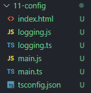

보통 생성된 자바스크립트 파일들을 다른 디렉토리에 넣어 해결한다. 어디에다가 tsconfig.json에서 컴파일된 파일들을 지정할 수 있다. tsconfig안에 `outDir`이라는 설정이 있다. 기본적으로 따로 설정하지 않으면 항상 현재 디렉토리 안에 타입스크립트가 있는 곳에서 자바스크립트 파일이 생기게 된다. outDir에 경로를 지정해보자. 폴더명을 입력해주면 알아서 그 위치에 폴더가 생성되며, 컴파일된 자바스크립트가 생긴다.

```json
{
  "compilerOptions": {
    "outDir": "./build"
  }
}
```

config 폴더 내부에 src폴더를 만들어서 그 안에 타입스크립트 파일을 넣어보자. 터미널을 통해 다시 실행시켜보면 build 파일 내부에 src폴더는 없고 자바스크립트 두 개가 컴파일된 걸 확인할 수 있다. 이처럼 타입스크립트 파일이 있는 곳부터 상위폴더로 지정된다. 그래서 제일 최상위 폴더에는 타입스크립트가 없고 src 폴더 내부에 타입스크립트가 있기 때문에 src가 최상위로 결정된 것이다.

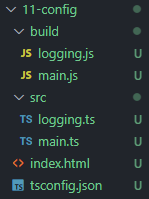

최상위에 다른 logging이라는 폴더가 있고 src와 logging 각각에 타입스크립트가 있다면 이제는 디렉토리가 유지되면서 나온다. build안에 logging과 src가 그대로 나오는 것을 확인할 수 있다. 타입스크립트가 있는 최상위부터 반영이 되어서 컴파일된 디렉토리가 나오게 된다.

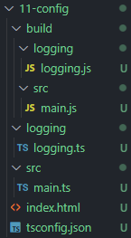

보통 개발할 때는 최상위에서 폴더를 나누는 것이 아닌 src 디렉토리 안에 필요한대로 폴더를 나눈다.이제는 구조를 유지하면서 파일이 생성된다.

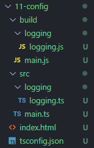

index.html로 돌아와서 경로를 수정해주자. 이제 모든 타입스크립트 파일은 항상 src 디렉토리 안에 있어야 한다. 따로 tsconfig에서 루트 디렉토리를 지정하지 않으면 이 프로젝트 전체적으로 설정된다.

```html
<script src="./build/main.js"></script>
<script src="./build/logging/logging.js"></script>
```

큰 규모의 프로젝트의 경우 다수의 개발자가 참여한다. 만들어둔 구조를 유지하고 싶은데 다른 개발자가 실수로 제일 최상위 루트에서 다른 파일을 생성해버린다고 가정해보자. 이제 타입스크립트는 제일 최상위에 있다. 그래서 build안에 src 디렉토리가 따로 있고 그 안에 logging이 있다. 이러면 index의 경로를 전부 수정해줘야 한다.

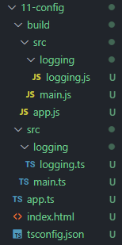

이런 일을 방지하기 위해서는 다른 사람이 src 디렉토리 외에서는 절대 타입스크립트 파일을 생성할 수 없게 만들어야 한다. tsconfig.json으로 돌아와보자. `rootDir`를 설정해주면 된다. 기본적으로는 최상위로 설정되어져 있다. 이제는 rootDir에 src경로를 입력한다. 이제 경로는 무조건 src 디렉토리임을 선언해주는 것이다. app.ts가 있는 채로 다시 실행시켜보면 Error가 발생하는 것을 확인할 수 있다. 그리고 여전히 잘못된 경로로 빌드되어 있음을 확인할 수 있다. 이제 app.ts를 삭제하고 다시 실행해보면 정상적으로 빌드되는 것을 확인할 수 있다.

```json
{
  "compilerOptions": {
    "rootDir": "./src"
  }
}
```

compilerOptions말고도 다른 것을 설정해볼 수 있다. compilerOptions 밑에 어떤 파일들을 추가하고 제외할 것인지 설정할 수 있다. 기본적으로 루트 디렉토리에 있는 타입스크립트 파일을 포함해서 컴파일 하도록 설정되어 있다. 만약에 소스 안에 어떤 개발자용으로 무언가를 작성했고 이 파일은 절대로 컴파일이 안되야 하는 파일이라면 compilerOptions 아래에 다양한 옵션을 추가할 수 있다. 새로운 dev.ts를 추가한다. 그리고 `exclude`를 이용하여 컴파일에서 제외시킨다. 다시 명령어를 실행시키면 dev.ts는 컴파일되지 않은 것을 확인할 수 있다.

```json
{
  "compilerOptions": {
    //..
  },
  "exclude": ["./src/dev.ts"]
}
```

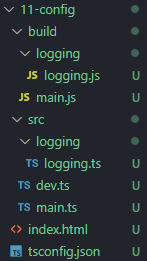

반대로 원하는 것만 컴파일할 수 있도록 지정할 수 있다. 이제는 dev.ts만 컴파일할 수 있도록 만들어 보자. `include`를 사용하면 특정 파일만 컴파일되게 만들 수 있다.

```json
{
  "compilerOptions": {
    //..
  },
  "include": ["./src/dev.ts"]
}
```

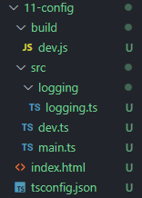

---

## TSConfig - 컴파일러 옵션

1. incremental <br/>

컴파일이 될 때마다 계속 새롭게 모든 파일을 컴파일하는 것이 아니라, 이전 컴파일된 파일과 비교해서 수정사항이 없다면 그 부분은 유지하고 `수정된 내용만 컴파일`하는 것이다. true로 설정해주면 컴파일 시간이 빨라지지만, 예전에 컴파일했던 정보들을 disk에 보관하기 때문에 용량이 더 커질 수 있다.

2. target <br/>

target은 어떤 버전으로 컴파일할지 설정할 수 있다. 보통 es5, 6를 많이 사용한다.

3. module<br/>

모듈 정보를 어떻게 할건지 결정할 수 있다. 여기에서도 문자열을 사용해보면 다양한 것들을 이용할 수 있다. 노드 프로젝트라면 commonjs를, 브라우저 환경이라면 ES 표준안에 맞는 것을 선택하는게 좋다. 라이브러리를 따로 사용하지 않으면 ES5에 들어있는 모든 것들을 이용할 수 있다.

4. lib <br/>

어떤 라이브러리를 이용할 건지 결정하고 싶다면 선택적으로 사용할 수 있다. 보통 따로 선택하지 않고 target에서 따라져 나오는 것을 선택해서 이용한다.

5. allowJs<br/>

프로젝트 안에서 자바스크립트의 파일을 같이 쓸건지, 프로젝트의 자바스크립트와 타입스크립트를 섞어서 만들건지 결정할 수 있다.

6. checkJs <br/>

자바스크립트 파일에서 무언가 잘못 코딩되어있을 경우 경고와 에러가 뜨게 한다. 한 프로젝트 안에서 자바스크립트와 타입스크립트를 섞어서 진행한다면 allowJs와 checkJs는 true로 설정하는 것이 좋다.

7. jsx <br/>

jsx는 리액트에서 사용되는 것으로 리액트와 관련된걸 사용할 수 있다.

8. declaration <br/>

타입 정의에 관련된 것으로 내가 작성한 코드를 라이브러리 형식으로 다른 사람에게 제공할 것이 아니라면 잘 사용하지 않는다. 일반 제품을 만드는 프로젝트에서는 설정하지 않는다.

9. sourceMap <br/>

디버깅할 떄 유용하게 사용할 수 있다.

10. outFile <br/>

작성한 다수의 타입스크립트 파일을 딱 하나의 자바스크립트 파일로 만들 때 사용할 수 있다.

11. composition <br/>

앞에서 언급한 incremental과 함께 사용할 수 있다. 이전에 빌드된 정보들을 기억하고 있어서 다음에 빌드할 때 더 빠르게 빌드할 수 있도록 도와준다.

12. tsBuildInfoFile <br/>

설정한 incremental 옵션이 true이면 관련된 정보들을 담을 수 있는 파일을 지정한다.

13. removeComments <br/>

주석을 전부 없애준다.

14. noEmit <br/>

true로 설정하면 컴파일 에러만 체크하고 자바스크립트로 컴파일 하지 않는다. 컴파일 에러만 확인하고 싶을 때 사용할 수 있다.

15. isolatedModules <br/>

각각의 파일을 다른 모듈로 변환해서 만든다.

> 컴파일러 옵션에 대한 궁금증은 tsconfig.json 내부에 입력된 사이트를 통해 상세한 정보를 알 수 있다. 이해가 잘 되지 않거나 버전이 업데이트 되어 새로운 옵션이 추가된다면 사이트를 통해 확인할 수 있다.

---

## TSConfig - 디버깅

main에는 Car라는 클래스가 있다. enigine이 있고 move가 호출될 때마다 engine은 1씩 추가된다. logging은 콘솔에 Hello를 출력한다. 타입스크립트를 이용하여 간단하게 클래스를 만들었지만 빌드된 자바스크립트를 보면 ES5 문법으로 복잡하게 구현됨을 확인할 수 있다.

```ts
// main.ts
class Car {
  engine = 0;
  move() {
    const engine = this.engine + 1;
    console.log(engine);
  }
}

const car = new Car();
car.move();

//logging.ts
console.log("Hello");
```

move함수에 버그가 발생하여 engine의 숫자가 아니라 다른 문자열이 출력되었다고 가정해보자.

```ts
// main.ts
class Car {
  engine = 0;
  move() {
    const engine = this.engine + 1;
    console.log("enigine Bug!");
    console.log(engine);
  }
}
```

디버깅을 하기 위해 개발자툴(F12)를 눌러 확인해볼 수 있을 것이다. 하지만 작성한 코드가 아닌 컴파일된 자바스크립트 코드만 보인다. 디버깅을 하기 위해서 컴파일된 코드를 일일이 읽고 이해하면서 break point를 잡는 건 어려운 일이다.

이를 하지 않고 간단하게 디버깅할 수 있는 방법이 sourceMap이다. 다시 tsconfig.json으로 돌아가보자. compilerOptions 중 sourceMap이라는 옵션이 있다. sourceMap을 true로 설정하는 다는 것은 map이라는 파일을 설정하겠다는 의미이다. map은 작성한 타입스크립트의 코드와 컴파일된 자바스크립트 코드를 연결시켜주는 모든 정보가 담긴 파일이다. 즉, 컴파일된 코드 하나하나를 작성한 타입스크립트에서 어디를 가리키는지를 알려주는 파일이다. sourceMap을 설정하고 다시 빌드해보자.

```json
{
  "compilerOptions": {
    "sourceMap": true
  }
}
```

build폴더 내부에 main.js.map이라는 파일이 생겼음을 확인할 수 있다. map 파일은 보기에는 굉장히 난해한 데이터를 담고 있다. 하지만 디버깅 툴과 브라우저에서는 전부 이해할 수 있다. 이제 다시 브라우저를 확인해보면 src폴더에 main.ts를 통해 작성한 타입스크립트를 확인할 수 있다. 이제 디버깅 툴에서 좀 더 쉽게 디버깅할 수 있다.

---
